# Diário de Bordo - Cardoso Evangelista Brandão

**Disciplina:** Gerência de Configuração e Evolução de Software (GCES)

**Equipe:** Gov Hub BR

**Comunidade/Projeto de Software Livre:** Gov Hub BR

---

## Sprint 0 – [06/04/2026 – 20/04/2026]

### Resumo da Sprint
Essa sprint inicial teve como foco a familiarização com o projeto Gov Hub e a configuração do ambiente do mesmo, ainda, de maneira mais coletiva o aprendizado do fluxo d>

### Atividades Realizadas

| Data  | Atividade | Tipo (Código/Doc/Discussão/Outro) | Link/Referência | Status |
| ----- | --------- | --------------------------------- | --------------- | ------ |
| 16/04 | Criação do fork | Código | [Fork][link-Fork] | Concluído |
| 16/04 | Leitura do e-book | Estudo | [E-book][link-Ebook] | Concluído |
| 20/04 | Leitura e estudo da documentação do projeto | Estudo | [Documentação][link-Documentação] | Concluído |
| 20/04 | Configuração do ambiente | Código | [Configuração][link-Config] | Incompleto |
| 20/04 | Adicionando meu diário de bordo ao GitHub Pages | Documentação | - | Concluído |

### Detalhamento das Atividades Realizadas

Ao realizar a configuração do ambiente localmente eu consegui com que 2 das 3 ferramentas necessárias fossem abertas.

1. Rodando o Jupyter

Print da tela com o Jupyter aberto.

<i><b>Fonte:</b> Anna Clara Brandão</i>

 2. Superset rodando

Print da tela com o Superset aberto.

<i><b>Fonte:</b> Anna Clara Brandão</i>

3. Airflow com problemas

Tive problemas ainda não solucionados com o Airflow, como é possível observar no print do terminal abaixo.

<i><b>Fonte:</b> Anna Clara Brandão</i>

### Maiores Avanços
* Aprendi a rodar a maior parte da aplicação localmente;
* Entendi a organização do repositório após a leitura da documentação e do E-book disponibilizados pela equipe do Gov Hub.

### Maiores Dificuldades
* Dispositivo institucional não permitiu fazer a instalação do Docker, atrasei a configuração pois dependia exclusivamente do meu notebook pessoal, que não estava comigo;
* Abertura de ferramenta Airflow;
* Ambiente demorou para configurar por falta de dependências;
* Dispositivo pessoal não aguentou o uso do Docker.

### Aprendizados
* Fluxo de contribuição do projeto.

### Plano Pessoal para a Próxima Sprint
* [X] Solucionar a abertura da ferramenta Airflow.
* [X] Conferir as issues disponíveis para iniciar alguma contribuição.
* [X] Participar da revisão de código de um colega.
* [X] Preencher meu diário de bordo em paralelo as atividades realizadas (diminuir sobrecarga).

---

## Sprint 1 - [21/04/2026 - 04/05/2026]

### Resumo da Sprint

Nesta sprint continuei tentando resolver meus problemas com a configuração do ambiente GovHub. Descobri que o problema estava na minha máquina, que não suportava o Docke>

### Atividades realizadas

| Data  | Atividade | Tipo (Código/Doc/Discussão/Outro) | Link/Referência | Status |
| ----- | --------- | --------------------------------- | --------------- | ------ |
| 02/05 - 03/05 | Configuração do 0 em máquina emprestada. | Configuração | [Configuração][link-Config] | Concluído |
| 04/05 | Pesquisas sobre possíveis issues para contribuição. | Estudo | [Issues][link-Issues] | Concluído |

### Detalhamento das atividades realizadas

Nessa sprint alcancei a configuração por completa do GovHub:

1. Airflow pós-login rodando

Print da tela com o Airflow pós-login.

<i><b>Fonte:</b> Anna Clara Brandão</i>

2. Airflow configurado com o banco local

Print da tela com o Airflow pós-configurações e conexões.

<i><b>Fonte:</b> Anna Clara Brandão</i>

3. Jupyter rodando

Print da tela com o Jupyter.

<i><b>Fonte:</b> Anna Clara Brandão</i>

4. Superset pós-login rodando

Print da tela inicial do Superset logado.

<i><b>Fonte:</b> Anna Clara Brandão</i>

5. Superset com a conexão configurada

Print da tela com o Superset conectado.

<i><b>Fonte:</b> Anna Clara Brandão</i>

6. dbt configurado

Print do terminal com a configuração do dbt.

<i><b>Fonte:</b> Anna Clara Brandão</i>

7. Rodando modelo de contratos dbt

Print do terminal rodando modelos de contratos do dbt.

<i><b>Fonte:</b> Anna Clara Brandão</i>

### Maiores Avanços

* Consegui configurar completamente o ambiente, após muita dificuldade.
* Pude praticar bastante o uso do WSL.
* Finalmente consegui voltar a atenção pras issues do projeto em si.

### Maiores Dificuldades

* O uso do Windows para rodar o projeto se mostrou bastante desafiador, precisei usar o WSL.
* Pouca experiência com WSL.

### Aprendizados

* Aprendi sobre a dificuldade de lidar com os problemas que usar Windows causou na configuração do projeto e contorná-los.
* Mais experiência com o uso do WSL.
* Funcionamento básico do Airflow.
* Funcionamento do padrão de issues.

### Plano Pessoal para a Próxima Sprint

* [X] Escolher após a análise feita nessa sprint uma issue para contribuir.
* [X] Iniciar projeto extra (UDA pipeline) explicado em sala.
* [X] Finalizar alguma atividade (extra, contribuição no GovHub, etc.).

---

## Sprint 2 - [05/05/2026 - 25/05/2026]

### Resumo da Sprint

Nessa sprint foi desenvolvido o projeto extra disponibilizado pela professora, que consistiu em desenvolver um pipeline automatizado que coletasse PDFs de relatórios trimestrais de incorporadoras (MRV, Direcional, Tenda), extraísse dados operacionais usando IA e disponibilizasse via API REST para alimentar um Boletim de Conjuntura do setor habitacional.
Para a resolução do problema, construí um sistema em três camadas: um coletor que varre os portais de RI das empresas diariamente e ignora PDFs já processados (via SHA-256); um motor de extração que usa PyMuPDF para ler o PDF e GPT-4 para interpretar os dados semanticamente (sem depender de posição ou formato do documento); e uma API FastAPI que entrega os dados filtrados por empresa, ano e trimestre. Todo dado extraído é rastreável até o PDF de origem, e 23 testes automatizados cobrem o pipeline sem necessidade de chave de API.

### Atividades realizadas

| Data | Atividade | Tipo (Código/Doc/Discussão/Outro) | Link/Referência | Status |
|------|-----------|-----------------------------------|-----------------|--------|
| 07/05 | Leitura e análise do enunciado do projeto e do Boletim de Conjuntura 3T25 de exemplo | Estudo | [Boletim 3T25][link-ExtraBoletim] | Concluído |
| 07/05 | Definição da arquitetura: Full-Scan com PyMuPDF + GPT-4 + Instructor + FastAPI + APScheduler | Discussão | — | Concluído |
| 08/05 | Implementação do Contrato Semântico (`src/models.py`) com schema Pydantic, validações de range e blindagem contra alucinações | Código | [models.py][link-ExtraContratoSemantico] | Concluído |
| 10/05 | Implementação do Catálogo de Dados e Linhagem (`src/catalog.py`) com deduplicação SHA-256 dupla e data lineage por PDF | Código | [catalog.py][link-ExtraCatalogo] | Concluído |
| 12/05 | Implementação do Motor de Extração Full-Scan (`src/extractor.py`) com PyMuPDF + GPT-4o + system prompt com 7 regras semânticas | Código | [extractor.py][link-ExtraExtractor] | Concluído |
| 13/05 | Implementação dos Scrapers de RI e Scheduler (`src/collector.py`) para MRV, Direcional e Tenda com polling diário via APScheduler | Código | [collector.py][link-ExtraCollector] | Concluído |
| 17/05 | Implementação da API REST (`src/api.py`) com FastAPI, endpoints filtráveis por empresa/ano/trimestre e catálogo de linhagem | Código | [api.py][link-ExtraApi] | Concluído |
| 21/05 | Criação de 23 testes automatizados cobrindo contrato semântico, idempotência, CRUD e resiliência a dois layouts de PDF | Código | [tests/][link-ExtraTests] | Concluído |
| 21/05 | Validação local: 23/23 testes passando sem necessidade de API key | Teste | — | Concluído |

### Detalhamento das atividades realizadas

O link para o Fork onde foi adicionado todo o projeto extra desenvolvido pode ser encontrado [aqui][link-ExtraLinkGithub].

1. Resultado dos testes rodando

Print do terminal mostrando todos os testes passando.

<i><b>Fonte:</b> Anna Clara Brandão</i>

2. Rodando sem precisar de API key

Print do terminal mostrando a execução do projeto ao não precisar de API key.

<i><b>Fonte:</b> Anna Clara Brandão</i>

3. Rodando após injeção de dados

Print do resultado do terminal ao colocar o comando:

`# Todos os dados`
`curl -s "http://localhost:8000/api/conjuntura" | python3 -m json.tool`

<i><b>Fonte:</b> Anna Clara Brandão</i>

Print do resultado do terminal ao colocar o comando:

`# Filtro por empresa`
`curl -s "http://localhost:8000/api/conjuntura?empresa=MRV" | python3 -m json.tool`

<i><b>Fonte:</b> Anna Clara Brandão</i>

Print do resultado do terminal ao colocar o comando:

`# Filtro por ano e trimestre`
`curl -s "http://localhost:8000/api/conjuntura?ano=2025&trimestre=3" | python3 -m json.tool`

<i><b>Fonte:</b> Anna Clara Brandão</i>

Print do resultado do terminal ao colocar o comando:

`# Status atualizado`
`curl -s "http://localhost:8000/api/status" | python3 -m json.tool`

<i><b>Fonte:</b> Anna Clara Brandão</i>

### Maiores Avanços

* Desenvolvimento da solução por completo.
* Finalmente ter alguma task 100% feita na matéria.

### Maiores Dificuldades

* Indecisão na escolha de fazer a solução por FullScan ou Chunking.
* Pouca experiência em Python, tive que ir pesquisando tudo que fazia.
* Projeto com alta complexidade pra mim.

### Aprendizados

* Aprendi um pouco mais a utilizar Python.
* A integração com IA foi novidade pra mim.

### Plano Pessoal para a Próxima Sprint

* [X] Fazer mais algumas revisões, para garantir que está tudo certo no projeto extra.
* [X] Abrir PR do projeto extra.
* [X] Iniciar minha contribuição na issue escolhida.
* [X] Documentar tudo pendente no diário de bordo.

---

## Sprint 3 - [26/05/2026 - 08/06/2026]

### Resumo da Sprint

Nesta sprint, com o ambiente do Gov Hub já configurado nas sprints anteriores, voltei o foco para duas frentes de trabalho simultâneas. Na contribuição ao Gov Hub, analisei as issues abertas com o rótulo OSS (voltadas à comunidade), escolhi a issue [#309][link-Issue309] — que solicitava a implementação de testes unitários para o módulo `cliente_contratos.py` — e a levei do início ao fim: estudo do código, implementação dos testes com mocks, validação local e abertura do Pull Request. Em paralelo, dediquei a sprint à entrega do **Projeto Individual da disciplina de GCES**, que consistiu em modernizar e automatizar o ciclo de vida do projeto mk.js, um jogo de luta multiplayer, implementando containerização, CI/CD, testes, segurança, qualidade de código, orquestração com Kubernetes e deploy contínuo em produção.

### Atividades realizadas

| Data | Atividade | Tipo (Código/Doc/Discussão/Outro) | Link/Referência | Status |
|------|-----------|-----------------------------------|-----------------|--------|
| 26/05 | Análise das issues abertas e escolha da issue #309 (testes unitários para `cliente_contratos.py`) | Estudo | [Issue #309][link-Issue309] | Concluído |
| 03/06 | Comentário na issue #309 manifestando interesse em assumi-la, conforme o guia de contribuição | Discussão | [Issue #309][link-Issue309] | Concluído |
| 03/06 | Estudo do `cliente_contratos.py` e da classe base `cliente_base.py` para entender o comportamento a ser testado | Estudo | — | Concluído |
| 04/06 | Implementação dos testes unitários para Gov Hub cobrindo os seis métodos da classe `ClienteContratos`, com mocks do método `request` | Código | [test_cliente_contratos.py][link-TestContratoGovhub] | Concluído |
| 04/06 | Validação local Gov Hub: 18 testes passando, formatação (black) e lint (ruff) sem apontamentos, 100% de cobertura no arquivo-alvo | Teste | — | Concluído |
| 04/06 | Ajuste do fluxo de Git (rebase com `upstream/main`, padronização do commit) e abertura do Pull Request | Código | [Pull Request][link-PR1govhub] | Concluído |
| 05/06 | Análise dos requisitos do Projeto Individual de GCES e modernização das dependências (Express 3->4, Socket.io 0.9->4) | Código | [Repositório GCES][link-RepoGCES] | Concluído |
| 05/06 | Fase 1 — Criação do `Dockerfile.dev` com hot-reload via nodemon | Código | [Repositório GCES][link-RepoGCES1] | Concluído |
| 05/06 | Fase 2 — Docker Compose integrando Node.js e PostgreSQL com camada de persistência de partidas | Código | [Repositório GCES][link-RepoGCES2] | Concluído |
| 05/06 | Fase 3 — Pipeline de CI com lint (ESLint) e build via GitHub Actions | Código | [Repositório GCES][link-RepoGCES3] | Concluído |
| 05/06 | Fases 4 e 5 — Implementação de testes unitários (com bug intencional -> correção) e testes de fuzzing para o backend | Código | [Repositório GCES][link-RepoGCES45] | Concluído |
| 07/06 | Fase 6 — Integração de SAST com CodeQL e SCA com npm audit no pipeline de CI | Código | [Repositório GCES][link-RepoGCES6] | Concluído |
| 07/06 | Fase 7 — Integração do SonarCloud com Quality Gate configurado | Código | [Repositório GCES][link-RepoGCES7] | Concluído |
| 07/06 | Fase 8 — Dockerfiles de produção com multi-stage build e Nginx como servidor de arquivos estáticos | Código | [Repositório GCES][link-RepoGCES8] | Concluído |
| 07/06 | Fase 9 — Manifestos Kubernetes e configuração Terraform para orquestração da aplicação | Código | [Repositório GCES][link-RepoGCES9] | Concluído |
| 07/06 | Fase 10 — CD com publicação de imagens no GitHub Container Registry e configuração de HTTPS via Cert Manager | Código | [Repositório GCES][link-RepoGCES10] | Concluído |
| 07/06 | Deploy em produção no Render, expansão da cobertura de testes para 100% no arquivo principal e documentação final | Código/Doc | [Produção][link-ProducaoGCES] | Concluído |

### Detalhamento das atividades realizadas

#### Contribuição ao Gov Hub — Issue #309

A contribuição consistiu em escrever testes unitários para `airflow_lappis/plugins/cliente_contratos.py`. A classe `ClienteContratos` possui seis métodos, todos seguindo o mesmo padrão: realizam uma requisição HTTP por meio do método `request` da classe base e retornam os dados ou `None` em caso de erro.

Para cada um dos seis métodos, implementei três cenários de teste:
- **Sucesso:** status 200 com uma lista, esperando o retorno dos dados;
- **Status de erro:** status diferente de 200 (ex.: 404), esperando `None`;
- **Resposta fora do formato:** status 200 com um corpo que não é lista, esperando `None`.

Também validei que cada método chama o endpoint correto. As requisições foram simuladas com `unittest.mock`, sem nenhuma chamada real à API — atendendo ao pedido da issue por "mocks estruturados".

1. Comentário na issue manifestando interesse

Print do comentário deixado na issue #309 solicitando a atribuição, conforme orienta o guia de contribuição do projeto.

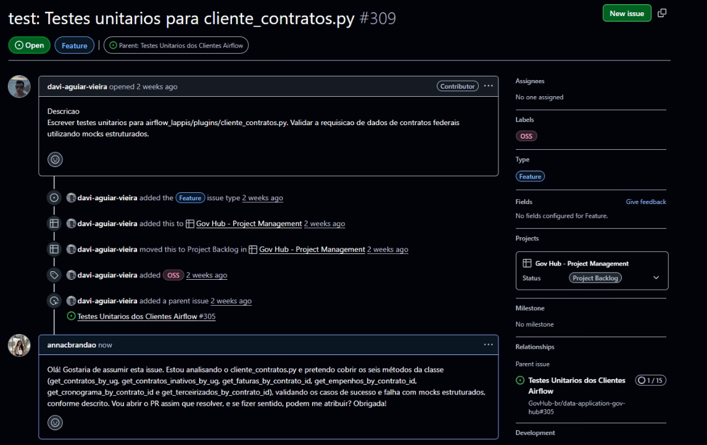

<i><b>Fonte:</b> Anna Clara Brandão</i>

2. Testes passando e cobertura do arquivo

Prints do terminal mostrando os 18 testes passando e a cobertura de 100% sobre `cliente_contratos.py`.

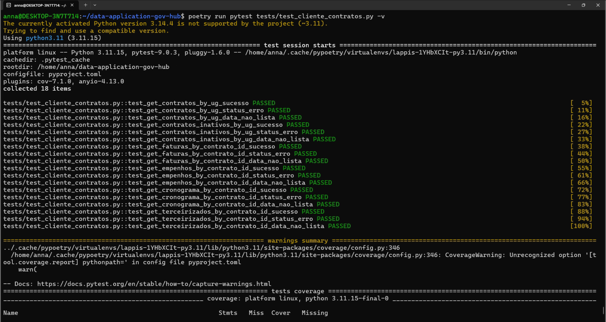

<i><b>Fonte:</b> Anna Clara Brandão</i>

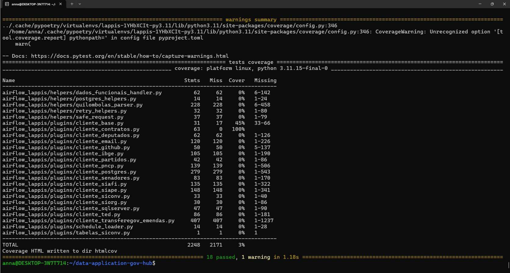

<i><b>Fonte:</b> Anna Clara Brandão</i>

3. Verificação de formatação e lint

Print do terminal mostrando o arquivo aprovado em `black` e `ruff`, sem apontamentos.

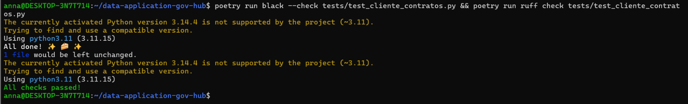

<i><b>Fonte:</b> Anna Clara Brandão</i>

4. Pull Request aberto

Prints da página do Pull Request no repositório principal.

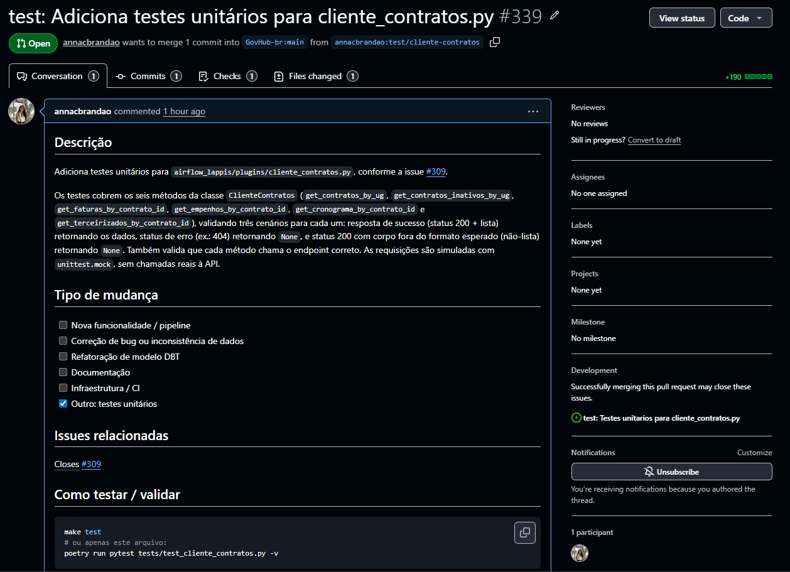

<i><b>Fonte:</b> Anna Clara Brandão</i>

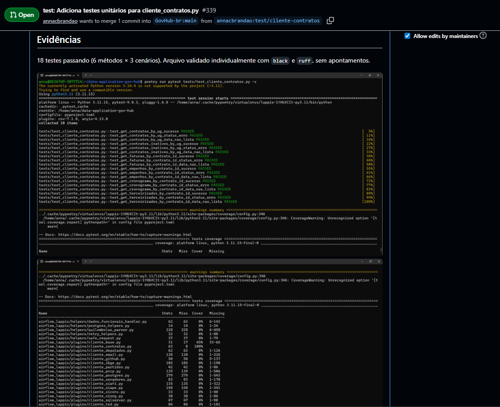

<i><b>Fonte:</b> Anna Clara Brandão</i>

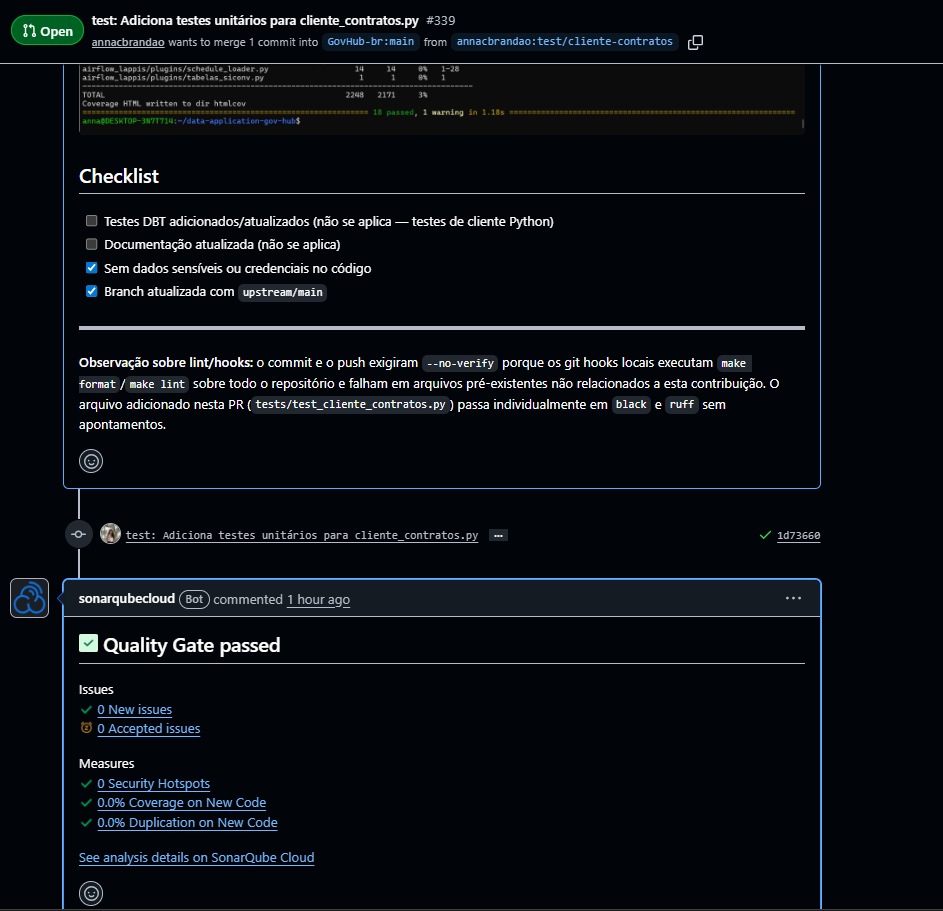

<i><b>Fonte:</b> Anna Clara Brandão</i>

---

#### Projeto Individual de GCES

O projeto consistiu em modernizar e automatizar o ciclo de vida completo do **mk.js**, um jogo de luta multiplayer com backend em Node.js e frontend em HTML5 Canvas. O código original utilizava dependências de 2013 (Express 3.x, Socket.io 0.9.x), incompatíveis com versões modernas do Node.js, o que exigiu modernização antes de qualquer outra etapa.

As 10 fases foram implementadas de forma incremental:

- **Fases 1 e 2:** Containerização com Docker para desenvolvimento (hot-reload via nodemon) e produção, integração com PostgreSQL via Docker Compose e implementação de persistência de histórico de partidas.
- **Fase 3:** Pipeline de CI com ESLint configurado para falhar em erros de lint.
- **Fase 4:** Identificação de um bug real no código (`this._games[game]` ao invés de `this._games[id]`) e demonstração do ciclo exigido: primeiro commit com teste falhando, segundo commit com a correção.
- **Fase 5:** Testes de fuzzing com 18 entradas maliciosas (null, SQL injection, path traversal, strings gigantes), totalizando 59 testes.
- **Fase 6:** SAST com CodeQL e SCA com `npm audit`.
- **Fase 7:** Integração com SonarCloud — Quality Gate passou com Security Rating A, Reliability A, Maintainability A, 0 vulnerabilidades e 51,9% de cobertura.
- **Fase 8:** Dockerfiles de produção com multi-stage build em Alpine e Nginx servindo os arquivos estáticos do frontend.
- **Fase 9:** Manifestos Kubernetes para todos os componentes (namespace, secrets, PVC, deployments, services, Ingress com Cert Manager) e configuração Terraform.
- **Fase 10:** CD automático publicando imagens no GitHub Container Registry a cada push, com HTTPS via Cert Manager e Nginx redirecionando 80→443. Deploy público realizado no Render.

A cobertura de testes foi expandida para **100% de statements, branches, funções e linhas** no arquivo `games.js` por meio de mocks de socket.

1. Pipeline de CI/CD verde

Prints da aba Actions do repositório do projeto individual mostrando parte dos workflows passando.

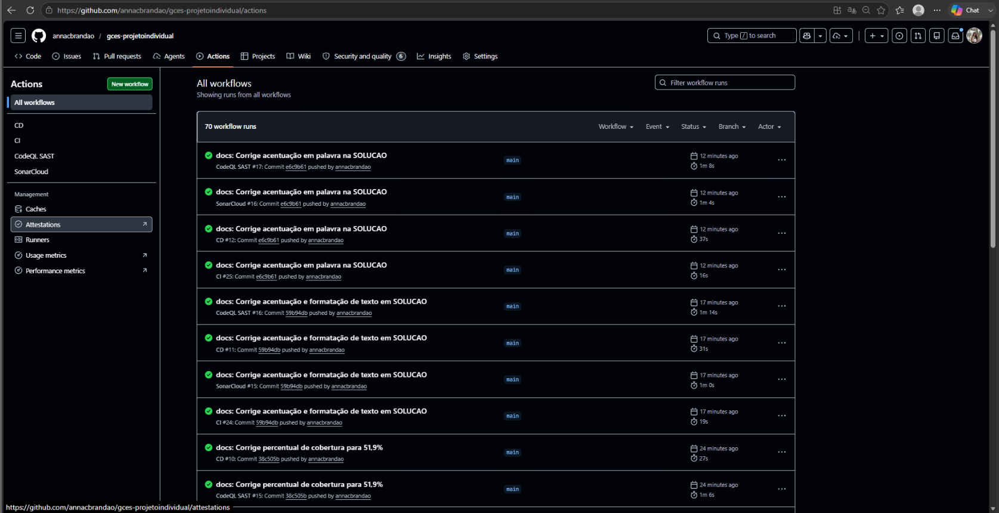

<i><b>Fonte:</b> Anna Clara Brandão</i>

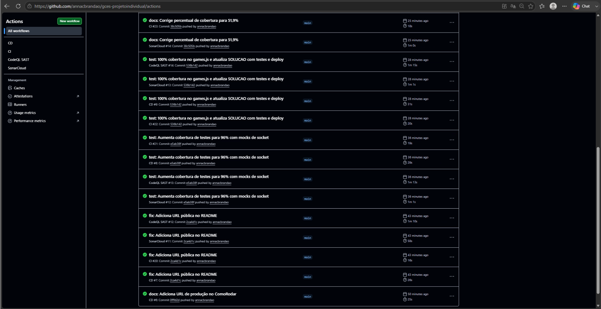

<i><b>Fonte:</b> Anna Clara Brandão</i>

2. SonarCloud — métricas de qualidade

Prints do dashboard do SonarCloud mostrando o Quality Gate passando e as métricas do projeto.

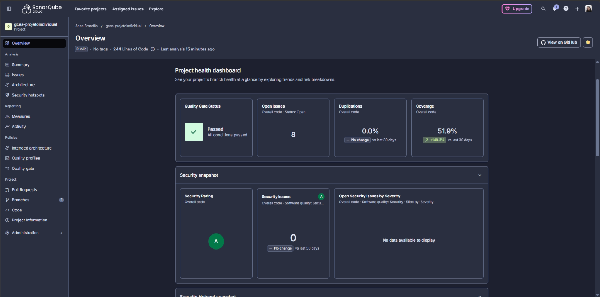

<i><b>Fonte:</b> Anna Clara Brandão</i>

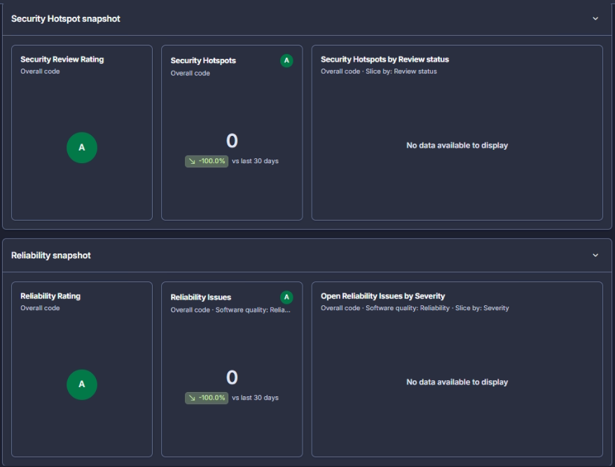

<i><b>Fonte:</b> Anna Clara Brandão</i>

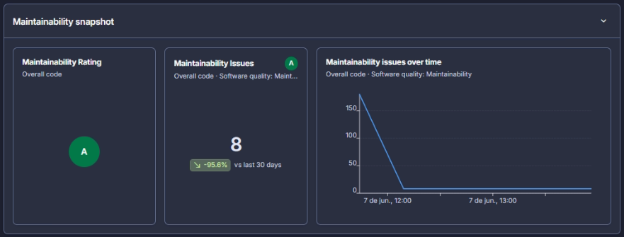

<i><b>Fonte:</b> Anna Clara Brandão</i>

3. Ambiente de produção público

Print do repositório no GitHub com a URL de produção e print da aplicação rodando em produção.

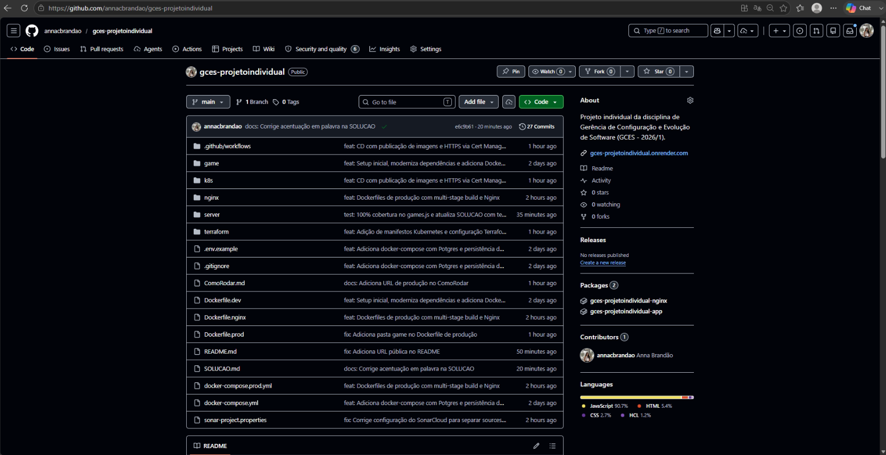

<i><b>Fonte:</b> Anna Clara Brandão</i>

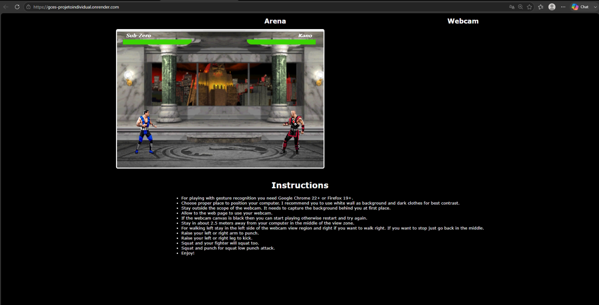

<i><b>Fonte:</b> Anna Clara Brandão</i>

### Maiores Avanços

* Primeira contribuição de código ao Gov Hub levada do início ao fim, seguindo o fluxo completo do projeto (fork, branch, commit padronizado, rebase com o upstream e Pull Request).
* Cobertura de 100% do arquivo-alvo no Gov Hub, com todos os métodos e cenários relevantes testados.
* Entrega completa das 10 fases do Projeto Individual de GCES, contemplando containerização, CI/CD, testes unitários e de fuzzing, segurança (SAST/SCA), qualidade de código com SonarCloud, Kubernetes, Terraform e deploy contínuo.
* Cobertura de **100% de statements, branches, funções e linhas** no arquivo principal do projeto individual (`games.js`), alcançada por meio de mocks de socket que simulam conexões reais sem depender de infraestrutura.
* Aplicação publicada e acessível publicamente em https://gces-projetoindividual.onrender.com.

### Maiores Dificuldades

* Os hooks de Git do Gov Hub (pré-commit e pré-push) executam formatação e lint sobre o repositório inteiro, falhando por causa de problemas pré-existentes em arquivos não relacionados à minha contribuição. Precisei investigar a fundo para contornar esse comportamento sem comprometer a integridade do projeto.
* A configuração do `mypy` no Gov Hub reportava o import como não encontrado quando rodado de forma isolada, comportamento ligado à forma como o `pythonpath` é resolvido no projeto.
* No projeto individual, a transferência de arquivos entre máquinas diferentes via zip causou corrupção em arquivos YAML e JSON em algumas ocasiões, exigindo reescrita dos arquivos diretamente no terminal.
* Configuração inicial do SonarCloud: o escopo de análise precisou ser ajustado para separar corretamente os arquivos de código-fonte dos arquivos de teste, evitando indexação duplicada.

### Aprendizados

* Como escrever testes unitários com `pytest` e `unittest.mock`, simulando respostas de uma API sem depender dela.
* Importância de validar uma contribuição isoladamente quando as ferramentas de qualidade do projeto rodam sobre todo o repositório.
* Fluxo de manutenção de uma branch atualizada com o `upstream` via rebase, e a diferença entre os remotes `origin` (fork) e `upstream` (repositório principal).
* Convenções de Conventional Commits aplicadas tanto ao nome da branch quanto à mensagem de commit.
* Construção de pipelines de CI/CD completos com GitHub Actions, cobrindo lint, testes, fuzzing, análise de segurança estática (SAST), verificação de vulnerabilidades em dependências (SCA) e publicação automática de imagens Docker.
* Criação de mocks de objetos complexos (sockets) para testes unitários em Node.js, permitindo testar lógica que depende de eventos de rede sem infraestrutura real.
* Configuração de ambientes Docker para desenvolvimento e produção com multi-stage build, e uso do Nginx como servidor de arquivos estáticos com proxy reverso.
* Fundamentos práticos de Kubernetes (Deployments, Services, Ingress, Secrets, PVC) e Terraform para provisionar infraestrutura como código.

### Plano Pessoal para a Próxima Sprint

* [ ] Acompanhar o code review do Pull Request ao Gov Hub e implementar eventuais ajustes solicitados pelos mantenedores.
* [ ] Buscar uma segunda issue para contribuir ao Gov Hub.
* [ ] Manter o diário de bordo atualizado em paralelo às atividades.

[link-Documentação]: https://gov-hub.io/govhub/sobre-projeto/overview/
[link-Fork]: https://github.com/annacbrandao/gov-hub
[link-Ebook]: https://gov-hub.io/govhub/ebook-viewer/
[link-Config]: https://gov-hub.io/govhub/documentacao/instalacao/
[link-Issues]: https://github.com/orgs/GovHub-br/projects/4/views/1?filterQuery=oss
[link-ExtraBoletim]: https://github.com/unb-Sistemas-de-Machine-learning/Projetos-Individuais-2026-1/blob/main/projeto-individual-4/exemplo_Boletim_Conjuntura_2025_3T.pdf
[link-ExtraContratoSemantico]: https://github.com/annacbrandao/Projetos-Individuais-2026-1/blob/anna-brandao/projeto-4/anna-brandao/projeto-4/src/models.py
[link-ExtraCatalogo]: https://github.com/annacbrandao/Projetos-Individuais-2026-1/blob/anna-brandao/projeto-4/anna-brandao/projeto-4/src/catalog.py
[link-ExtraExtractor]: https://github.com/annacbrandao/Projetos-Individuais-2026-1/blob/anna-brandao/projeto-4/anna-brandao/projeto-4/src/extractor.py
[link-ExtraCollector]: https://github.com/annacbrandao/Projetos-Individuais-2026-1/blob/anna-brandao/projeto-4/anna-brandao/projeto-4/src/collector.py
[link-ExtraApi]: https://github.com/annacbrandao/Projetos-Individuais-2026-1/blob/anna-brandao/projeto-4/anna-brandao/projeto-4/src/api.py
[link-ExtraTests]: https://github.com/annacbrandao/Projetos-Individuais-2026-1/tree/anna-brandao/projeto-4/anna-brandao/projeto-4/tests
[link-ExtraLinkGithub]: https://github.com/annacbrandao/Projetos-Individuais-2026-1/tree/anna-brandao/projeto-4
[link-Issue309]: https://github.com/GovHub-br/data-application-gov-hub/issues/309
[link-PR1govhub]: https://github.com/GovHub-br/data-application-gov-hub/pull/339#issuecomment-4625996046
[link-TestContratoGovhub]: https://github.com/annacbrandao/data-application-gov-hub/blob/test/cliente-contratos/tests/test_cliente_contratos.py
[link-RepoGCES]: https://github.com/annacbrandao/gces-projetoindividual
[link-RepoGCES1]: https://github.com/annacbrandao/gces-projetoindividual/commit/fa04a23297470f473df03438a76eaa77064079e5
[link-RepoGCES2]: https://github.com/annacbrandao/gces-projetoindividual/commit/56a75ee0a22c331bb792601b1941c591a01534d0
[link-RepoGCES3]: https://github.com/annacbrandao/gces-projetoindividual/commit/44384d7d8629d9ad7d5c9ccb70606c248200a014
[link-RepoGCES45]: https://github.com/annacbrandao/gces-projetoindividual/commits/main/
[link-RepoGCES6]: https://github.com/annacbrandao/gces-projetoindividual/commit/e274f8a950191c62679500346a994efc785a07d4
[link-RepoGCES7]: https://github.com/annacbrandao/gces-projetoindividual/commit/ace25982c03f65a2295b733600e17b285d202eed
[link-RepoGCES8]: https://github.com/annacbrandao/gces-projetoindividual/commit/c52cc03a6c3b41b36439a0d7033827776403727f
[link-RepoGCES9]: https://github.com/annacbrandao/gces-projetoindividual/commit/7d83c5f562d6997a274075b993b58234c6d89582
[link-RepoGCES10]: https://github.com/annacbrandao/gces-projetoindividual/commit/922539dda1461732db6c9846f1741566a8960ed8
[link-ProducaoGCES]: https://gces-projetoindividual.onrender.com
