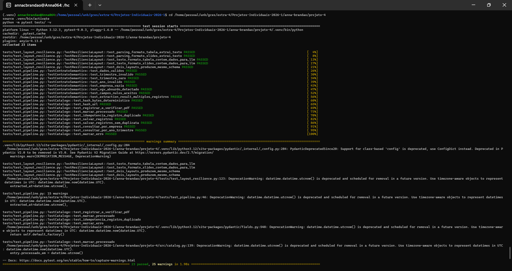
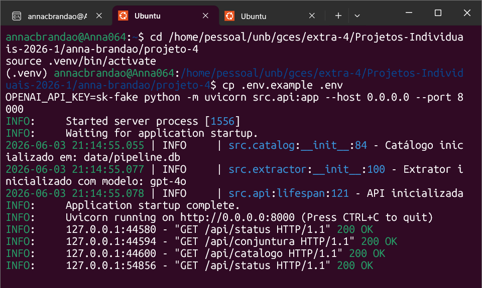
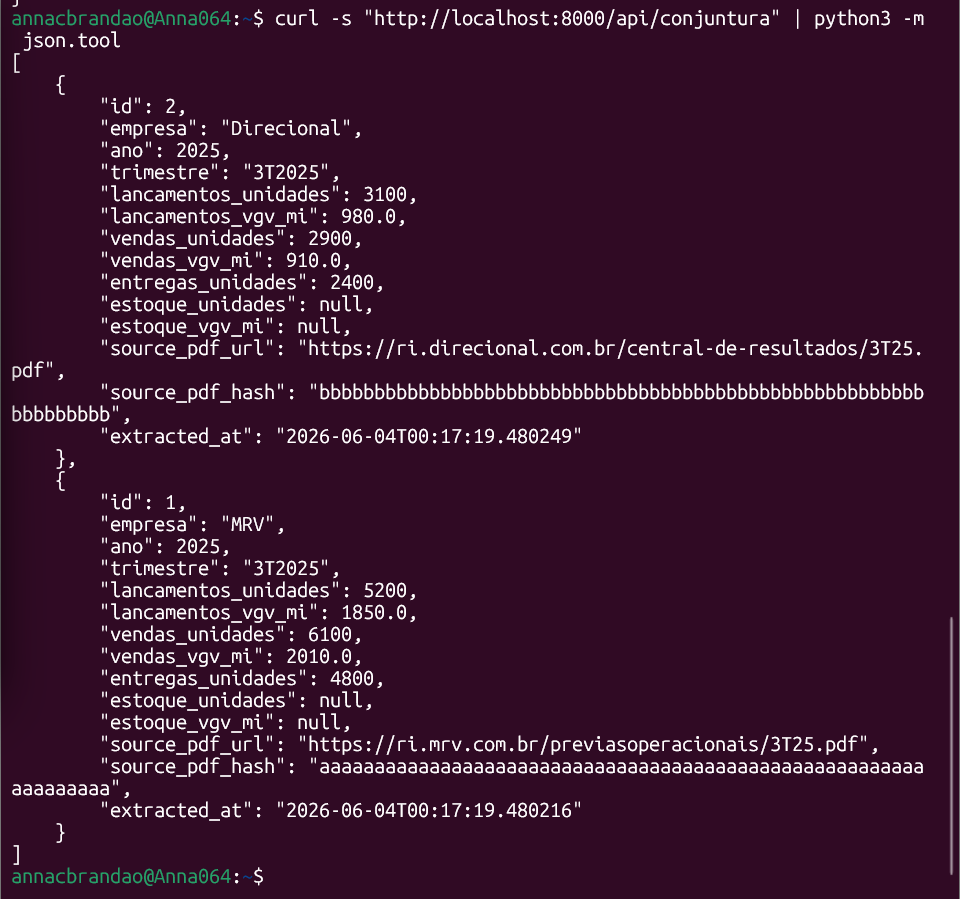
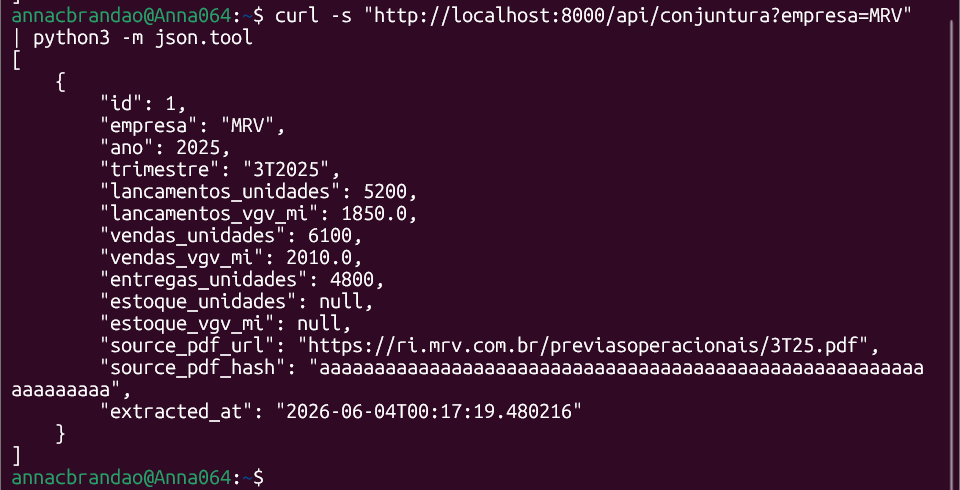
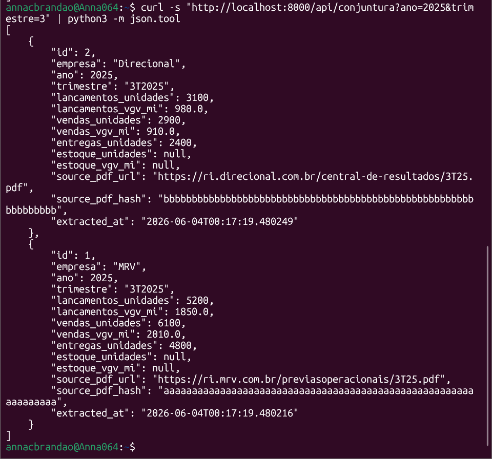
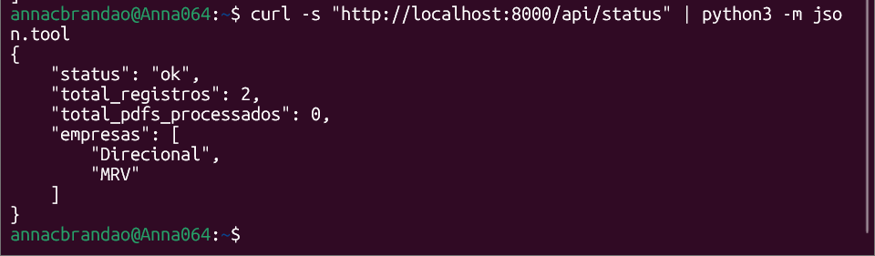

# Diário de Bordo - Cardoso Evangelista Brandão

**Disciplina:** Gerência de Configuração e Evolução de Software (GCES)

**Equipe:** Gov Hub BR

**Comunidade/Projeto de Software Livre:** Gov Hub BR

---

## Sprint 0 – [06/04/2026 – 20/04/2026]

### Resumo da Sprint
Essa sprint inicial teve como foco a familiarização com o projeto Gov Hub e a configuração do ambiente do mesmo, ainda, de maneira mais coletiva o aprendizado do fluxo d>

### Atividades Realizadas
| Data  | Atividade | Tipo (Código/Doc/Discussão/Outro) | Link/Referência | Status |
| ----- | --------- | --------------------------------- | --------------- | ------ |
| 16/04 | Criação do fork | Código | [Fork][link-Fork] | Concluído |
| 16/04 | Leitura do e-book | Estudo | [E-book][link-Ebook] | Concluído |
| 20/04 | Leitura e estudo da documentação do projeto | Estudo | [Documentação][link-Documentação] | Concluído |
| 20/04 | Configuração do ambiente | Código | [Configuração][link-Config] | Incompleto |
| 20/04 | Adicionando meu diário de bordo ao GitHub Pages | Documentação | - | Concluído |

### Detalhamento das Atividades Realizadas

Ao realizar a configuração do ambiente localmente eu consegui com que 2 das 3 ferramentas necessárias fossem abertas.

1. Rodando o Jupyter

Print da tela com o Jupyter aberto.

<i><b>Fonte:</b> Anna Clara Brandão</i>

 2. Superset rodando

Print da tela com o Superset aberto.

<i><b>Fonte:</b> Anna Clara Brandão</i>

3. Airflow com problemas

Tive problemas ainda não solucionados com o Airflow, como é possível observar no print do terminal abaixo.

<i><b>Fonte:</b> Anna Clara Brandão</i>

### Maiores Avanços
* Aprendi a rodar a maior parte da aplicação localmente;
* Entendi a organização do repositório após a leitura da documentação e do E-book disponibilizados pela equipe do Gov Hub.

### Maiores Dificuldades
* Dispositivo institucional não permitiu fazer a instalação do Docker, atrasei a configuração pois dependia exclusivamente do meu notebook pessoal, que não estava comigo;
* Abertura de ferramenta Airflow;
* Ambiente demorou para configurar por falta de dependências;
* Dispositivo pessoal não aguentou o uso do Docker.

### Aprendizados
* Fluxo de contribuição do projeto.

### Plano Pessoal para a Próxima Sprint
* [X] Solucionar a abertura da ferramenta Airflow.
* [X] Conferir as issues disponíveis para iniciar alguma contribuição.
* [X] Participar da revisão de código de um colega.
* [X] Preencher meu diário de bordo em paralelo as atividades realizadas (diminuir sobrecarga).

---

## Sprint 1 - [21/04/2026 - 04/05/2026]

### Resumo da Sprint

Nesta sprint continuei tentando resolver meus problemas com a configuração do ambiente GovHub. Descobri que o problema estava na minha máquina, que não suportava o Docke>

### Atividades realizadas

| Data  | Atividade | Tipo (Código/Doc/Discussão/Outro) | Link/Referência | Status |
| ----- | --------- | --------------------------------- | --------------- | ------ |
| 02/05 - 03/05 | Configuração do 0 em máquina emprestada. | Configuração | [Configuração][link-Config] | Concluído |
| 04/05 | Pesquisas sobre possíveis issues para contribuição. | Estudo | [Issues][link-Issues] | Concluído |

### Detalhamento das atividades realizadas

Nessa sprint alcancei a configuração por completa do GovHub:

1. Airflow pós-login rodando

Print da tela com o Airflow pós-login.

<i><b>Fonte:</b> Anna Clara Brandão</i>

2. Airflow configurado com o banco local

Print da tela com o Airflow pós-configurações e conexões.

<i><b>Fonte:</b> Anna Clara Brandão</i>

3. Jupyter rodando

Print da tela com o Jupyter.

<i><b>Fonte:</b> Anna Clara Brandão</i>

4. Superset pós-login rodando

Print da tela inicial do Superset logado.

<i><b>Fonte:</b> Anna Clara Brandão</i>

5. Superset com a conexão configurada

Print da tela com o Superset conectado.

<i><b>Fonte:</b> Anna Clara Brandão</i>

6. dbt configurado

Print do terminal com a configuração do dbt.

<i><b>Fonte:</b> Anna Clara Brandão</i>

7. Rodando modelo de contratos dbt

Print do terminal rodando modelos de contratos do dbt.

<i><b>Fonte:</b> Anna Clara Brandão</i>

### Maiores Avanços

* Consegui configurar completamente o ambiente, após muita dificuldade.
* Pude praticar bastante o uso do WSL.
* Finalmente consegui voltar a atenção pras issues do projeto em si.

### Maiores Dificuldades

* O uso do Windows para rodar o projeto se mostrou bastante desafiador, precisei usar o WSL.
* Pouca experiência com WSL.

### Aprendizados

* Aprendi sobre a dificuldade de lidar com os problemas que usar Windows causou na configuração do projeto e contorná-los.
* Mais experiência com o uso do WSL.
* Funcionamento básico do Airflow.
* Funcionamento do padrão de issues.

### Plano Pessoal para a Próxima Sprint

* [X] Escolher após a análise feita nessa sprint uma issue para contribuir.
* [X] Iniciar projeto extra (UDA pipeline) explicado em sala.
* [X] Finalizar alguma atividade (extra, contribuição no GovHub, etc.).

---

## Sprint 2 - [05/05/2026 - 25/05/2026]

### Resumo da Sprint

Nessa sprint foi desenvolvido o projeto extra disponibilizado pela professora, que consistiu em desenvolver um pipeline automatizado que coletasse PDFs de relatórios trimestrais de incorporadoras (MRV, Direcional, Tenda), extraísse dados operacionais usando IA e disponibilizasse via API REST para alimentar um Boletim de Conjuntura do setor habitacional.
Para a resolução do problema, construí um sistema em três camadas: um coletor que varre os portais de RI das empresas diariamente e ignora PDFs já processados (via SHA-256); um motor de extração que usa PyMuPDF para ler o PDF e GPT-4 para interpretar os dados semanticamente (sem depender de posição ou formato do documento); e uma API FastAPI que entrega os dados filtrados por empresa, ano e trimestre. Todo dado extraído é rastreável até o PDF de origem, e 23 testes automatizados cobrem o pipeline sem necessidade de chave de API.

### Atividades realizadas

| Data | Atividade | Tipo (Código/Doc/Discussão/Outro) | Link/Referência | Status |
|------|-----------|-----------------------------------|-----------------|--------|
| 07/05 | Leitura e análise do enunciado do projeto e do Boletim de Conjuntura 3T25 de exemplo | Estudo | [Boletim 3T25](https://github.com/unb-Sistemas-de-Machine-learning/Projetos-Individuais-2026-1/blob/main/projeto-individual-4/exemplo_Boletim_Conjuntura_2025_3T.pdf) | Concluído |
| 07/05 | Definição da arquitetura: Full-Scan com PyMuPDF + GPT-4 + Instructor + FastAPI + APScheduler | Discussão | — | Concluído |
| 08/05 | Implementação do Contrato Semântico (`src/models.py`) com schema Pydantic, validações de range e blindagem contra alucinações | Código | [models.py](https://github.com/annacbrandao/Projetos-Individuais-2026-1/blob/anna-brandao/projeto-4/anna-brandao/projeto-4/src/models.py) | Concluído |
| 10/05 | Implementação do Catálogo de Dados e Linhagem (`src/catalog.py`) com deduplicação SHA-256 dupla e data lineage por PDF | Código | [catalog.py](https://github.com/annacbrandao/Projetos-Individuais-2026-1/blob/anna-brandao/projeto-4/anna-brandao/projeto-4/src/catalog.py) | Concluído |
| 12/05 | Implementação do Motor de Extração Full-Scan (`src/extractor.py`) com PyMuPDF + GPT-4o + system prompt com 7 regras semânticas | Código | [extractor.py](https://github.com/annacbrandao/Projetos-Individuais-2026-1/blob/anna-brandao/projeto-4/anna-brandao/projeto-4/src/extractor.py) | Concluído |
| 13/05 | Implementação dos Scrapers de RI e Scheduler (`src/collector.py`) para MRV, Direcional e Tenda com polling diário via APScheduler | Código | [collector.py](https://github.com/annacbrandao/Projetos-Individuais-2026-1/blob/anna-brandao/projeto-4/anna-brandao/projeto-4/src/collector.py) | Concluído |
| 17/05 | Implementação da API REST (`src/api.py`) com FastAPI, endpoints filtráveis por empresa/ano/trimestre e catálogo de linhagem | Código | [api.py](https://github.com/annacbrandao/Projetos-Individuais-2026-1/blob/anna-brandao/projeto-4/anna-brandao/projeto-4/src/api.py) | Concluído |
| 21/05 | Criação de 23 testes automatizados cobrindo contrato semântico, idempotência, CRUD e resiliência a dois layouts de PDF | Código | [tests/](https://github.com/annacbrandao/Projetos-Individuais-2026-1/blob/anna-brandao/projeto-4/anna-brandao/projeto-4/tests/) | Concluído |
| 21/05 | Validação local: 23/23 testes passando sem necessidade de API key | Teste | — | Concluído |

### Detalhamento das atividades realizadas

O link para o Fork onde foi adicionado todo o projeto extra desenvolvido pode ser encontrado [aqui](https://github.com/annacbrandao/Projetos-Individuais-2026-1/tree/anna-brandao/projeto-4).

1. Resultado dos testes rodando

Print do terminal mostrando todos os testes passando.

<i><b>Fonte:</b> Anna Clara Brandão</i>

2. Rodando sem precisar de API key

Print do terminal mostrando a execução do projeto ao não precisar de API key.

<i><b>Fonte:</b> Anna Clara Brandão</i>

3. Rodando após injeção de dados

Print do resultado do terminal ao colocar o comando:

`# Todos os dados`
`curl -s "http://localhost:8000/api/conjuntura" | python3 -m json.tool`

<i><b>Fonte:</b> Anna Clara Brandão</i>

Print do resultado do terminal ao colocar o comando:

`# Filtro por empresa`
`curl -s "http://localhost:8000/api/conjuntura?empresa=MRV" | python3 -m json.tool`

<i><b>Fonte:</b> Anna Clara Brandão</i>

Print do resultado do terminal ao colocar o comando:

`# Filtro por ano e trimestre`
`curl -s "http://localhost:8000/api/conjuntura?ano=2025&trimestre=3" | python3 -m json.tool`

<i><b>Fonte:</b> Anna Clara Brandão</i>

Print do resultado do terminal ao colocar o comando:

`# Status atualizado`
`curl -s "http://localhost:8000/api/status" | python3 -m json.tool`

<i><b>Fonte:</b> Anna Clara Brandão</i>

### Maiores Avanços

* Desenvolvimento da solução por completo.
* Finalmente ter alguma task 100% feita na matéria.

### Maiores Dificuldades

* Indecisão na escolha de fazer a solução por FullScan ou Chunking.
* Pouca experiência em Python, tive que ir pesquisando tudo que fazia.
* Projeto com alta complexidade pra mim.

### Aprendizados

* Aprendi um pouco mais a utilizar Python.
* A integração com IA foi novidade pra mim.

### Plano Pessoal para a Próxima Sprint

* [X] Fazer mais algumas revisões, para garantir que está tudo certo no projeto extra.
* [X] Abrir PR do projeto extra.
* [X] Iniciar minha contribuição na issue escolhida.
* [X] Documentar tudo pendente no diário de bordo.

---

## Sprint 3 - [26/05/2026 - 08/06/2026]

### Resumo da Sprint

[link-Documentação]: https://gov-hub.io/govhub/sobre-projeto/overview/
[link-Fork]: https://github.com/annacbrandao/gov-hub
[link-Ebook]: https://gov-hub.io/govhub/ebook-viewer/
[link-Config]: https://gov-hub.io/govhub/documentacao/instalacao/
[link-Issues]: https://github.com/orgs/GovHub-br/projects/4/views/1?filterQuery=oss
