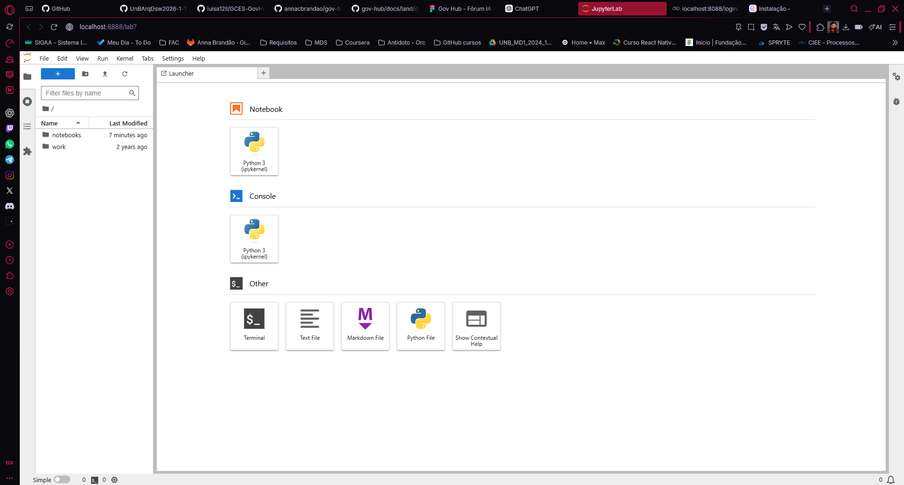
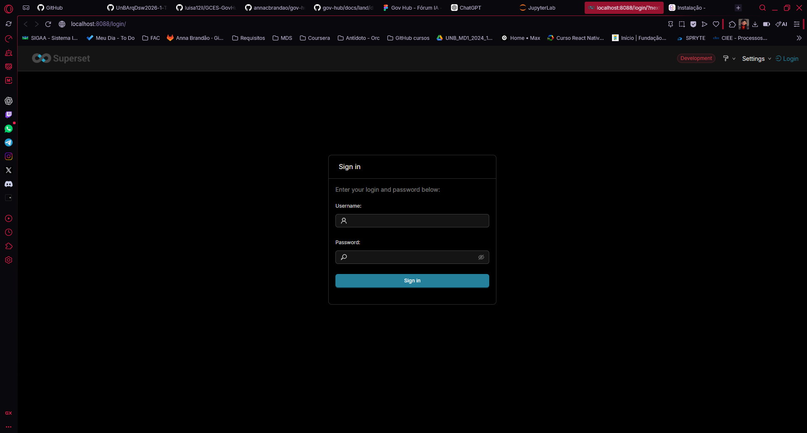
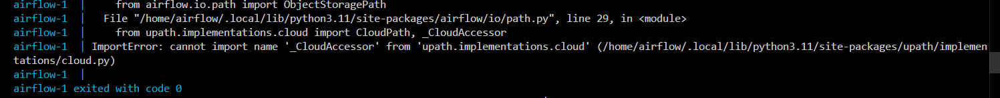
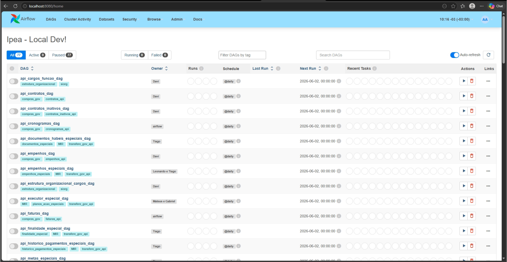
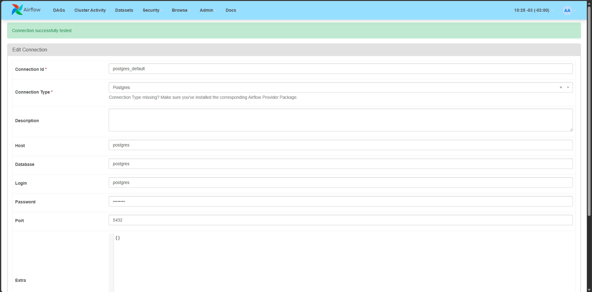
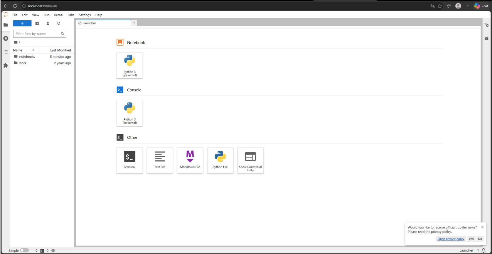
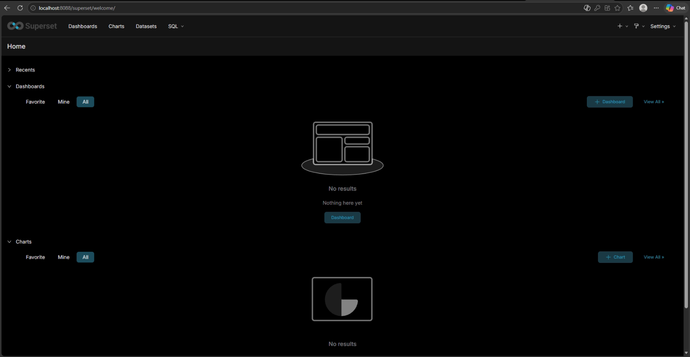
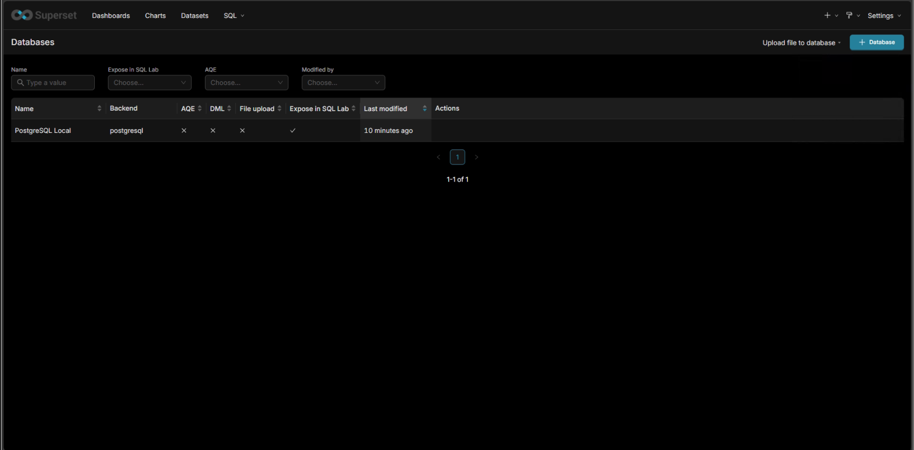
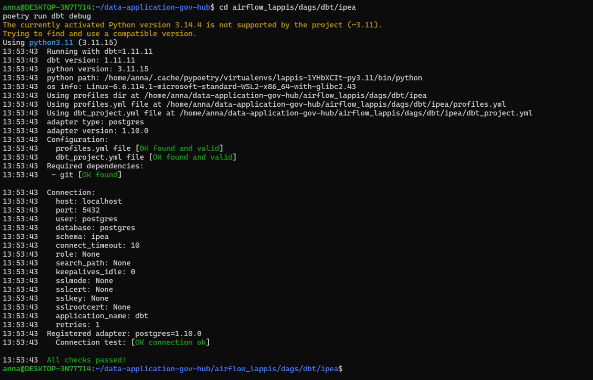
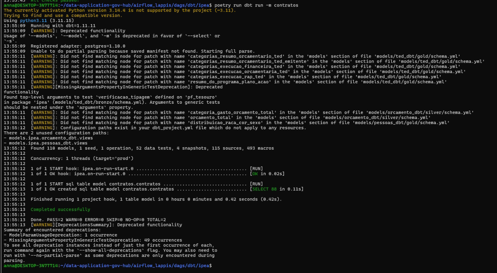

# Diário de Bordo - Cardoso Evangelista Brandão

**Disciplina:** Gerência de Configuração e Evolução de Software (GCES)

**Equipe:** Gov Hub BR

**Comunidade/Projeto de Software Livre:** Gov Hub BR

---

## Sprint 0 – [06/04/2026 – 20/04/2026]

### Resumo da Sprint
Essa sprint inicial teve como foco a familiarização com o projeto Gov Hub e a configuração do ambiente do mesmo, ainda, de maneira mais coletiva o aprendizado do fluxo d>

### Atividades Realizadas
| Data  | Atividade | Tipo (Código/Doc/Discussão/Outro) | Link/Referência | Status |
| ----- | --------- | --------------------------------- | --------------- | ------ |
| 16/04 | Criação do fork | Código | [Fork][link-Fork] | Concluído |
| 16/04 | Leitura do e-book | Estudo | [E-book][link-Ebook] | Concluído |
| 20/04 | Leitura e estudo da documentação do projeto | Estudo | [Documentação][link-Documentação] | Concluído |
| 20/04 | Configuração do ambiente | Código | [Configuração][link-Config] | Incompleto |
| 20/04 | Adicionando meu diário de bordo ao GitHub Pages | Documentação | - | Concluído |

### Detalhamento das Atividades Realizadas

Ao realizar a configuração do ambiente localmente eu consegui com que 2 das 3 ferramentas necessárias fossem abertas.

1. Rodando o Jupyter

<i><b>Fonte:</b> Anna Clara Brandão</i>

 2. Superset rodando

<i><b>Fonte:</b> Anna Clara Brandão</i>

3. Airflow com problemas

Tive problemas ainda não solucionados com o Airflow:

<i><b>Fonte:</b> Anna Clara Brandão</i>

### Maiores Avanços
* Aprendi a rodar a maior parte da aplicação localmente;
* Entendi a organização do repositório após a leitura da documentação e do E-book disponibilizados pela equipe do Gov Hub.

### Maiores Dificuldades
* Dispositivo institucional não permitiu fazer a instalação do Docker, atrasei a configuração pois dependia exclusivamente do meu notebook pessoal, que não estava comigo;
* Abertura de ferramenta Airflow;
* Ambiente demorou para configurar por falta de dependências;
* Dispositivo pessoal não aguentou o uso do Docker.

### Aprendizados
* Fluxo de contribuição do projeto.

### Plano Pessoal para a Próxima Sprint
* [X] Solucionar a abertura da ferramenta Airflow.
* [X] Conferir as issues disponíveis para iniciar alguma contribuição.
* [X] Participar da revisão de código de um colega.
* [X] Preencher meu diário de bordo em paralelo as atividades realizadas (diminuir sobrecarga).

---

## Sprint 1 - [21/04/2026 - 11/05/2026]

### Resumo da Sprint

Nesta sprint continuei tentando resolver meus problemas com a configuração do ambiente GovHub. Descobri que o problema estava na minha máquina, que não suportava o Docke>

### Atividades realizadas

| Data  | Atividade | Tipo (Código/Doc/Discussão/Outro) | Link/Referência | Status |
| ----- | --------- | --------------------------------- | --------------- | ------ |
| 06/05 - 07/05 | Configuração do 0 em máquina emprestada. | Configuração | [Configuração][link-Config] | Concluído |
| 10/05 | Pesquisas sobre possíveis issues para contribuição. | Estudo | [Issues][link-Issues] | Concluído |

### Detalhamento das atividades realizadas

Nessa sprint alcancei a configuração por completa do GovHub:

1. Airflow pós-login rodando

<i><b>Fonte:</b> Anna Clara Brandão</i>

2. Airflow configurado com o banco local

<i><b>Fonte:</b> Anna Clara Brandão</i>

3. Jupyter rodando

<i><b>Fonte:</b> Anna Clara Brandão</i>

4. Superset pós-login rodando

<i><b>Fonte:</b> Anna Clara Brandão</i>

5. Superset com a conexão configurada

<i><b>Fonte:</b> Anna Clara Brandão</i>

6. dbt configurado

<i><b>Fonte:</b> Anna Clara Brandão</i>

7. Rodando modelo de contratos dbt

<i><b>Fonte:</b> Anna Clara Brandão</i>

### Maiores Avanços

* Consegui configurar completamente o ambiente, após muita dificuldade.
* Pude praticar bastante o uso do WSL.
* Finalmente consegui voltar a atenção pras issues do projeto em si.

### Maiores Dificuldades

* O uso do Windows para rodar o projeto se mostrou bastante desafiador, precisei usar o WSL.
* Pouca experiência com WSL.

### Aprendizados

* Aprendi sobre a dificuldade de lidar com os problemas que usar Windows causou na configuração do projeto e contorná-los.
* Mais experiência com o uso do WSL.
* Funcionamento básico do Airflow.
* Funcionamento do padrão de issues.

### Plano Pessoal para a Próxima Sprint

* [X] Escolher após a análise feita nessa sprint uma issue para contribuir.
* [X] Iniciar projeto extra (UDA pipeline) explicado em sala.
* [X] Finalizar alguma atividade (extra, contribuição no GovHub, etc.)

---

## Sprint 2 - [05/05/2026 - 25/05/2026]

### Resumo da Sprint

---

## Sprint 3 - [26/05/2026 - 08/06/2026]

### Resumo da Sprint

[link-Documentação]: https://gov-hub.io/govhub/sobre-projeto/overview/
[link-Fork]: https://github.com/annacbrandao/gov-hub
[link-Ebook]: https://gov-hub.io/govhub/ebook-viewer/
[link-Config]: https://gov-hub.io/govhub/documentacao/instalacao/
[link-Issues]: https://github.com/orgs/GovHub-br/projects/4/views/1?filterQuery=oss
