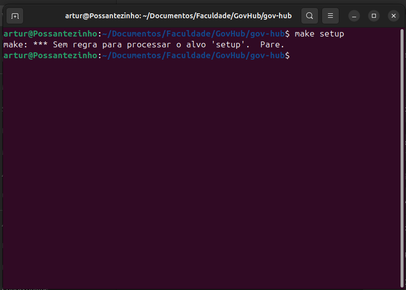

# Diário de Bordo – Artur de Camargos Rodrigues

**Disciplina:** Gerência de Configuração e Evolução de Software (GCES)

**Equipe:** Gov Hub BR

**Comunidade/Projeto de Software Livre:** Gov Hub BR

---

## Sprint 0 – [06/04/2026 – 20/04/2026]

### Resumo da Sprint
Durante a sprint 0 meu foco foi na configuração do ambiente e entendimento do projeto, além de verificar issues.

### Atividades Realizadas
| Data  | Atividade | Tipo (Código/Doc/Discussão/Outro) | Link/Referência | Status |
| ----- | --------- | --------------------------------- | --------------- | ------ |
| 19/08 | Configuração inicial do ambiente | Código | [link - Documentação](https://gov-hub.io/govhub/sobre-projeto/overview/) | Concluído |
| 20/08 | Leitura e estudo da documentação do projeto | Estudo | [link - GitHub](https://github.com/GovHub-br/data-application-gov-hub/issues) | Concluído |

### Maiores Avanços
* Aprendi a rodar a aplicação localmente.
* Corrigi bugs durante a instalação do ambiente.
* Entendi melhor a organização do repositório.
* Verifiquei issues.

### Maiores Dificuldades
* Tive muita dificuldade em rodar o comando make, sofrendo o seguinte erro:

### Aprendizados
* Subir ambiente virtual.
* Fluxo de contribuição do projeto.

### Plano Pessoal para a Próxima Sprint
* [ ] Contribuir com pelo menos 1 PR.
* [ ] Participar da revisão de código de um colega.