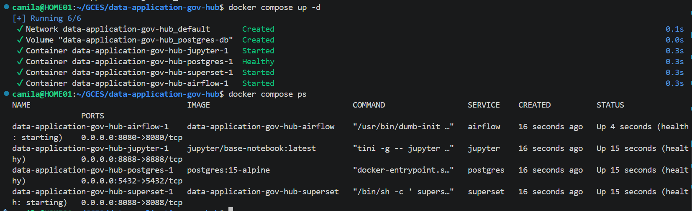
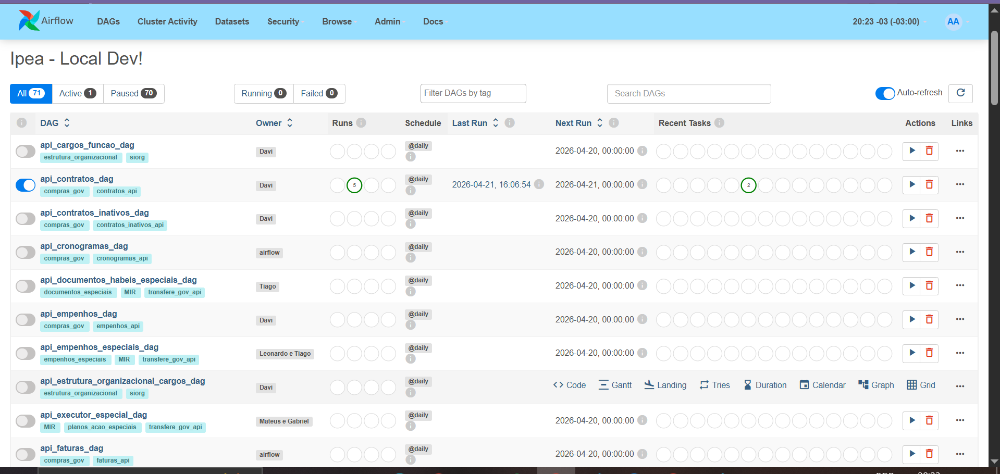
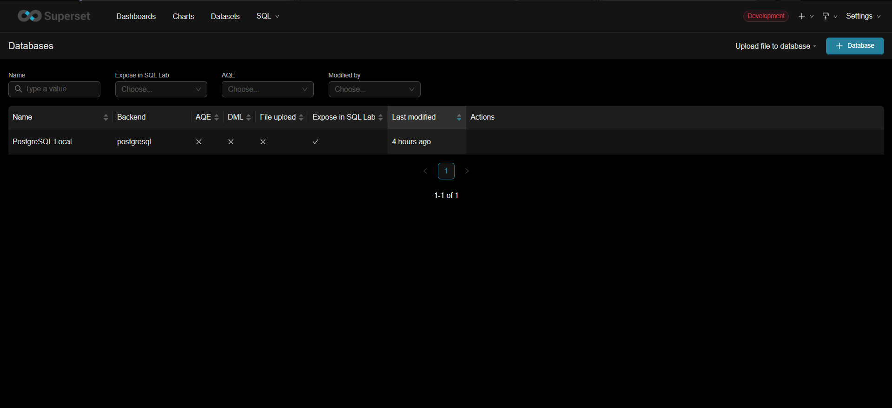
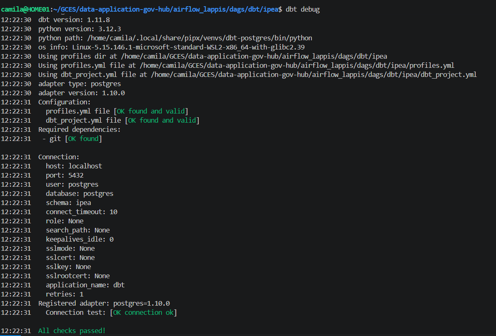
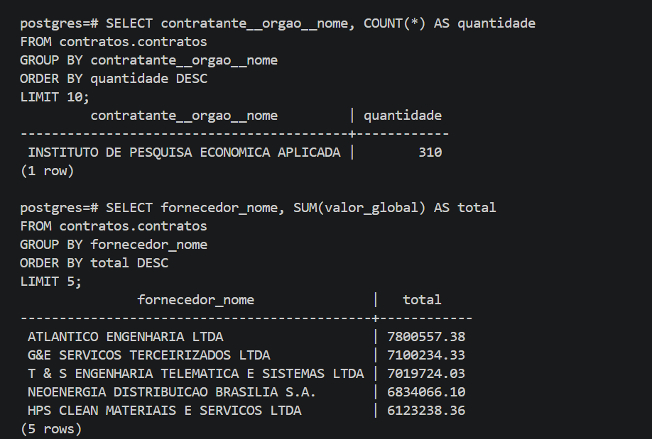

# Diário de Bordo – Camila Silva Cavalcante

**Disciplina:** Gerência de Configuração e Evolução de Software (GCES)

**Equipe:** Gov Hub BR

**Comunidade/Projeto de Software Livre:** Gov Hub BR

---

## Sprint 0 – [06/04/2026 – 20/04/2026]

### Resumo da Sprint

Durante esta sprint, que foi focada na organização do grupo e familiarização com o projeto. Realizei a criação do fork, estudei a documentação técnica e políticas de contribuição do projeto. Fiz a configuração completa do ambiente de desenvolvimento do projeto, incluindo a instalação e ajuste de ferramentas.

### Atividades Realizadas

| Data  | Atividade | Tipo  | Link/Referência | Status |
| ----- | --------- | --------------------------------- | --------------- | ------ |
| 15/04 | Leitura e estudo da documentação do projeto | Estudo | [Documentação](https://gov-hub.io/govhub/sobre-projeto/overview/) | Concluído |
| 18/04 | Mapeamento das políticas de contribuição | Estudo | [Guia de Contribuição](https://github.com/GovHub-br/gov-hub?tab=contributing-ov-file) | Concluído |
| 19/04 | Leitura do E-book | Estudo | [E-book](https://gov-hub.io/govhub/ebook-viewer/) | Concluído |
| 19/04 | Fork do repositório | Código | [Fork](https://github.com/CamilaSilvaC/gov-hub) | Concluído |
| 19/04 | Configuração do ambiente | Código | [Guia de Instalação](https://gov-hub.io/govhub/documentacao/instalacao/) | Concluído |

### Detalhamento das Atividades Realizadas
Para garantir que o ambiente estava bem configurado e que o projeto GovHub funcionava corretamente, foram feitos testes práticos utilizando todos os componentes da arquitetura (Docker, Airflow, PostgreSQL, dbt e Superset). A seguir, estão descritas as principais etapas realizadas:

1. Execução do ambiente via Docker

Print da tela mostrando os containers do Docker.

<i><b>Fonte:</b> Camila Silva Cavalcante</i>

2. Ingestão de dados com Airflow

Painel do Airflow mostrando as DAGs e a DAG api_contratos_dag executada.

<i><b>Fonte:</b> Camila Silva Cavalcante</i>

3. Superset — Conexão com Banco e Exploração Inicial

Painel do Superset com a conexão com o banco PostgreSQL local configurada.

<i><b>Fonte:</b> Camila Silva Cavalcante</i>

4. Configuração e Validação do DBT

O comando dbt debug foi executado com sucesso, validando os arquivos de configuração (profiles.yml e dbt_project.yml) e a conexão com o banco PostgreSQL.

<i><b>Fonte:</b> Camila Silva Cavalcante</i>

5. Consultas no banco de dados

Mostra os resultados das consultas SQL executadas para validar e explorar os dados da tabela contratos.contratos.

<i><b>Fonte:</b> Camila Silva Cavalcante</i>

### Maiores Avanços

* Consegui configurar completamente um ambiente complexo utilizando Docker + WSL.
* Entendi melhor a organização do repositório.
* Entendimento prático do funcionamento do Airflow, PostgreSQL e dbt.

### Maiores Dificuldades

* Dificuldade ao configurar o ambiente por falta de dependências.
* Incompatibilidade de versão do Python (3.12 vs 3.11 exigido pelo projeto).

### Aprendizados

* Fluxo de contribuição do projeto.
* Como configurar ambientes de desenvolvimento usando Docker e WSL.
* Funcionamento básico do Airflow (DAGs, Variables, Connections).
* Percebi melhor como seguir o passo a passo da documentação ajuda a evitar erros na configuração.

### Plano Pessoal para a Próxima Sprint

* [ ] Analisar as issues e encontrar uma para contribuir.
* [ ] Atuar em conjunto com a **Luísa Ferreira** para o diagnóstico e resolução de problemas técnicos identificados na nossa issue.
* [ ] Contribuir com pelo menos 1 PR.