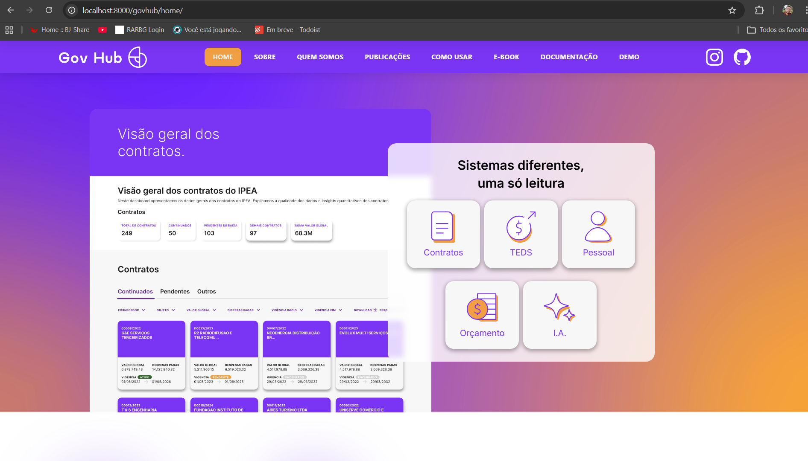
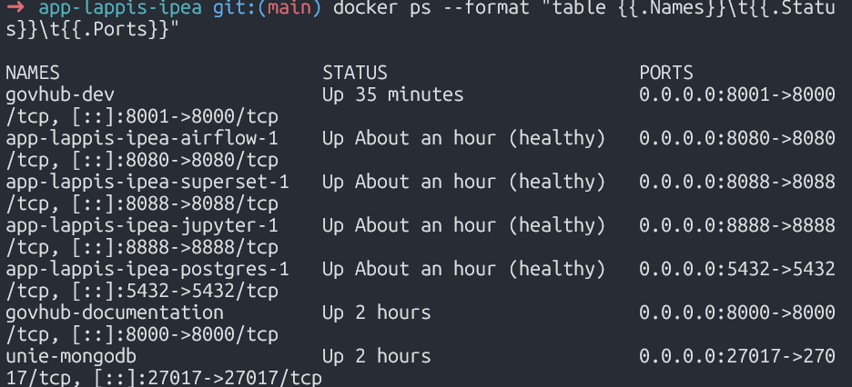
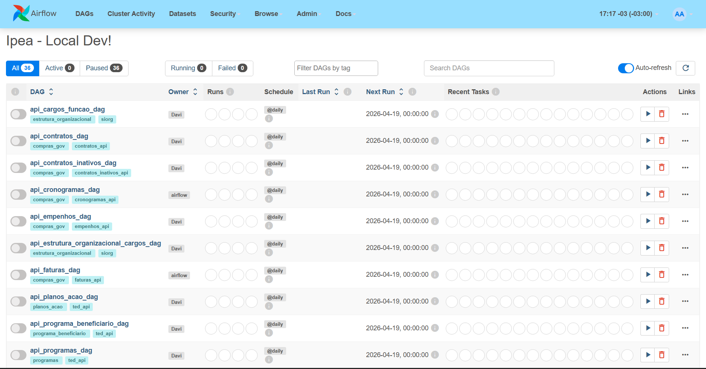

# Diário de Bordo – Gabriel Saraiva Canabrava

**Disciplina:** Gerência de Configuração e Evolução de Software (GCES)

**Equipe:** Gov Hub BR

**Comunidade/Projeto de Software Livre:** Gov Hub BR

---

## Sprint 0 – [06/04/2026 – 20/04/2026]

### Resumo da Sprint

Foco integral em configurar, inicializar e diagnosticar a infraestrutura principal do **Gov Hub BR** de forma local. Atuei desde a rodagem da documentação oficial (`Gitpage/govhub-dev`) até a estabilização completa da Stack de Dados (`app-lappis-ipea`), realizando deploy via Docker-Compose e conectando o Apache Superset ao Apache Airflow e Banco de Dados (PostgreSQL) interno. Enfrentei também o troubleshooting ativo de falhas nos drivers e dependências dos pipelines.

### Atividades Realizadas

| Data  | Atividade | Tipo (Código/Doc/Discussão/Outro) | Link/Referência | Status |
| ----- | --------- | --------------------------------- | --------------- | ------ |
| 20/04 | Criação do fork | Código | [Link](https://github.com/gabrielsarcan/GCES-GovHub-relatorios) | Concluído |
| 20/04 | Estudo das políticas de contribuição e diretrizes do projeto | Estudo | [Guia de Contribuição](https://gov-hub.io/govhub/comunidade/guia-contribuicao/) | Concluído |
| 20/04 | Configuração do ambiente local | Código | [Guia de Instalação](https://gov-hub.io/govhub/documentacao/instalacao/#make-test) | Concluído |

### Detalhamento das Atividades Realizadas

Para consolidar a configuração do ambiente e validar as resoluções de problemas no projeto GovHub, realizei testes e validações locais. Abaixo estão detalhadas as etapas principais:

1. Rodando Interface da Plataforma GovHub

Página inicial do Gov Hub BR em execução local (localhost:8000), demonstrando os domínios disponíveis

<i><b>Fonte:</b> Gabriel Saraiva Canabrava</i>

2. Containers Docker em Execução

Terminal listando o status saudável (healthy) via `docker ps` provando que a stack completa do Data Warehouse engatou corretamente.

<i><b>Fonte:</b> Gabriel Saraiva Canabrava</i>

3. Configurando Variáveis no Airflow e Disparando DAG

Configuração das Variáveis Ambientais no Airflow mapeando `airflow_orgao` para "IPEA" garantindo que a rotina automatizada de extração efetuasse as requisições REST com a chave da Unidade Gestora correta.

<i><b>Fonte:</b> Gabriel Saraiva Canabrava</i>

### Maiores Avanços
* Entendi a comunicação entre os vários contêineres e a identificação de *hostnames*.
* Consegui abrir o SQL Lab para operar consultas no schema alimentado pelo *Data Warehouse* interno.
* Aprendi a preencher as lacunas de um banco vazio configurando as variáveis corretas dentro do Apache Airflow e manipulando CLI Docker.

### Maiores Dificuldades
* Configuração sugerida nas documentações apontou conflito com os controles de pacotes do host Ubuntu (PEP-668 / *externally managed env*), exigindo o isolamento da instalação e execução via ferramentas específicas na máquina primária.
* Falta da extensão `psycopg2` na montagem do contêiner padrão do Apache Superset exigiu intervenção minuciosa diretamente do shell do container isolado.
* Entender primeiramente todo o fluxo inicial da arquitetura Medallion do projeto, identificando a falta de ingestão padrão de arquivos e localizando que a resposta aos inserts estava nos workers do Airflow.

### Aprendizados
* Intervenção e manipulação ágil dentro dos ambientes containerizados para instalar bibliotecas cruciais em serviços como Superset.
* Dinâmica e fluxo dos pipelines REST engatilhados por variáveis DAG para trazer dados reais até a montagem DW local.
* Identificação clara de dependências base do Python formatados para Data Environments com bibliotecas cruciais como o SQLAlchemy.

### Plano Pessoal para a Próxima Sprint
* [ ] Buscar good first issues para começar a contribuir.
* [ ] Contribuir com pelo menos 1 PR.
* [ ] Participar da revisão de código de um colega.
## Sprint 1

### Resumo da Sprint

Durante esta sprint, o foco principal foi trazer melhorias para o projeto através da implementação de testes unitários e correções de bugs. Durante a revisão da classe `ClienteBase` (que orquestra as requisições HTTP para as integrações do projeto), foi identificado que o sistema não possuía cobertura de testes unitários automatizados. Ao iniciar o desenvolvimento dos testes usando `pytest` e `unittest.mock`, foi descoberto um bug lógico silencioso na estrutura de repetição (retries) quando uma API fica indisponível.

### Atividades Realizadas

| Data  | Atividade | Tipo (Código/Doc/Discussão/Outro) | Link/Referência | Status |
| ----- | --------- | --------------------------------- | --------------- | ------ |
| 11/05 | Correção de bug no `ClienteBase` e adição de testes | Código | [PR #269](https://github.com/GovHub-br/data-application-gov-hub/pull/269) | Concluído |

### Detalhamento das Atividades Realizadas

#### O Bug Encontrado 🐛
A condição do loop para lançar a exceção final era `if attempt < self.DEFAULT_MAX_RETRIES:`. Como a função `range()` conta até `MAX_RETRIES - 1`, essa condição era avaliada como `True` em todas as tentativas. O resultado é que o bloco `else`, responsável por levantar o `raise Exception("API failed...")`, nunca era alcançado. O erro era engolido pelo sistema, retornando um status 500 sem gerar a falha explícita esperada pelo orquestrador (Airflow).

#### Mudanças Implementadas 🚀
* **Correção do Bug (Bugfix):** Alterada a condição de verificação para `if attempt < self.DEFAULT_MAX_RETRIES - 1:`, garantindo que a exceção seja lançada corretamente após esgotadas todas as tentativas.
* **Cobertura de Testes (Testes Unitários):**
  * Criação do arquivo `tests/test_cliente_base.py`.
  * Adição de testes automatizados mockando a biblioteca `httpx` e `time.sleep` (para execução instantânea).
  * Cobertura de cenários: Sucesso imediato, Sucesso após Retry (falha temporária), Limite máximo de tentativas excedido (falha total) e passagem correta de parâmetros (como timeouts customizados).
* **Limpeza (Refactor):** Remoção do arquivo obsoleto `test_foo.py`.

#### Impacto
Essas mudanças garantem que as DAGs do Airflow falhem da maneira correta (acionando alertas caso configurados) quando uma API governamental cai de vez, e introduz a base para que outros clientes do projeto comecem a ser testados de forma contínua e sem dependência de internet.

### Maiores Avanços

* Implementação de testes unitários automatizados para a classe base de requisições (`ClienteBase`).
* Descoberta e correção de um bug lógico no mecanismo de *retry* que engolia as exceções da API.

### Maiores Dificuldades

* Lidar com bloqueios de lint (`E501`) pré-existentes no projeto em arquivos antigos não relacionados à PR atual.

### Aprendizados

* Uso do `pytest` e `unittest.mock` para simular requisições HTTP (`httpx`) e controle de tempo (`time.sleep`) nos testes automatizados.
* A importância de testar os limites e condições de repetição no tratamento de exceções (retries).

### Plano Pessoal para a Próxima Sprint

* [ ] Acompanhar a revisão e o merge do PR #269.
* [ ] Expandir a cobertura de testes para outros componentes do sistema.
* [ ] Buscar novas issues relevantes para contribuir.

---

## Sprint 2

### Resumo da Sprint

Durante esta sprint, atuei no repositório `data-application-gov-hub` (que utiliza Python, Poetry e Airflow) com o objetivo de resolver a issue #315. O foco foi a criação de um cliente de integração para a API da MRV, juntamente com seus respectivos testes unitários, para garantir o correto funcionamento dos cenários de sucesso e a devida tolerância a falhas.

### Atividades Realizadas

| Data  | Atividade | Tipo (Código/Doc/Discussão/Outro) | Link/Referência | Status |
| ----- | --------- | --------------------------------- | --------------- | ------ |
| 27/05 | Criação do `ClienteMRV` e testes unitários | Código | Issue #315, Branch `feature/cliente-mrv` | Commitado (push realizado) |

### Detalhamento das Atividades Realizadas

#### Implementações (Feature) 🚀
* **`airflow_lappis/plugins/cliente_mrv.py`:**
  * Criação da classe `ClienteMRV` que herda de `ClienteBase` (classe já existente que encapsula requisições usando `httpx.Client` e trata as regras de retentativa/timeouts).
  * Adição do método `consultar_empreendimentos(params)`, que realiza um GET no endpoint `/empreendimentos` repassando os parâmetros de busca informados.
* **`tests/test_cliente_mrv.py`:**
  * Desenvolvimento de testes unitários utilizando o `pytest` e mockando as chamadas HTTP com `@patch("httpx.Client.request")`.
  * **Cenário de Sucesso:** Validação de que o cliente envia corretamente a requisição GET `/empreendimentos`, repassa os `kwargs` esperados e retorna um payload validado (como uma lista mockada contendo o nome e ID do empreendimento).
  * **Cenário de Falha:** Simulação de um erro `HTTPStatus.NOT_FOUND` (mockando `raise_for_status` para disparar `httpx.HTTPStatusError`). Assim, foi possível validar se a mecânica de *retry* presente na `ClienteBase` tenta a requisição `DEFAULT_MAX_RETRIES` vezes antes de lançar a exceção final.

#### Estado Atual e Comandos Executados
* O código já se encontra commitado na branch `feature/cliente-mrv` e foi "pushado" (`git push -u origin feature/cliente-mrv`).
* **Observação:** O ambiente Python do Poetry apresentou problemas ao rodar os hooks nativos de linting e formatação (ex: `black` via `Makefile` e `pre-commit`). Para contornar temporariamente e salvar o progresso, as operações de commit e push foram forçadas com a tag `--no-verify`.

### Maiores Avanços

* Criação e validação do novo cliente de integração MRV em ambiente de testes.
* Simulação eficiente de cenários de erro HTTP com mocks, provando que a lógica de *retries* da classe pai atua corretamente no contexto da filha (`ClienteMRV`).

### Maiores Dificuldades

* Problemas no ambiente Python (Poetry) ao tentar rodar os hooks nativos de linting e formatação durante os commits, sendo necessário usar `--no-verify` para enviar o código para o GitHub.

### Aprendizados

* Implementação de novos clientes de integração reusando e estendendo comportamentos de classes base (`ClienteBase`).
* Aplicação avançada de `mock` (`@patch`) para simular cenários de sucesso HTTP e disparar erros (`HTTPStatusError`) utilizando o `pytest`.

### Plano Pessoal para a Próxima Sprint

* [ ] Acompanhar a revisão da branch `feature/cliente-mrv` (Issue #315).
* [ ] Buscar novas issues relevantes para contribuir.