# Diário de Bordo – Gabryel Nicolas Soares de Sousa

**Matricula**: 221022570

**Disciplina:** Gerência de Configuração e Evolução de Software (GCES)

**Equipe:** Gov Hub BR

**Comunidade/Projeto de Software Livre:** Gov Hub BR

> **Observação:** Eu fazia parte do projeto KDE Frameworks, mas migrei para o Gov Hub BR a partir da sprint 2

---

## Sprint 0 – [06/04/2026 – 20/04/2026]

### Resumo da Sprint

Sprint voltada ao onboarding completo no projeto KDE Frameworks. Fiz a leitura detalhada do guia de contribuição e do código de conduta da comunidade, criei contas nas principais plataformas de colaboração (KDE Invent e Matrix) e explorei a arquitetura do KDE Frameworks. Estudei como os subprojetos são organizados em 4 tiers de dependências e me aprofundei em projetos em desenvolvimento, como o Language Bindings (Ship Frameworks via Pip).

### Atividades Realizadas

| Data  | Atividade                                      | Tipo                              | Link/Referência                                                | Status    |
|-------|------------------------------------------------|-----------------------------------|----------------------------------------------------------------|-----------|
| 07/04 | Leitura do guia de contribuição do KDE         | Estudo                            | [Get Involved](https://community.kde.org/Get_Involved)         | Concluído |
| 09/04 | Leitura e compreensão do código de conduta     | Estudo                            | [KDE Code of Conduct](https://kde.org/code-of-conduct/)        | Concluído |
| 11/04 | Criação de conta no KDE Invent                 | Configuração                      | [invent.kde.org](https://invent.kde.org)                       | Concluído |
| 12/04 | Criação de conta no Matrix                     | Configuração                      | [matrix.org](https://matrix.org)                               | Concluído |
| 15/04 | Exploração inicial da estrutura de subprojetos | Estudo                            | [KDE Frameworks](https://api.kde.org/)                         | Concluído |
| 20/04 | Documentação do diário de bordo                | Documentação                      | -                                                              | Concluído |

### Detalhamento das Atividades Realizadas

Prints abaixo registram as etapas de onboarding e exploração do projeto:

1. KDE Community Wiki — Get Involved

Acesso à página de entrada para novos contribuidores, com orientações sobre como entrar em contato com a comunidade e diferentes formas de contribuir:

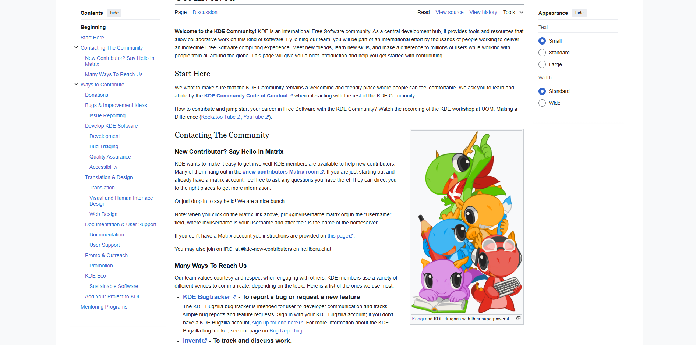

<i><b>Fonte:</b> Gabryel Sousa</i>

2. KDE Community — Code of Conduct

Leitura do Código de Conduta oficial da comunidade KDE, com os valores base de convivência: ser considerado, respeitoso, colaborativo e pragmático:

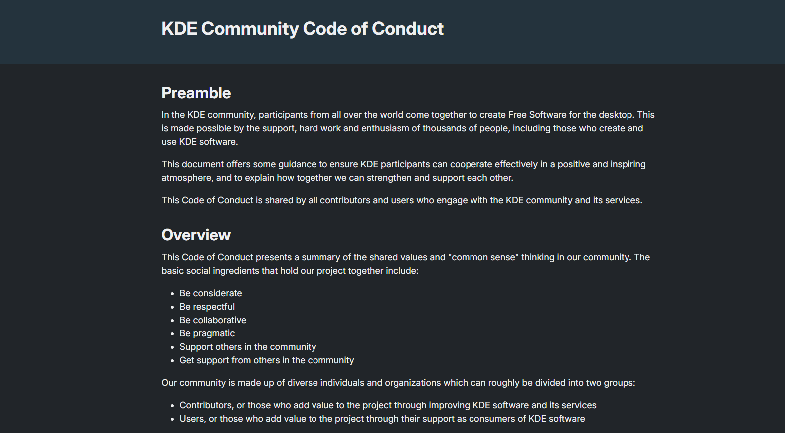

<i><b>Fonte:</b> Gabryel Sousa</i>

3. KDE Developer Portal — Documentação

Exploração do portal de desenvolvimento, com acesso aos guias de Getting Started, Building KDE software, Kirigami, KXmlGui, Python e Rust:

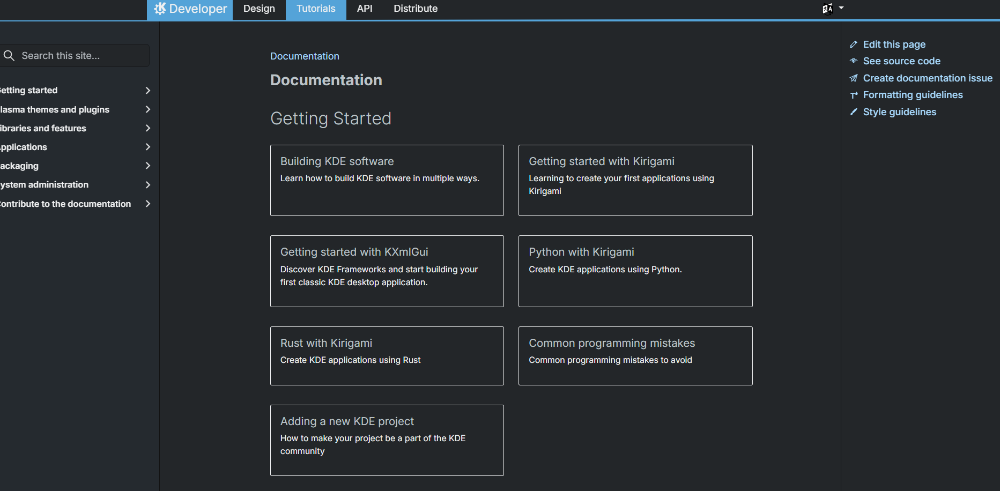

<i><b>Fonte:</b> Gabryel Sousa</i>

4. Ship Frameworks via Pip

Exploração da página em desenvolvimento sobre distribuição dos KDE Frameworks via pip, parte das KDE Goals para facilitar o desenvolvimento com Python:

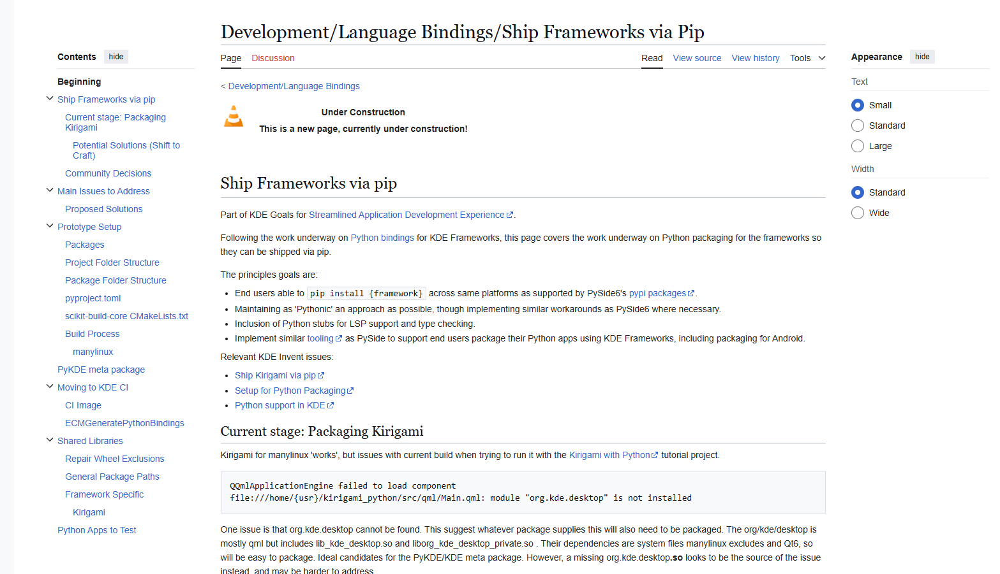

<i><b>Fonte:</b> Gabryel Sousa</i>

---

### Maiores Avanços

- Configuração das contas nas plataformas KDE (Invent e Matrix) concluída com êxito.
- Entendimento das diretrizes de contribuição e do código de conduta da comunidade.
- Visão geral consolidada sobre a estrutura do KDE Frameworks.

### Maiores Dificuldades

- A quantidade de subprojetos e a forma como se relacionam tornou a compreensão inicial bastante trabalhosa.

### Aprendizados

- Entendimento do código de conduta e das responsabilidades dentro de uma comunidade colaborativa.
- Diretrizes e boas práticas de contribuição no ecossistema KDE e em projetos open source.
- Criação de contas e autenticação nas plataformas KDE (Invent e Matrix).

### Plano Pessoal para a Próxima Sprint

- [ ] Investigar com mais detalhes pelo menos 1 ou 2 subprojetos do KDE Frameworks.
- [ ] Mapear e analisar uma issue adequada para contribuidores iniciantes.
- [ ] Subir o ambiente local de desenvolvimento.
- [ ] Submeter um primeiro commit ou pull request simples para praticar o fluxo de contribuição.

---

## Sprint 1 – [21/04/2026 – 11/05/2026]

### Resumo da Sprint

Sprint voltada à busca pela primeira issue para contribuir. Realizei o clone do repositório e iniciei os estudos sobre a documentação mais afundo. Nenhuma contribuição de código nesta sprint.

> Após a apresentação da sprint 1, fui remanejado para o projeto Gov Hub BR, então a partir da sprint 2 minhas atividades serão relacionadas ao projeto Gov Hub BR.

### Atividades Realizadas

| Data  | Atividade                                          | Tipo          | Link/Referência                                                | Status    |
|-------|----------------------------------------------------|---------------|----------------------------------------------------------------|-----------|
| 09/05 | Leitura das issues de documentação                 | Estudo        | [Repositório](https://invent.kde.org/teams/goals)              | Concluído |
| 10/05 | Estudo da documentação dos tiers do KDE Frameworks | Estudo        | [KDE API](https://api.kde.org/)                                | Concluído |
| 10/05 | Clone do repositório e preparação do ambiente      | Configuração  | [Repositório](https://invent.kde.org/teams/goals)              | Concluído |
| 11/05 | Estudo das libs                                    | Estudo        | [KDE API](https://api.kde.org/)                                | Concluído |
| 12/05 | Documentação do diário de bordo                    | Documentação  | -                                                              | Concluído |

### Detalhamento das Atividades Realizadas

Os seguintes prints documentam o processo de busca pela primeira issue e exploração das libs do KDE Frameworks:

1. KDE Frameworks — Tier 1

Exploração das libs do Tier 1, que dependem apenas do Qt e podem ser usadas em qualquer projeto Qt:

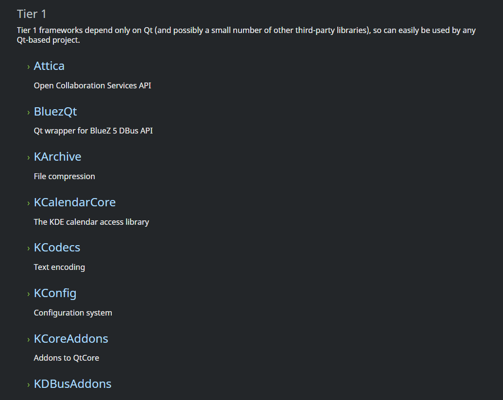

<i><b>Fonte:</b> Gabryel Sousa</i>

2. KDE Frameworks — Tier 2

Exploração das libs do Tier 2, que dependem do Tier 1 e ainda possuem dependências gerenciáveis:

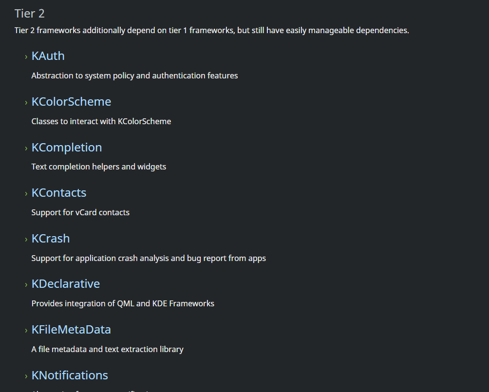

<i><b>Fonte:</b> Gabryel Sousa</i>

3. KDE Frameworks — Tier 3

Exploração das libs do Tier 3, pacotes mais completos e com dependências mais complexas:

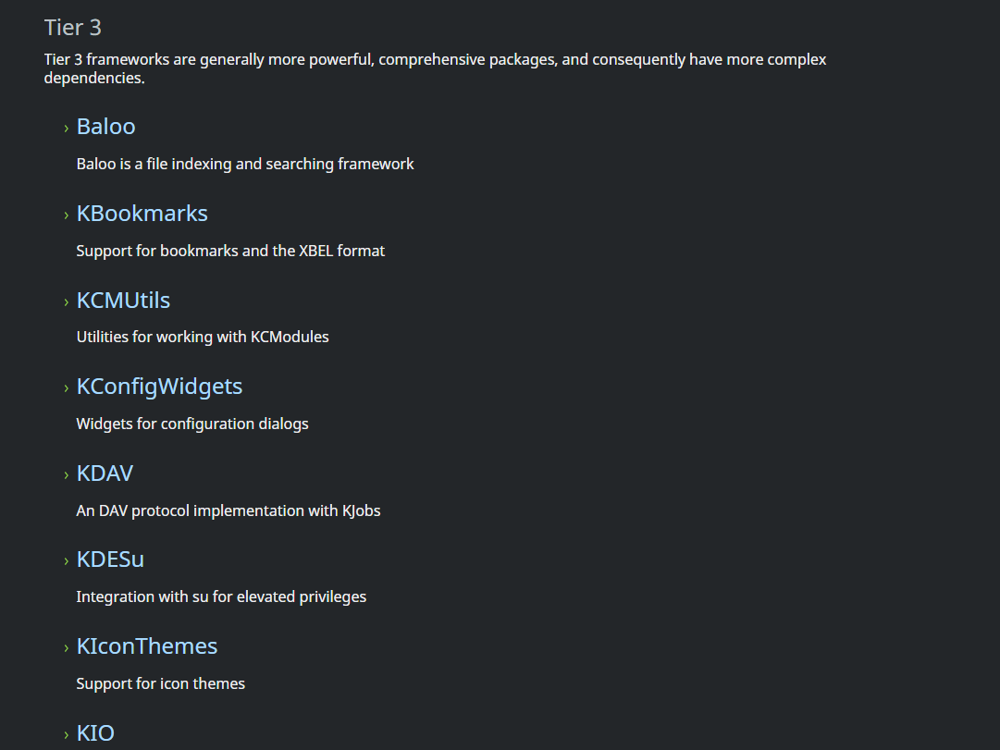

<i><b>Fonte:</b> Gabryel Sousa</i>

4. KDE Frameworks — Tier 4 e Outras Libs

Exploração das libs do Tier 4, compostas por plugins que atuam em segundo plano, e das outras bibliotecas oferecidas pela comunidade KDE:

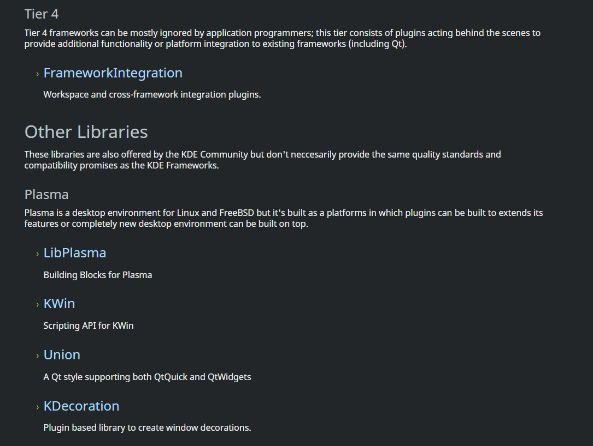

<i><b>Fonte:</b> Gabryel Sousa</i>

---

### Maiores Avanços

- Leitura completa da documentação de todos os tiers do KDE Frameworks.
- Identificação de uma issue de documentação adequada para contribuidores iniciantes.
- Clone do repositório realizado com sucesso.

### Maiores Dificuldades

- Navegar e entender a grande quantidade de libs distribuídas nos diferentes tiers.

### Aprendizados

- Estrutura e organização dos 4 tiers do KDE Frameworks e suas diferenças de dependência.
- Diferenças iniciais entre os sistemas de documentação doxygen e qdoc.
- Fluxo de clone de repositórios no KDE Invent.

### Plano Pessoal para a Próxima Sprint

- [ ] Iniciar a migração da documentação de pelo menos um arquivo das libs.
- [ ] Submeter um primeiro merge request com a contribuição de documentação.
- [ ] Interagir com a comunidade nos canais do Matrix para tirar dúvidas sobre o processo.

---

## Sprint 2 – [12/05/2026 – 26/05/2026]

### Resumo da Sprint

Sprint dedicada à transição para o projeto Gov Hub BR. Após o remanejamento do projeto KDE Frameworks, estudei a documentação e a arquitetura do novo projeto, configurei o ambiente local de desenvolvimento e realizei uma análise inicial das issues disponíveis. Nenhuma contribuição de código nesta sprint.

### Atividades Realizadas

| Data  | Atividade                                         | Tipo          | Link/Referência                                                                                                              | Status    |
|-------|---------------------------------------------------|---------------|------------------------------------------------------------------------------------------------------------------------------|-----------|
| 23/05 | Estudo da documentação e arquitetura do projeto   | Estudo        | [Gov Hub BR - Documentação](https://gov-hub.io/govhub/comunidade/guia-contribuicao/)                                        | Concluído |
| 23/05 | Configuração do ambiente local de desenvolvimento | Configuração  | -                                                                                                                            | Concluído |
| 24/05 | Análise das issues                                | Análise       | [Gov Hub BR - Issues](https://github.com/GovHub-br/data-application-cidades/issues?page=2)                                  | Concluído |
| 24/05 | Documentação do diário de bordo                   | Documentação  | -                                                                                                                            | Concluído |

### Detalhamento das Atividades Realizadas

Os seguintes prints documentam o processo de transição e exploração do projeto Gov Hub BR:

1. Gov Hub BR — Guia de Contribuição

Leitura do guia de contribuição do projeto, com orientações sobre fork do repositório, criação de branches e boas práticas de colaboração:

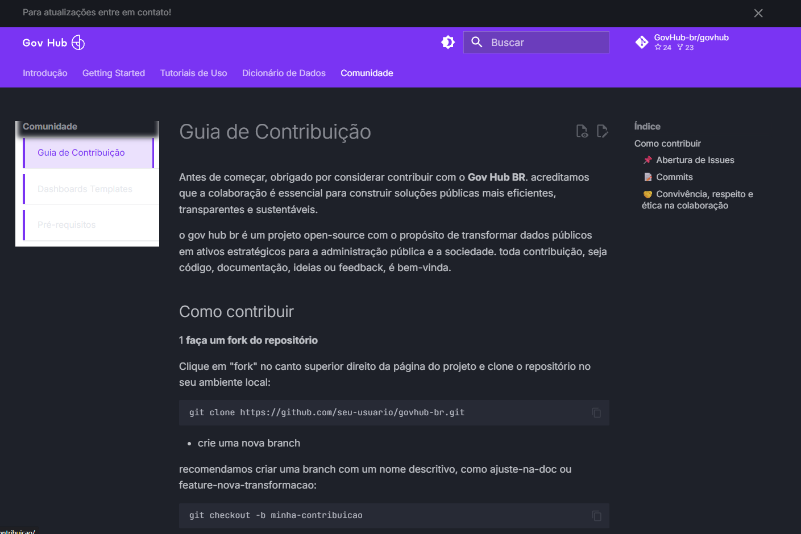

<i><b>Fonte:</b> Gabryel Sousa</i>

2. Gov Hub BR — Análise de Issues

Exploração das issues abertas no repositório, com features e tasks:

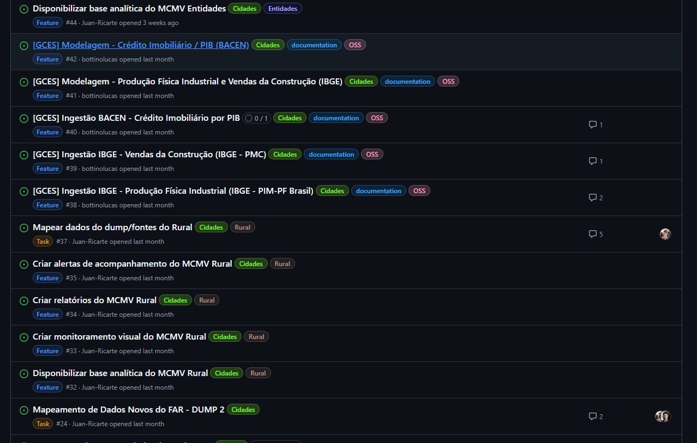

<i><b>Fonte:</b> Gabryel Sousa</i>

---

### Maiores Avanços

- Entendimento da arquitetura e do fluxo de desenvolvimento do Gov Hub BR.
- Leitura detalhada do guia de contribuição do projeto.
- Configuração do ambiente local de desenvolvimento concluída com êxito.
- Levantamento das issues abertas e identificação de oportunidades de contribuição.

### Maiores Dificuldades

- A configuração do ambiente local e a assimilação da estrutura do projeto demandaram um esforço inicial relevante.

### Aprendizados

- Funcionamento da arquitetura e do ciclo de desenvolvimento do Gov Hub BR.
- Etapas necessárias para configurar o ambiente local do projeto.
- Panorama geral das issues disponíveis e das frentes de contribuição possíveis.
- Diretrizes e boas práticas de contribuição adotadas pelo projeto Gov Hub BR.

### Plano Pessoal para a Próxima Sprint

- [ ] Iniciar o desenvolvimento de novas features ou correções de bugs no projeto.
- [ ] Aprofundar os estudos sobre o projeto.
- [ ] Contribuir com mais MRs.
- [ ] Participar ativamente de code reviews junto aos demais membros da equipe.

---

## Sprint 3 – [27/05/2026 – 08/06/2026]

### Resumo da Sprint

Sprint dedicada à realização do Projeto Individual 4, cujo objetivo foi construir um pipeline de Análise de Dados Não Estruturados (UDA) para o setor habitacional. O projeto coleta PDFs das Centrais de Resultados (RI) de incorporadoras, extrai métricas operacionais com apoio de LLM (GPT-4o), persiste os dados estruturados com linhagem em SQLite e disponibiliza uma API REST para alimentar um boletim de conjuntura.

Durante a sprint, implementei uma arquitetura composta por polling das centrais de RI, cálculo de hash SHA-256 para idempotência, parsing com PyMuPDF, extração semântica com GPT-4o e contrato Pydantic, persistência em SQLite e endpoints FastAPI documentados via Swagger. A entrega foi validada com dados reais de seis empresas: MRV, Cury, Tenda, Plano & Plano, Direcional e Pacaembu.

### Atividades Realizadas

| Data  | Atividade | Tipo | Link/Referência | Status |
|-------|-----------|------|-----------------|--------|
| 08/06 | Análise da especificação do Projeto Individual 4 e do boletim de conjuntura de referência | Estudo | [commit](https://github.com/gabryelns/Projetos-Individuais-2026-1/commit/3f53aa3c9abd589acddea91b06dbd50d6d597800) | Concluído |
| 08/06 | Definição da arquitetura do pipeline UDA com polling, SQLite, LLM e API REST | Arquitetura | [commit](https://github.com/gabryelns/Projetos-Individuais-2026-1/commit/9d562c84f6bebc42bbac97edae0a77d63cdc2e8e) | Concluído |
| 08/06 | Implementação da camada de persistência, catálogo de documentos, linhagem e idempotência por SHA-256 | Código | [commit](https://github.com/gabryelns/Projetos-Individuais-2026-1/commit/f189597bdf1c67668954648b396678d8fdde69d8) | Concluído |
| 08/06 | Implementação do processamento de PDFs com PyMuPDF e extração Full-Scan | Código | [commit](https://github.com/gabryelns/Projetos-Individuais-2026-1/commit/d4a65405964ea760784262c44c9af9d4087363e9) | Concluído |
| 08/06 | Implementação da extração com GPT-4o, contrato Pydantic e validação de respostas | Código/Teste | [commit](https://github.com/gabryelns/Projetos-Individuais-2026-1/commit/87bd7a28edd50c41e46367f0369a7591c47b20fa) | Concluído |
| 08/06 | Implementação da API FastAPI, endpoints de conjuntura e catálogo, documentação Swagger | Código/Doc | [commit](https://github.com/gabryelns/Projetos-Individuais-2026-1/commit/87bd7a28edd50c41e46367f0369a7591c47b20fa) | Concluído |
| 08/06 | Validação com boletim real contendo dados de 6 empresas, persistindo métricas e evidências | Teste | [commit](https://github.com/gabryelns/Projetos-Individuais-2026-1/commit/6bd1dc9eecac20961fcaf4a978490cfbbf02b69a) | Concluído |
| 08/06 | Documentação final, README e abertura do PR do projeto | Documentação | [commit](https://github.com/gabryelns/Projetos-Individuais-2026-1/commit/83c6c10f58b1db67c6daa788df5a2287df45a29c) | Concluído |

### Detalhamento das Atividades Realizadas

1. Banco de dados inicializado

Evidência da inicialização bem-sucedida do banco SQLite, com o catálogo de linhagem e as tabelas do pipeline criadas corretamente:

<i><b>Fonte:</b> Gabryel Sousa</i>

2. PDF processado pelo GPT-4o

Evidência do processamento completo de um PDF pelo pipeline: extração de texto, envio ao GPT-4o, validação Pydantic e persistência dos dados de 6 empresas no banco:

<i><b>Fonte:</b> Gabryel Sousa</i>

3. Idempotência garantida

Evidência do mecanismo de idempotência: ao processar o mesmo PDF pela segunda vez, o sistema identifica o hash SHA-256 já registrado e ignora o arquivo sem acionar o GPT-4o:

<i><b>Fonte:</b> Gabryel Sousa</i>

4. API REST retornando dados estruturados

Resposta do endpoint `/api/conjuntura?ano=2025&trimestre=3`, retornando as métricas extraídas com linhagem completa incluindo URL de origem, hash do documento e timestamp de processamento:

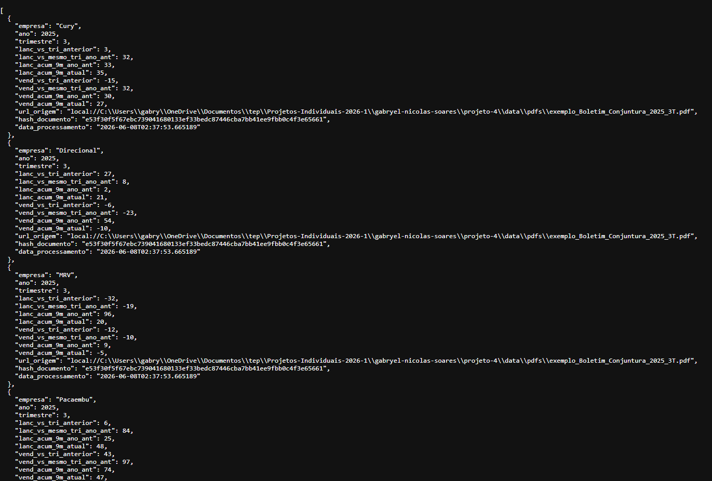

<i><b>Fonte:</b> Gabryel Sousa</i>

5. Swagger UI com endpoints documentados

Interface Swagger/OpenAPI gerada automaticamente pelo FastAPI, com todos os endpoints do pipeline documentados e disponíveis para teste:

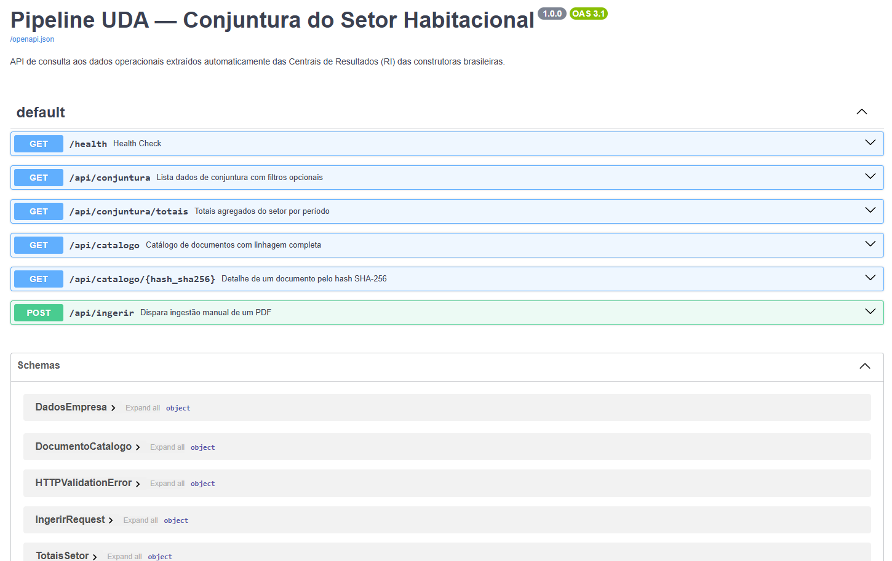

<i><b>Fonte:</b> Gabryel Sousa</i>

6. Catálogo de linhagem

Resposta do endpoint `/api/catalogo`, evidenciando o registro de linhagem completo com hash SHA-256, URL de origem, timestamps e status de processamento:

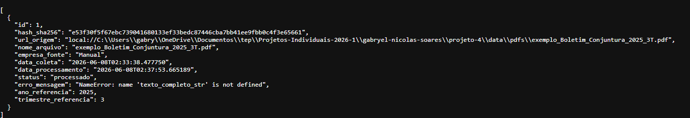

<i><b>Fonte:</b> Gabryel Sousa</i>

---

### Maiores Avanços

- Construção de um pipeline completo de UDA, da coleta do PDF até a disponibilização dos dados por API REST.
- Integração de PyMuPDF, GPT-4o, Pydantic, SQLite e FastAPI em um fluxo único e reprodutível.
- Validação com dados reais de seis incorporadoras, cobrindo o requisito de resiliência contra variações de layout.
- Implementação de linhagem de dados conectando cada métrica ao PDF de origem, hash SHA-256 e URL de coleta.
- Mecanismo de idempotência por hash evitando reprocessamento desnecessário e custos extras de API.

### Maiores Dificuldades

- Garantir que o GPT-4o retornasse `null` para campos ausentes em vez de alucinar valores, exigindo ajustes no prompt e no contrato Pydantic.
- Lidar com variações de layout nos PDFs das diferentes incorporadoras mantendo a extração consistente.
- Conciliar o formato do boletim oficial com os recortes publicados nos PDFs, que utilizam segmentações distintas.

### Aprendizados

- Uso de contratos semânticos com Pydantic como camada de qualidade para respostas de LLM.
- Importância de separar extração semântica, validação estrutural e persistência para reduzir risco de alucinação.
- Como SQLite pode ser usado como storage leve e portável para pipelines de dados com linhagem.
- Estratégia Full-Scan como alternativa simples e confiável ao chunking para documentos curtos.
- Implementação de idempotência por hash SHA-256 para evitar reprocessamento e controlar custos de API.

### Plano Pessoal para a Próxima Sprint

- [ ] Revisar eventuais comentários recebidos no PR do Projeto Individual 4.
- [ ] Organizar as evidências de execução e a documentação técnica do projeto.
- [ ] Continuar acompanhando oportunidades de contribuição no Gov Hub BR.
- [ ] Aprofundar conhecimentos em pipelines de dados e validação automatizada.