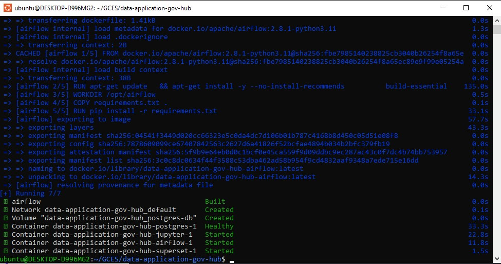
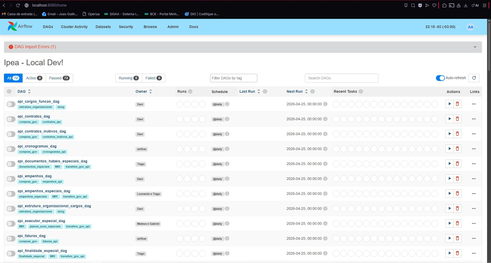
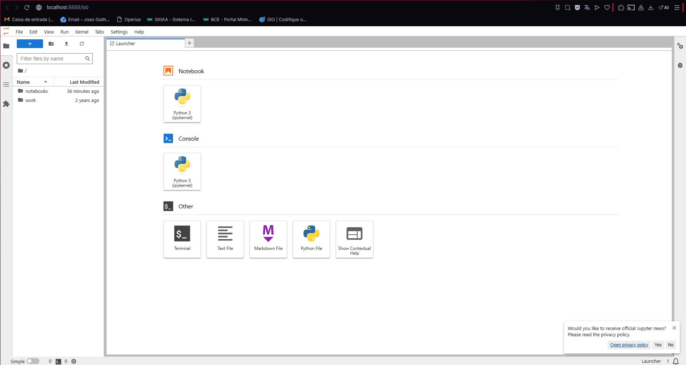
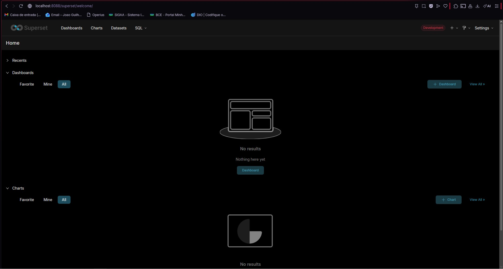

# Diário de Bordo – João Guilherme Fonseca

**Disciplina:** Gerência de Configuração e Evolução de Software (GCES)

**Equipe:** Gov Hub BR

**Comunidade/Projeto de Software Livre:** Gov Hub BR

---

## Sprint 0 – [06/04/2026 – 20/04/2026]

### Resumo da Sprint
Breve descrição das atividades e reflexões.

### Atividades Realizadas
| Data  | Atividade | Tipo (Código/Doc/Discussão/Outro) | Link/Referência | Status |
| ----- | --------- | --------------------------------- | --------------- | ------ |
| 20/08 | Configuração inicial do ambiente | Código | – | Concluído |
| 22/08 | Leitura e estudo da documentação do projeto | Estudo | [link wiki] | Concluído |
| 24/08 | Abertura de issue para bug em módulo X | Discussão | [link issue] | Concluído |

### Maiores Avanços
* Aprendi a rodar a aplicação localmente.
* Entendi melhor a organização do repositório.

### Maiores Dificuldades
* Ambiente demorou para configurar por falta de dependências.
* Imcompatibilidade das versões do Python
* Erro no Docker ao tentar dar build pela primeira vez.

### Aprendizados
* Fluxo de contribuição do projeto.

### Plano Pessoal para a Próxima Sprint
* [ ] Contribuir com pelo menos 1 PR.
* [ ] Participar da revisão de código de um colega.

### Comprobátorios

* Build do ambiente no Docker

* Airflow

* Jupyter

* Superset
