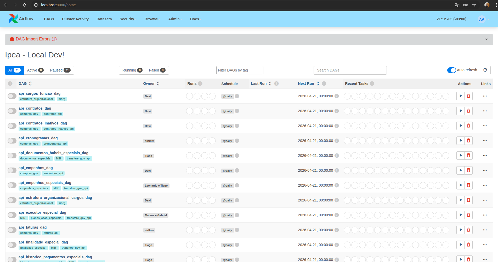
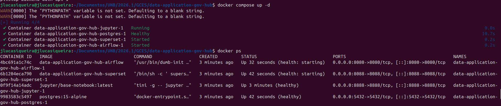
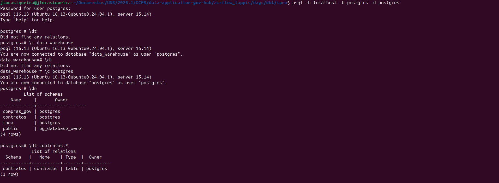
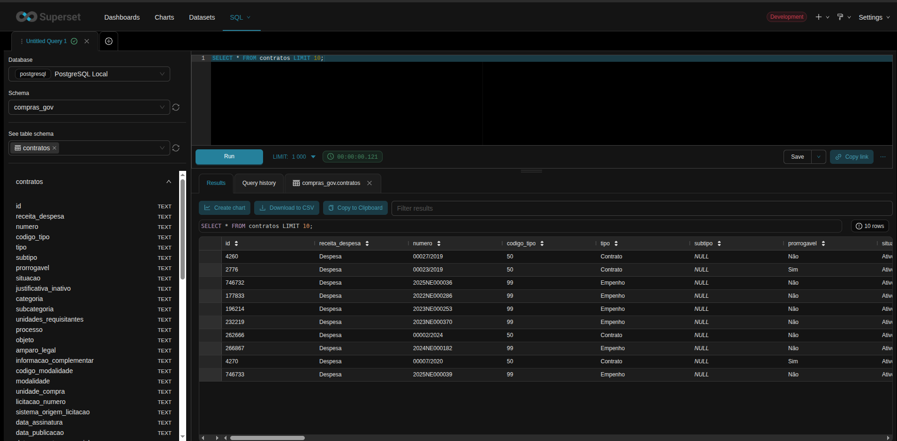

# Diário de Bordo – João Lucas Araujo Siqueira

**Disciplina:** Gerência de Configuração e Evolução de Software (GCES)

**Equipe:** Gov Hub BR

**Comunidade/Projeto de Software Livre:** Gov Hub BR

---

## Sprint 0 – [06/04/2026 – 20/04/2026]

### Resumo da Sprint
A Sprint 0 teve como principal objetivo a ambientação no projeto Gov Hub BR, com foco no entendimento da arquitetura, estudo das documentações e configuração do ambiente de desenvolvimento local. Durante esse período, consegui compreender o fluxo de contribuição do projeto, além de realizar a configuração do ambiente. 

### Atividades Realizadas
| Data  | Atividade | Tipo (Código/Doc/Discussão/Outro) | Link/Referência | Status |
| ----- | --------- | --------------------------------- | --------------- | ------ |
| 15/04 | Leitura e estudo da documentação do projeto | Estudo | [link - Documentação](https://gov-hub.io/govhub/sobre-projeto/overview/) | Concluído |
| 17/04 | Configuração inicial do ambiente | Código | [link - Guia de instalação](https://gov-hub.io/govhub/documentacao/instalacao/) | Concluído |
| 19/04 | Rastreamento de good first issues | Estudo | [link - GitHub](https://github.com/GovHub-br/data-application-gov-hub/issues) | Em andamento |

### Maiores Avanços
* Consegui configurar e rodar todo o ambiente local utilizando Docker, incluindo serviços como Apache Airflow, Apache Superset e Jupyter.

* Entendi o fluxo completo do projeto de dados: ingestão (Airflow) → transformação (dbt) → visualização (Superset).

* Entendi melhor a organização do repositório, incluindo DAGs do Airflow, estrutura do dbt e configurações via .env.

### Maiores Dificuldades
* Problemas iniciais com dependências do ambiente (ex: conflito entre versões do Poetry e plugins).
* Entendimento inicial do fluxo entre múltiplas ferramentas (Airflow, dbt, Superset), que não é trivial.

### Aprendizados
* Como configurar conexões dentro do Airflow e do Superset.
* Boas práticas iniciais de padronização e documentação em projetos de software livre.
* Entendimento na prática do fluxo de contribuição e arquitetura do projeto.

### Plano Pessoal para a Próxima Sprint
* [X] Contribuir com pelo menos 1 PR.
* [ ] Participar da revisão de código de um colega.

---

## Sprint 1 – [21/04/2026 – 04/05/2026]

### Resumo da Sprint
Atuei no desenvolvimento do fluxo de dados do IBGE focado no Censo Demográfico de Quilombolas e Indígenas. O principal objetivo foi criar uma solução de coleta via FTP e organização de dados capaz de lidar com a extrema falta de padrão nas planilhas do governo. Garanti que o pipeline funcione de forma estável, não duplique informações caso precise ser reexecutado (idempotência) e documente as tabelas no banco de dados. Ao final da sprint, concluí a implementação e abri o Pull Request correspondente para revisão da equipe

### Atividades Realizadas

| Data  | Atividade | Tipo | Link/Referência | Status |
| ----- | --------- | ---- | --------------- | ------ |
| 21/04 - 01/05 | Mapeamento inicial do projeto e busca por tarefas acessíveis (*good first issues*) | Estudo | [Issues - GovHub](https://github.com/GovHub-br/data-application-gov-hub/issues) | Concluído |
| 01/05 | Desenvolvimento do fluxo de dados do Censo 2022 referentes a Quilombolas e Indígenas por sexo e idade. (Issue #119) | Código | [Issue #119](https://github.com/GovHub-br/data-application-gov-hub/issues/119) | Concluído |
| 10/05 | Revisão do código | Estudo/Código | - | Concluído |
| 11/05 | Abertura do Pull Request para a Issue #119 e espera da avaliação da equipe| Código/Doc | [Link - PR](https://github.com/GovHub-br/data-application-gov-hub/pull/270) | Em Andamento|

### Implementação da Issue #122

O foco desta entrega foi criar um caminho totalmente automatizado para extrair, limpar e disponibilizar os dados do pacote "Quilombolas e Indígenas por sexo e idade" do Censo Demográfico 2022. 

As principais atividades foram:

* **Coleta automatizada:** Conectei o sistema diretamente aos servidores FTP do IBGE utilizando o ClienteIBGE para ler e baixar os arquivos de forma dinâmica, varrendo subpastas específicas. Optei por processar esses arquivos em memória, tornando o fluxo muito mais rápido e evitando sobrecarregar o armazenamento local.
* **Limpeza e organização dos dados:** Desenvolvi código para processar planilhas altamente despadronizadas. O sistema ignora abas desnecessárias (como gráficos e notas) e possui um parser flexível capaz de distinguir Apêndices (focados em texto) de Tabelas (focadas em números). Além disso, apliquei a técnica de flattening (despivotamento) para achatar e normalizar cabeçalhos hierárquicos e mesclados.
* **Armazenamento seguro:** Garanti que os dados fossem salvos no schema censo_demografico de forma confiável. Implementei uma trava de idempotência (via DROP TABLE IF EXISTS) que limpa os registros anteriores antes de uma nova inserção, impedindo qualquer duplicação caso a DAG do Airflow precise ser reexecutada.

### Maiores Avanços
* Criação de uma solução robusta para o flattening de cabeçalhos mesclados do IBGE, juntando os "pedaços" de títulos hierárquicos e padronizando-os em colunas limpas e rastreáveis.
* Garantia de confiabilidade da ingestão de dados ao criar um mecanismo de prevenção contra dados duplicados.
* Criação e submissão do Pull Request da Issue #119. 

### Maiores Dificuldades
* Lidar com os dados abertos do governo. Muitas planilhas utilizam células mescladas e espaços em branco apenas por motivos estéticos, o que dificulta bastante a leitura automatizada.
* As tabelas `.xlsx` possuem várias abas, fazendo necessária uma análise crítica para decidir o que precisaria ser lido para trazer os dados corretos.  
* Enfrentar os bloqueios de Pre-commit e Pre-push acusando erros em arquivos legados de outros desenvolvedores da equipe;
* Erro ao dar push na branch, sendo necessário fazer um fork do projeto.
* Adequação do código para garantir qualidade ao bot do sonarqube sem perder a robustez do processamento

### Aprendizados
* Compreensão aprofundada do projeto do GovHub.
* Aprofundei meu conhecimento em limpeza e transformação de dados com pandas, especialmente no tratamento de planilhas com estruturas irregulares.
* Boas práticas de Clean Code e modularização de código para CI/CD e ferramentas de análise estática de código (SonarQube)
* Fluxo Git avançado para contribuição em organizações de software livre, incluindo o uso de Forks, reestruturação de commits e a flag --no-verify para lidar com dívida técnica de terceiros.

### Plano Pessoal para a Próxima Sprint
- [ ] Ter o feedbakc sobre o PR e corrigir quaisquer erros identificados
- [ ] Ter o PR aprovado
- [ ] Encontrar novas issues mais complexas para contribuir

## Sprint 2 – [05/05/2026 – 25/05/2026]
 
### Resumo da Sprint
Nesta sprint, trabalhei  na Issue #317 do GovHub BR. Meu foco foi implementar testes unitários para o arquivo pedido na issue. 
Demorei a abrir o Pull Request por conta de outras demandas pessoais mas agora está aberto e aguardando revisão. O PR que mandei na sprint anterior ainde está em análise dos mantenedores, então não tive oportunidade de participar de uma correção do PR anterior

### Atividades Realizadas
 
| Data | Atividade | Tipo | Link/Referência | Status |
| ---- | --------- | ---- | --------------- | ------ |
| 05/05 - 12/05 | Busca de novas issues para contribuir | Estudo | [Issues - GovHub](https://github.com/GovHub-br/data-application-gov-hub/issues) | Concluído |
| 13/05 - 17/05 | Desenvolvimento de estes unitarios para airflow_lappis/plugins/cliente_senadores.py. (Issue #317) | Doc | [Issue #317](https://github.com/GovHub-br/data-application-gov-hub/issues/317) | Concluído |
|01/06 | Revisão e abertura do Pull Request #333 | Doc | [Link - PR #333](https://github.com/GovHub-br/data-application-gov-hub/pull/333) | Concluído |

 
### Maiores Avanços
* Criação dos teste unitários solicitados 

### Maiores Dificuldades
* EScrever testes úteis para o problema. 
* Verificações de pré commits e pré push que pegavam arquivos que eu não alterei 

### Aprendizados
* Aprendi mais sobre o projeto e sobre testes unitários.

### Plano Pessoal para a Próxima Sprint
- [ ] Ter o novo PR aprovado por todos os revisores.
- [ ] Buscar novas issues para contribuir.
- [ ] Ter o PR anterior revisado.