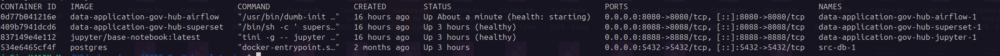
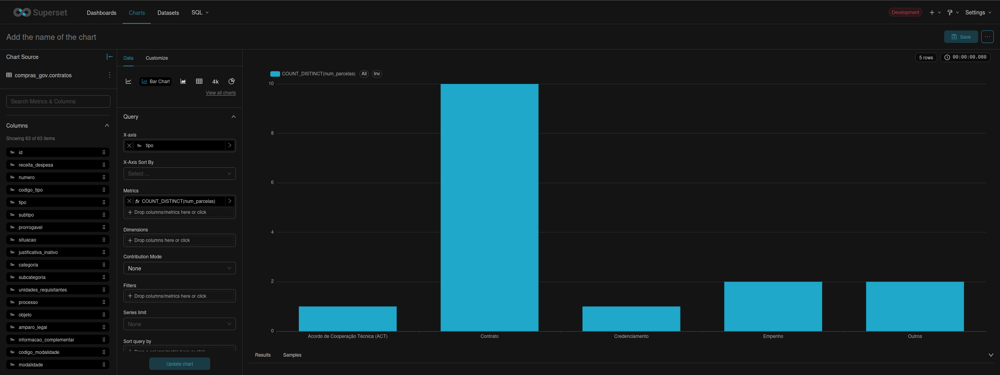
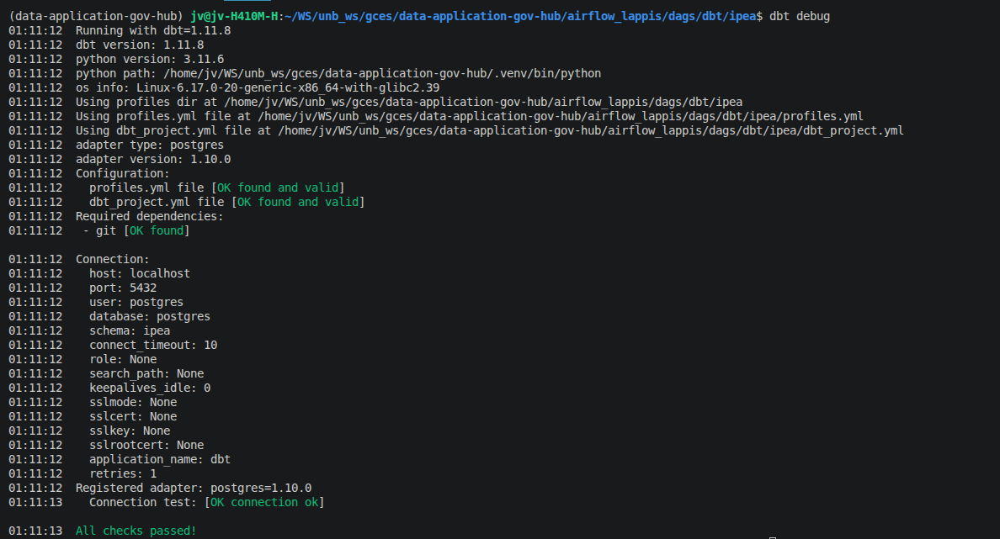
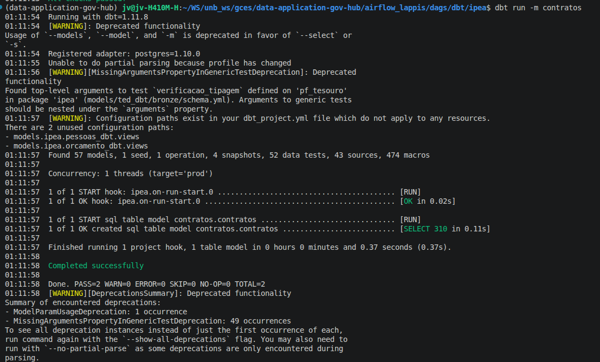
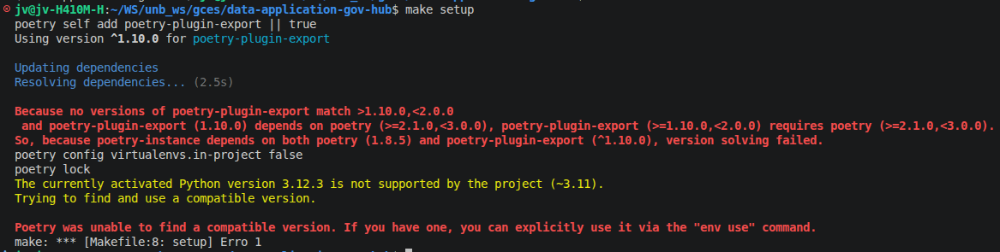

# Diário de Bordo – João Vitor Lopes Ribeiro

**Disciplina:** Gerência de Configuração e Evolução de Software (GCES)

**Equipe:** Gov Hub BR

**Comunidade/Projeto de Software Livre:** Gov Hub BR

---

## Sprint 0 – [06/04/2026 – 20/04/2026]

### Resumo da Sprint

Essa sprint foi destinada ao entendimento e ambientação do projeto. Os esforços dessa etapa foram destinados ao estudo da documentação do GovHubBR, com o intuito de compreender o objetivo do projeto e sua arquitetura, bem como subir o ambiente de execução da solução localmente.

### Atividades Realizadas
| Data  | Atividade | Tipo (Código/Doc/Discussão/Outro) | Link/Referência | Status |
| ----- | --------- | --------------------------------- | --------------- | ------ |
| 21/04 | Configuração inicial do ambiente | Código | – | Concluído |
| 20/04 | Leitura e estudo da documentação do projeto | Estudo | [link wiki](https://gov-hub.io/govhub/comunidade/guia-contribuicao/) | Concluído |
| 21/04 | Abertura de issue para bug em módulo X | Discussão | [link issues](https://github.com/GovHub-br/data-application-gov-hub/issues) | Em andamento |

### Maiores Avanços

* Entendi melhor o objetivo do GovHubBR.
* Entendi melhor a arquitetura do GovHubBR.
* Aprendi como contribuir ao projeto segundo às diretrizes guia de contribuição.
* Aprendi a rodar a aplicação localmente utilizando docker.

    Docker

     Airflow (List Task Instance)

    Superset

    
    DBT debug

    
    DBT run

### Maiores Dificuldades
* Incompatibilidade da versão python local com a exigida pelo projeto

### Aprendizados
* Utilização da ferramenta 'uv' para seleção de um versão python.
* Melhor compreensão do projeto.
* Fluxo de contribuição do projeto.

### Plano Pessoal para a Próxima Sprint
* [ ] Identificar Issue para contribuir.
* [ ] Contribuir com pelo menos 1 PR.
* [ ] Participar da revisão de código de um colega.