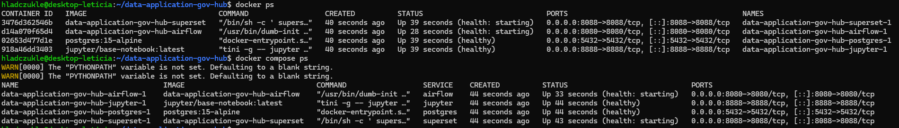
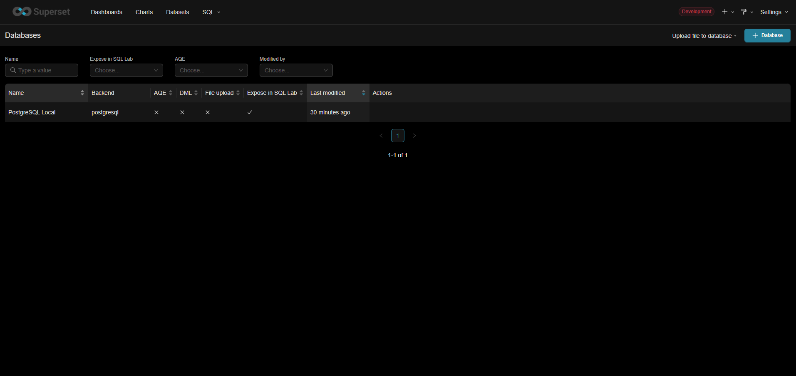
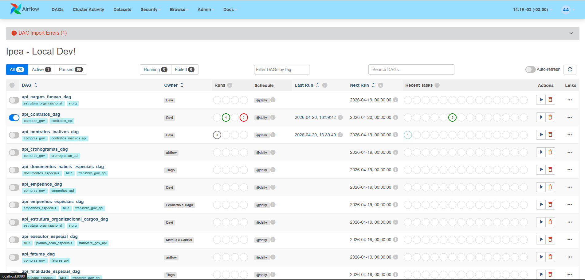
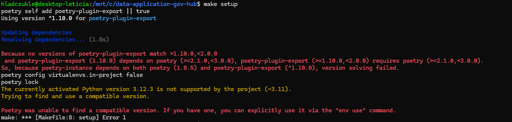
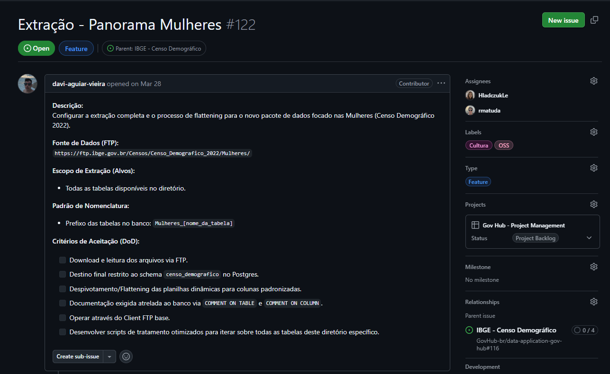
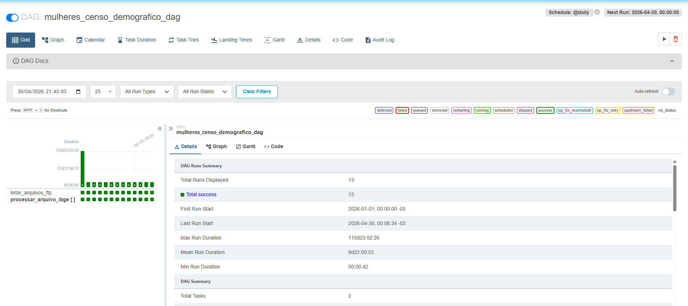
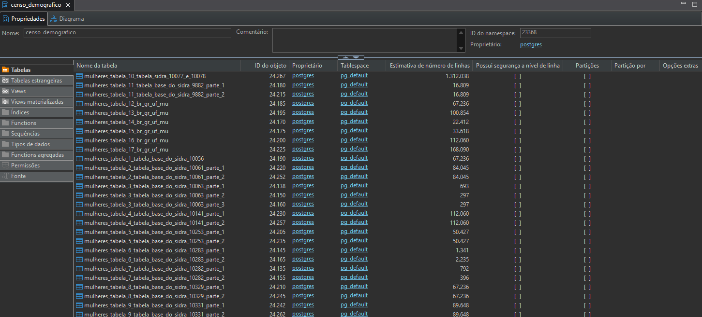
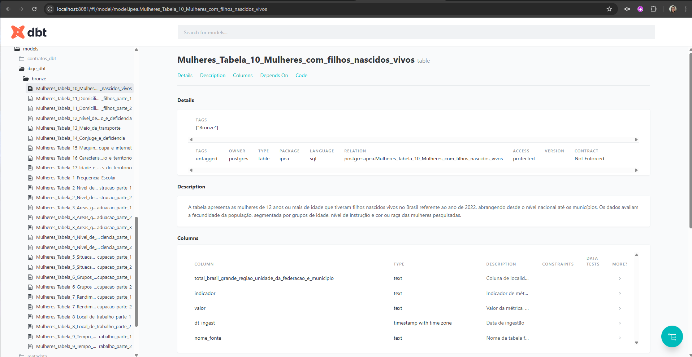
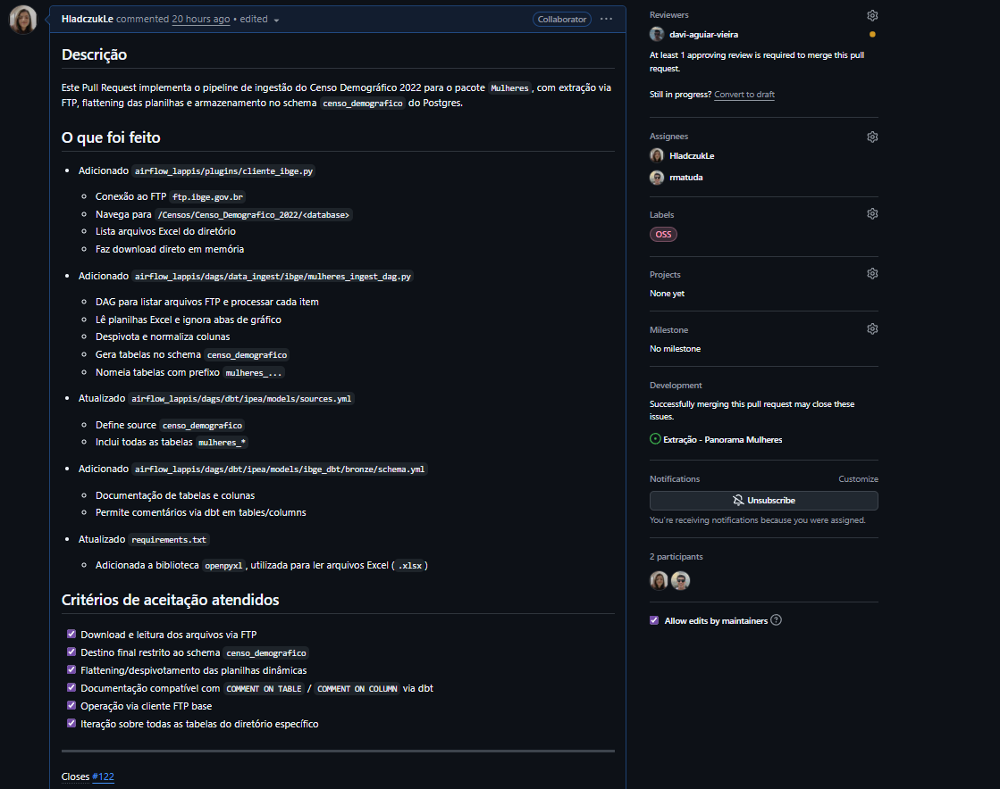

# Diário de Bordo – Letícia de Cássia Hladczuk Rodrigues

**Disciplina:** Gerência de Configuração e Evolução de Software (GCES)

**Equipe:** Gov Hub BR

**Comunidade/Projeto de Software Livre:** Gov Hub BR

---

## Sprint 0 – [06/04/2026 – 20/04/2026]

### Resumo da Sprint
Essa sprint foi focada na familiarização com o projeto, o aprendizado do fluxo de contribuições e a configuração do ambiente.

### Atividades Realizadas
| Data  | Atividade | Tipo (Código/Doc/Discussão/Outro) | Link/Referência | Status |
| ----- | --------- | --------------------------------- | --------------- | ------ |
| 15/04 | Leitura e estudo da documentação do projeto | Estudo | [link - Documentação](https://gov-hub.io/govhub/sobre-projeto/overview/) | Concluído |
| 17/04 | Configuração inicial do ambiente | Código | [link - Guia de instalação](https://gov-hub.io/govhub/documentacao/instalacao/) | Concluído |
| 17/04 | Rastreamento de good first issues | Estudo | [link - GitHub](https://github.com/GovHub-br/data-application-gov-hub/issues) | Em andamento |

### Maiores Avanços
* Consegui rodar a aplicação localmente. Containers Dockers rodando:

* Entendi melhor a organização do repositório.

* Configuração do Airflow e Superset.

### Maiores Dificuldades
* Logo no início, tive problema com a versão do Python, precisando fazer o ajuste para a versão 3.11. 

* Tive dificuldades de configurar o WSL, pois foi a minha primeira vez usando.

* Erros de sintaxe nas variáveis de ambiente do Airflow.

### Aprendizados
* Entendimento na prática do fluxo de contribuição e arquitetura do projeto.
* Melhoria na leitura de logs para diagnosticar falhas de dependência entre serviços.

### Plano Pessoal para a Próxima Sprint
* [X] Buscar good first issues para começar a contribuir.
* [ ] Contribuir com pelo menos 1 PR.
* [X] Participar da revisão de código de um colega.

## Sprint 1 – [21/04/2026 – 27/04/2026]

### Resumo da Sprint
Trabalhei em parceria com o [Rafael Matuda](https://github.com/rmatuda) para desenvolver o fluxo de dados do IBGE focado no Censo Demográfico das Mulheres. Nosso principal objetivo foi criar uma solução de coleta e organização de dados lidasse com a falta de padrão nas planilhas do governo. Garantimos que o sistema funcione de forma estável, não duplique informações caso precise ser reiniciado e esteja pronto para crescer no futuro.

### Atividades Realizadas

| Data  | Atividade | Tipo | Link/Referência | Status |
| ----- | --------- | ---- | --------------- | ------ |
| 21/04 - 23/04 | Mapeamento inicial do projeto e busca por tarefas acessíveis (*good first issues*) | Estudo | [Issues - GovHub](https://github.com/GovHub-br/data-application-gov-hub/issues) | Concluído |
| 24/04 - 27/04 | Desenvolvimento do fluxo de dados do Censo das Mulheres (Issue #122) | Código | [Issue #122](https://github.com/GovHub-br/data-application-gov-hub/issues/122) | Concluído |

### Implementação da Issue #122

O foco desta entrega foi criar um caminho totalmente automatizado para extrair, limpar e disponibilizar os dados do pacote "Mulheres" do Censo Demográfico 2022. 

As principais atividades foram:

* **Coleta automatizada:** Conectamos nosso sistema diretamente aos servidores do IBGE para ler e baixar os arquivos de forma dinâmica. Optamos por processar esses arquivos na memória, tornando o fluxo mais rápido e evitando sobrecarregar o armazenamento local.
* **Limpeza e organização dos dados:** Desenvolvemos regras inteligentes para ler as planilhas. O sistema agora ignora abas desnecessárias (como gráficos) e identifica automaticamente onde começam os dados reais. Além disso, padronizamos os nomes das colunas.
* **Armazenamento seguro:** Garantimos que os dados fossem salvos no banco de forma segura. Implementamos uma trava de segurança que limpa os registros anteriores antes de uma nova inserção, impedindo a duplicação de dados caso o processo precise rodar mais de uma vez. Também adicionamos colunas para rastrear de onde e quando cada dado veio.
* **Integração e documentação:** Conectamos esse novo fluxo com as ferramentas já utilizadas pelo projeto (dbt) e deixamos as tabelas e colunas devidamente documentadas no banco de dados para facilitar a vida dos próximos desenvolvedores ou analistas que forem utilizar essa base.

### Maiores Avanços
* Criamos uma solução para "fatiar" tabelas do governo que vinham agrupadas horizontalmente, utilizando as colunas em branco das próprias planilhas como guias de corte.
* Garantimos a confiabilidade da ingestão de dados ao criar um mecanismo de prevenção contra dados duplicados.

### Maiores Dificuldades
* Lidar com os dados abertos do governo. Muitas planilhas utilizam células mescladas e espaços em branco apenas por motivos estéticos, o que dificulta bastante a leitura automatizada.
* Conectar no ambiente dbt local.

### Aprendizados
* Compreensão aprofundada do projeto do GovHub.
* Apesar da minha experiência prévia com engenharia de dados, pude aprofundar meu domínio técnico por meio da participação neste projeto.
* Adquiri conhecimento sobre o dbt.

### Plano Pessoal para a Próxima Sprint
- [X] Subir o código para revisão (*Pull Request*) da issue #122

Comprobatórios da Issue #122

<h3>Descrição da Issue 122</h3>

<h3>Dag para extração das tabelas - <i>mulheres_censo_demografico_dag</i></h3>

<h3>Tabelas extraídas no banco de dados PostgreSQL</h3>

<h3>Tabelas na camada Bronze do DBT</h3>

## Sprint 2 – [28/04/2026 – 04/05/2026]

### Resumo da Sprint
Nesta sprint, eu e o [Rafael Matuda](https://github.com/rmatuda) concluímos a implementação da Issue #122 e abri o Pull Request correspondente para revisão. O foco foi revisar o que foi feito, descrever claramente as mudanças, documentar o fluxo de dados e acompanhar a revisão do time.

### Atividades Realizadas
| Data  | Atividade | Tipo | Link/Referência | Status |
| ----- | --------- | ---- | --------------- | ------ |
| 28/04 | Revisão do código | Estudo/Código | -  | Concluído |
| 29/04 | Abertura do Pull Request para a issue #122 | Código/Doc | [Link - PR](https://github.com/GovHub-br/data-application-gov-hub/pull/241) | Concluído |
| 29/04 | Ajustes de revisão e resposta aos comentários | Código | [Link - PR](https://github.com/GovHub-br/data-application-gov-hub/pull/241) | Em andamento |

### Detalhes do Pull Request
* O Pull Request foi criado para registrar as alterações da Issue #122 e permitir a revisão da equipe.
* Documentei as etapas do fluxo de dados e as validações usadas para garantir a qualidade da entrega.

### Maiores Avanços
* Criação do Pull Request da Issue #122.

### Maiores Dificuldades
* Erro ao dar push na minha branch, precisei fazer um fork do projeto.

### Próximos Passos
* Acompanhar a revisão do PR e implementar eventuais correções até a aprovação final.
* Encontrar novas issues para contribuir

### Plano Pessoal para a Próxima Sprint
- [ ] Ter o PR aprovado
- [ ] Encontrar novas issues para contribuir
