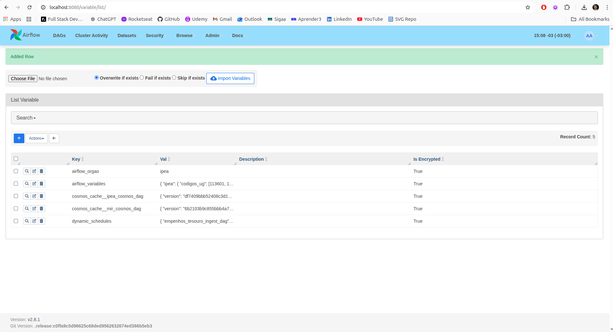
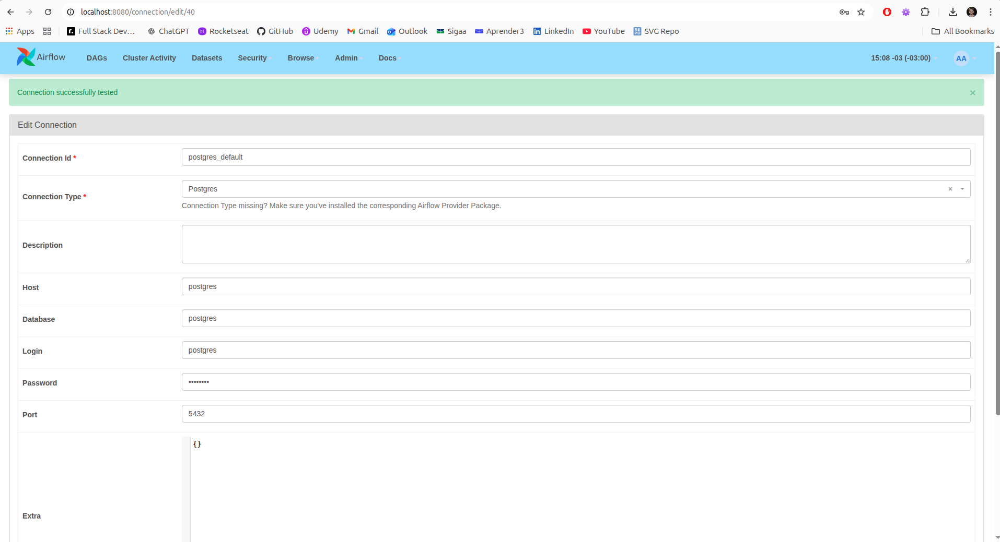
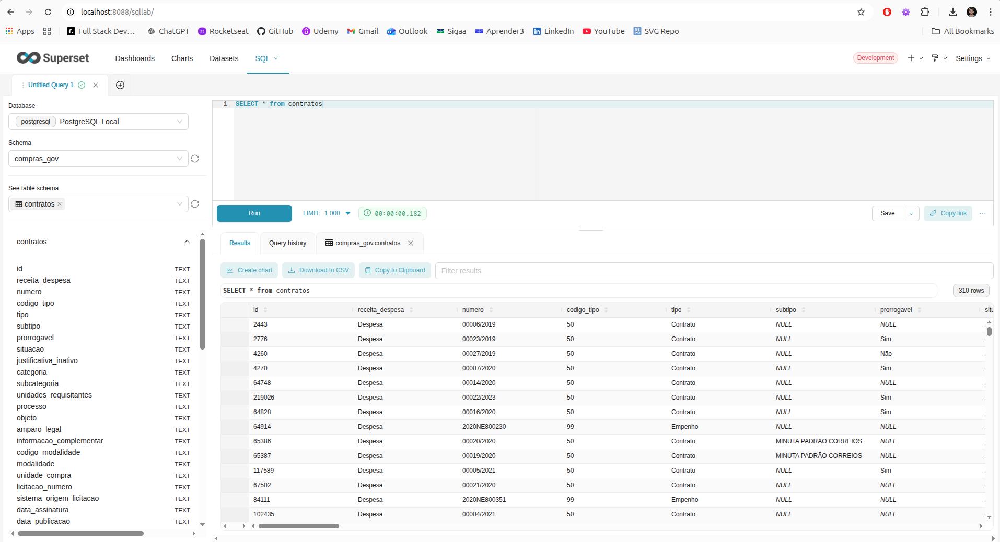
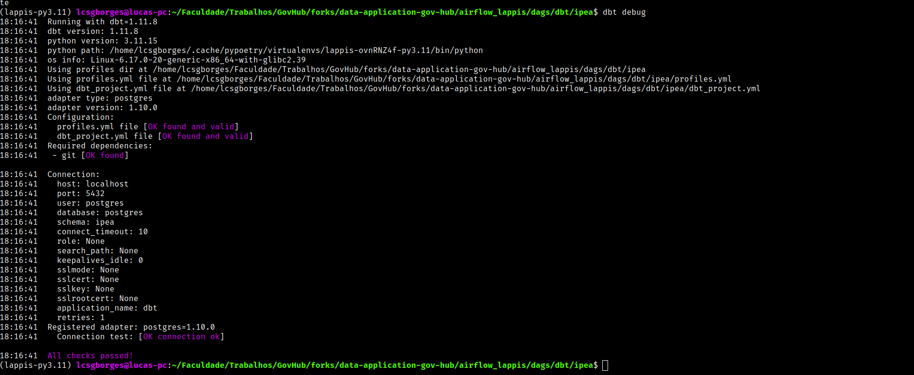
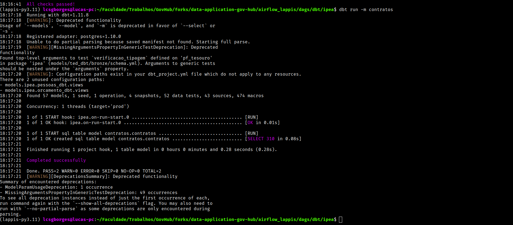

# Diário de Bordo – Lucas Guimarães Borges

**Disciplina:** Gerência de Configuração e Evolução de Software (GCES)

**Equipe:** Gov Hub BR

**Comunidade/Projeto de Software Livre:** Gov Hub BR

---

## Sprint 0 – [06/04/2026 – 20/04/2026]

### Resumo da Sprint

Durante a Sprint 0, o foco principal foi a ambientação no projeto Gov Hub BR, compreendendo sua estrutura, propósito e fluxo de funcionamento. As atividades concentraram-se na configuração do ambiente de desenvolvimento, leitura da documentação oficial e estudo dos materiais disponibilizados, como o e-book do projeto.

Além disso, houve o primeiro contato prático com o fluxo de contribuição em um projeto de software livre, incluindo leitura de código, entendimento das dependências (como Airflow, Superset e dbt) e realização de commits no repositório oficial.

### Atividades Realizadas

| Data  | Atividade | Tipo (Código/Doc/Discussão/Outro) | Link/Referência | Status |
| ----- | --------- | --------------------------------- | --------------- | ------ |
| 15/04 - 17/04 | Leitura e estudo da documentação do projeto | Estudo | [Link](https://gov-hub.io/govhub/documentacao/instalacao/#make-test) | Concluído |
| 17/04 | Configuração inicial do ambiente | Código | [Comprobatórios](#comprobatórios) | Concluído |
| 17/04 | Leitura do e-book | Estudo | [Link](https://gov-hub.io/govhub/ebook-viewer/) | Concluído |
| 17/04 | Contribuição para o arquivo de build do projeto | Código | [Link commit](https://github.com/GovHub-br/data-application-gov-hub/commit/7c110e594a8017a52895f5b86b484d09f9e2b250) | Concluído |
| 17/04 | Contribuição para a documentação do projeto | Documentação | [Link commit 1](https://github.com/GovHub-br/gov-hub/commit/13fe3153e24e1c3ff6aa46f87ba467442104df41)    [Link commit 2](https://github.com/GovHub-br/gov-hub/commit/e5dd9f6536826da7bbde5abe53307569356f7e04) | Concluído |

### Maiores Avanços

* Consegui configurar e rodar a aplicação do GovHub localmente, validando toda a stack (Airflow, Superset e dbt);
* Identifiquei gargalos no processo de setup e contribui diretamente com melhorias no build e na documentação do projeto;
* Realizei minhas primeiras contribuições efetivas no repositório oficial, incluindo código e documentação;
* Compreendi a arquitetura geral da aplicação e o fluxo de dados entre os componentes do ecossistema;

### Maiores Dificuldades

* Configuração inicial do ambiente local;
* Entendimento inicial da integração entre as ferramentas do projeto (Airflow, Superset e dbt);

### Aprendizados

* Processo completo de setup de um ambiente de dados utilizando Airflow, Superset e dbt;
* Importância de uma documentação clara e bem estruturada em projetos open source;
* Leitura e entendimento da arquitetura utilizada no GovHub;

### Plano Pessoal para a Próxima Sprint

* [ ] Aprofundar o entendimento da camada de dados;
* [ ] Explorar issues abertas para identificar oportunidades de contribuição técnica;
* [ ] Submeter pelo menos 1 Pull Request com melhoria relevante no projeto;

### Comprobatórios

1. Instalação das dependências com `make setup`

2. Subindo o ambiente com `docker compose`

3. Configuração das variáveis dentro do airflow

4. Conexão do airflow com o banco de dados

5. Conexão do superset com o banco de dados bem sucedida

6. Configuração do dbt

## Sprint 1 – [21/04/2026 – 04/05/2026]

### Resumo da Sprint

Durante a Sprint 1, o foco principal foi identificar e resolver issues abertas no projeto Gov Hub BR. As atividades concentraram-se na análise de problemas relatados, compreensão dos requisitos, implementação de soluções e submissão de Pull Requests para contribuir efetivamente ao projeto.

### Atividades Realizadas

| Data  | Atividade | Tipo (Código/Doc/Discussão/Outro) | Link/Referência | Status |
| ----- | --------- | --------------------------------- | --------------- | ------ |
| 03/05 - 04/05 | Identificar possíveis issues para contribuir | Discussão | [Issues do projeto](https://github.com/orgs/GovHub-br/projects/4/views/1?filterQuery=oss) | Concluído |
| 04/05 | Contribuição resolvendo a issue #255 | Código | [Link commit](https://github.com/GovHub-br/data-application-gov-hub/commit/0274e87032891d9e9d4d7fd7f70c6507d1338ec9) | Concluído |

### Maiores Avanços

* Identifiquei as principais issues abertas do projeto para a disciplina de GCES;
* Contribuí para uma issue no repositório oficial, resolvendo problemas reais do projeto;
* Consegui que meu Pull Request fosse aprovado e mergeado para a branch principal;

### Maiores Dificuldades

* Encontrar uma issue para contribuir que eu soubesse fazer no momento;

### Aprendizados

* Configuração do Airflow via CLI;

### Plano Pessoal para a Próxima Sprint

* [ ] Contribuir para outra issue;
* [ ] Submeter pelo menos 1 Pull Request com melhoria relevante no projeto;
