# Diário de Bordo – Lucas Martins Gabriel

**Matricula**: 221022088

**Disciplina:** Gerência de Configuração e Evolução de Software (GCES)

**Equipe:** Gov Hub BR

**Comunidade/Projeto de Software Livre:** Gov Hub BR

> **Observação:** Eu fazia parte do projeto KDE Frameworks, mas fui remanejado para o Gov Hub BR na sprint 2

---

## Sprint 0 – [06/04/2026 – 20/04/2026]

### Resumo da Sprint

Sprint dedicada ao onboarding completo no projeto KDE Frameworks. Realizei leitura detalhada do guia de contribuição e código de conduta da comunidade, criação de contas nas principais plataformas de colaboração (KDE Invent e Matrix), e exploração da arquitetura do KDE Frameworks. Estudei a organização de subprojetos divididos em 4 tiers de dependências e explorei projetos em desenvolvimento como o Language Bindings (Ship Frameworks via Pip).

| Data  | Atividade                                      | Tipo (Código/Doc/Discussão/Outro) | Link/Referência                                                                                            | Status    |
|-------|------------------------------------------------|-----------------------------------|------------------------------------------------------------------------------------------------------------|-----------|
| 06/04 | Leitura do guia de contribuição do KDE         | Estudo                            | [Get Involved](https://community.kde.org/Get_Involved)                                                     | Concluído |
| 08/04 | Leitura e compreensão do código de conduta     | Estudo                            | [KDE Code of Conduct](https://kde.org/code-of-conduct/)                                                    | Concluído |
| 10/04 | Criação de conta no KDE Invent                 | Configuração                      | [invent.kde.org](https://invent.kde.org)                                                                   | Concluído |
| 12/04 | Criação de conta no Matrix                     | Configuração                      | [matrix.org](https://matrix.org)                                                                           | Concluído |
| 15/04 | Exploração inicial da estrutura de subprojetos | Estudo                            | [KDE Development Docs](https://develop.kde.org/docs/) e [KDE Frameworks](https://api.kde.org/)             | Concluído |
| 18/04 | Estudo do projeto Language Bindings            | Estudo                            | [Ship Frameworks via Pip](https://community.kde.org/Development/Language_Bindings/Ship_Frameworks_via_Pip) | Concluído |
| 20/04 | Documentação do diário de bordo                | Documentação                      | -                                                                                                          | Concluído |

### Detalhamento das Atividades Realizadas

Os seguintes prints documentam o processo de onboarding e exploração realizado:

1. KDE Invent - Grupos de Projetos

Estrutura de grupos disponíveis na plataforma (Accessibility, Automotive, Documentation, Education, Frameworks, Games, Graphics)

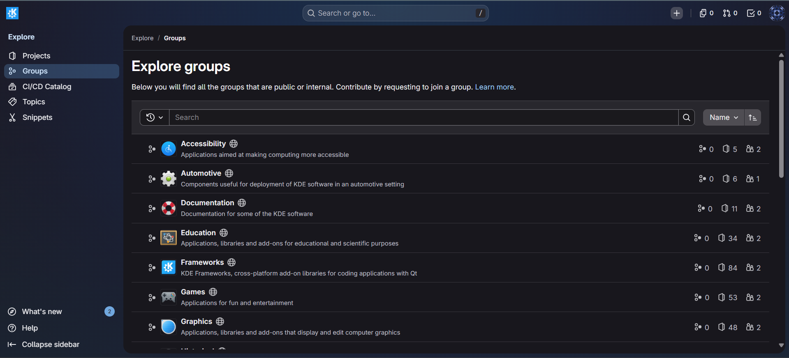

<i><b>Fonte:</b> Lucas Martins</i>

2. KDE Frameworks - Documentação de Tiers

Arquitetura modular do KDE Frameworks dividida em 4 tiers com suas respectivas dependências

<i><b>Fonte:</b> Lucas Martins</i>

3. KDE Developer Portal

Página inicial com guias de desenvolvimento (Getting Started, Building KDE, Kirigami, KXmlGui, Python, Rust)

<i><b>Fonte:</b> Lucas Martins</i>

4. KDE Community Wiki - Get Involved

Página de contribuição com informações sobre como contatar a comunidade e acessar Matrix

<i><b>Fonte:</b> Lucas Martins</i>

5. Ship Frameworks via Pip

Documentação do projeto "Ship Frameworks via Pip" para distribuição de frameworks via pip

<i><b>Fonte:</b> Lucas Martins</i>

6. Matrix - KDE Community

Estrutura de canais e salas da comunidade KDE no Matrix

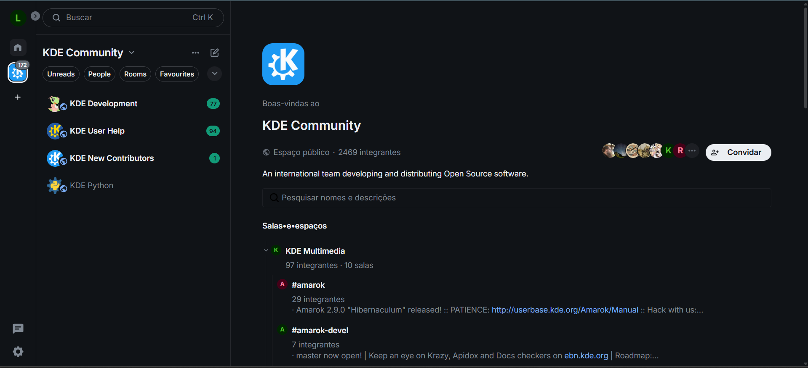

<i><b>Fonte:</b> Lucas Martins</i>

### Maiores Avanços

* Criação bem-sucedida de contas nas plataformas essenciais do KDE (Invent e Matrix).
* Compreensão das políticas de contribuição e código de conduta da comunidade KDE.
* Familiarização com a organização geral do projeto KDE Frameworks.
* Documentação estruturada do processo de onboarding para futuras referências.

### Maiores Dificuldades

* A estrutura de subprojetos do KDE Frameworks é complexa; foi desafiador compreender a organização.
* Dificuldade ao tentar acessar os canais do KDE no Matrix via homeserver matrix.org.

### Aprendizados

* Políticas de contribuição do projeto KDE e boas práticas de colaboração em comunidades open source.
* Código de conduta e responsabilidades éticas como membro da comunidade.
* Processo de autenticação e criação de contas em plataformas KDE (Invent e Matrix).
* Visão geral da arquitetura modular do KDE Frameworks e seus subprojetos.

### Plano Pessoal para a Próxima Sprint

- [ ] Estudar em profundidade a organização de pelo menos 2-3 subprojetos específicos do KDE Frameworks (ex: QtColorWidget, KAuth, KColorScheme)
- [ ] Encontrar e analisar uma issue para iniciantes em um dos subprojetos do KDE Frameworks
- [ ] Preparar o ambiente local para contribuir (clonar repositório, instalar dependências, executar testes)
- [ ] Realizar o primeiro commit ou pull request pequeno para ganhar experiência com o fluxo de contribuição
- [ ] Colaborar com outros membros da equipe: participar de revisão de código, fazer perguntas nos canais do Matrix/Invent

---

## Sprint 1 – [21/04/2026 – 11/05/2026]

### Resumo da Sprint

Sprint dedicada a encontrar a primeira issue para contribuir. Analisei uma meta issue de documentação e escolhi a lib KWeatherCore para trabalhar, fiz o fork do repositório e comecei a estudar sobre como transferir a documentação da lib de doxygen para qdoc. Sem contribuições de código nesta sprint, mas consegui encontrar uma issue para começar a trabalhar na próxima sprint.

> Após a apresentação da sprint 1, fui remanejado para o projeto Gov Hub BR, então a partir da sprint 2 minhas atividades serão relacionadas a esse projeto.

### Atividades Realizadas

| Data  | Atividade                                       | Tipo (Código/Doc/Discussão/Outro) | Link/Referência                                                                                                                     | Status    |
|-------|-------------------------------------------------|-----------------------------------|-------------------------------------------------------------------------------------------------------------------------------------|-----------|
| 09/05 | Leitura da meta issue                           | Estudo                            | [Port API documentation do qdoc](https://invent.kde.org/teams/goals/streamlined-application-development-experience/-/work_items/10) | Concluído |
| 10/05 | Estudo inicial da lib kweathercore              | Estudo                            | [KWeatherCore](https://invent.kde.org/libraries/kweathercore)                                                                       | Concluído |
| 10/05 | Fork da lib                                     | Configuração                      | [martinsglucas/kweathercore](https://invent.kde.org/martinsglucas/kweathercore)                                                     | Concluído |
| 10/05 | Ver outra issue semelhante que já foi resolvida | Estudo                            | [Krita](https://invent.kde.org/graphics/krita/-/work_items/76)                                                                      | Concluído |
| 12/05 | Documentação do diário de bordo                 | Documentação                      | -                                                                                                                                   | Concluído |

### Detalhamento das Atividades Realizadas

Os seguintes prints documentam o processo de busca pela primeira issue e exploração do KWeatherCore:

1. Meta Issue - Port API documentation do qdoc

Esse é o objetivo geral da meta issue, que envolve a transferência da documentação de doxygen para qdoc

<i><b>Fonte:</b> Lucas Martins</i>

2. Estudo da lib KWeatherCore

Página da lib KWeatherCore, que é o projeto escolhido para contribuir

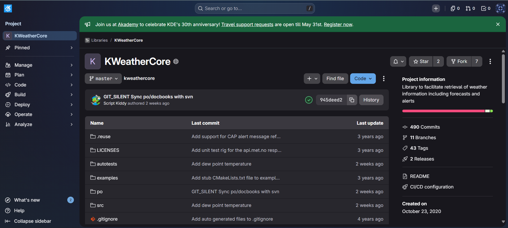

Documentação atual da lib KWeatherCore, que utiliza doxygen e precisa ser transferida para qdoc

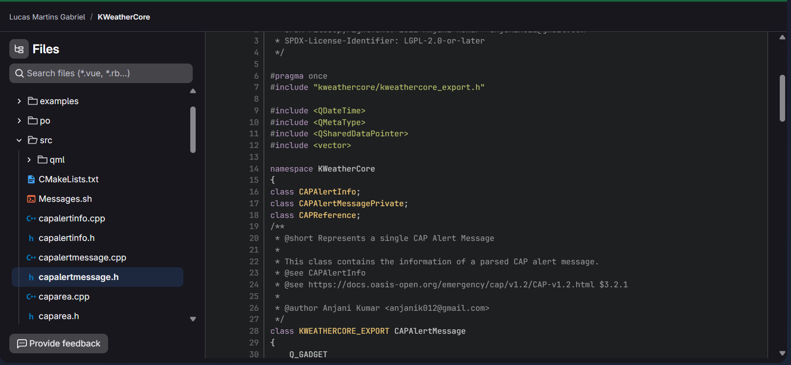

<i><b>Fonte:</b> Lucas Martins</i>

3. Fork do repositório

Página do meu fork do repositório da lib KWeatherCore, onde irei realizar as contribuições

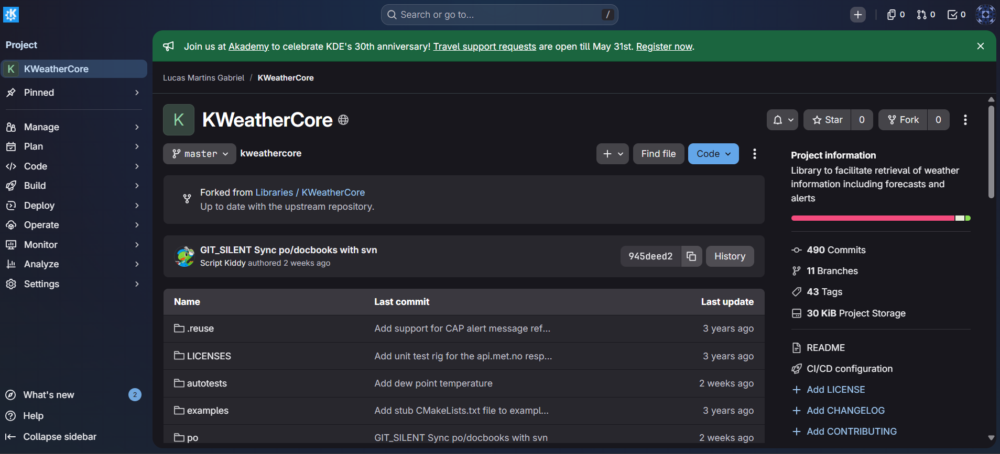

<i><b>Fonte:</b> Lucas Martins</i>

### Maiores Avanços

* Ter achado a primeira issue para contribuir

### Maiores Dificuldades

* Repositórios dos framworks sem tag de issues para iniciantes, o que dificulta a busca por uma issue para começar a contribuir

### Aprendizados

* Objetivo da comunidade KDE em melhorar a documentação das libs

### Plano Pessoal para a Próxima Sprint

* [ ] Estudar o Gov Hub BR e entender a arquitetura do projeto
* [ ] Configurar o ambiente local para desenvolvimento
* [ ] Encontrar uma issue para contribuir e abrir um pull request com a contribuição

---

## Sprint 2 – [12/05/2026 – 26/05/2026]

### Resumo da Sprint

Sprint dedicada à contribuição no projeto Gov Hub BR. Após remanejamento do projeto KDE Frameworks, estudei a documentação e arquitetura do projeto Gov Hub BR, configurei o ambiente local de desenvolvimento, e implementei minha primeira feature junto com a [Milena Fernandes](/contribuicoes_individuais/milena_fernandes/milena_fernandes.md): um helper para enviar notificações de falhas de tasks do Airflow via Telegram. A feature foi implementada, testada e teve um pull request aberto no repositório principal do projeto.

### Atividades Realizadas

| Data  | Atividade                                      | Tipo (Código/Doc/Discussão/Outro) | Link/Referência                                                                      | Status    |
|-------|------------------------------------------------|-----------------------------------|-------------------------------------------------------------------------------------|-----------|
| 22/05 | Estudo da documentação e arquitetura do projeto | Estudo                            | [Gov Hub BR - Documentação](https://gov-hub.io/govhub/comunidade/guia-contribuicao/)    | Concluído |
| 23/05 | Configuração do ambiente local de desenvolvimento | Configuração                      | -                                                                                    | Concluído |
| 23/05 | Análise da issue #293 de Telegram                | Análise                           | [Issue #293](https://github.com/GovHub-br/data-application-gov-hub/issues/293)       | Concluído |
| 24/05 | Implementação do helper de notificação via Telegram | Código                            | [telegram_helpers.py](https://github.com/martinsglucas/data-application-gov-hub/blob/feat/webhook-alerta-telegram/airflow_lappis/helpers/telegram_helpers.py)         | Concluído |
| 24/05 | Testes da feature e abertura de PR              | Código                            | [PR #321](https://github.com/GovHub-br/data-application-gov-hub/pull/321)            | Concluído |
| 24/05 | Documentação do diário de bordo                 | Documentação                      | -                                                                                    | Concluído |

### Detalhamento das Atividades Realizadas

Os seguintes prints documentam o processo de desenvolvimento da feature de notificações via Telegram:

1. Issue #293 - Observabilidade com Telegram

Issue de feature que propõe a implementação de um webhook do Airflow para notificar falhas de tasks via Telegram

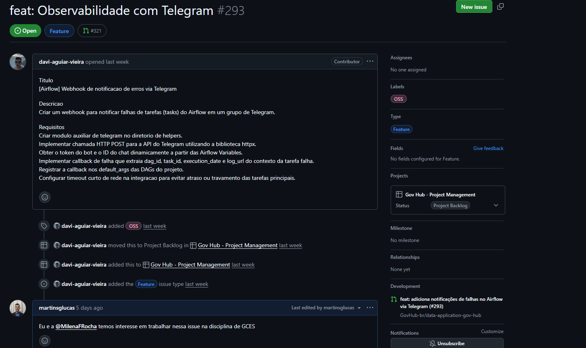

<i><b>Fonte:</b> Lucas Martins</i>

2. Fork do Repositório

Fork do repositório data-application-gov-hub criado para realização das contribuições

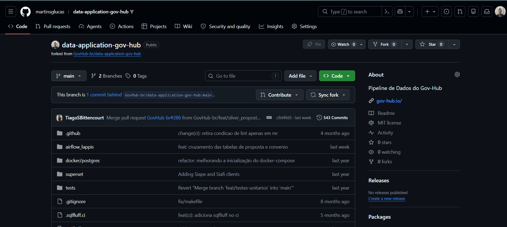

<i><b>Fonte:</b> Lucas Martins</i>

3. Dashboard do Airflow

Dashboard do Airflow exibindo os logs de execução da DAG api_contratos_dag com as tasks relacionadas à feature implementada

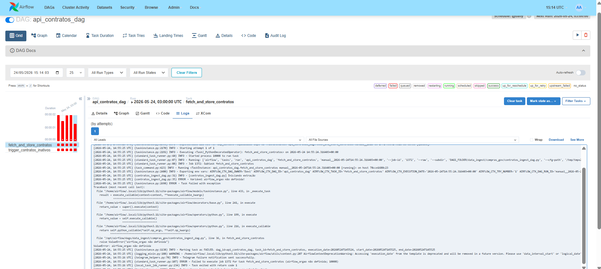

<i><b>Fonte:</b> Lucas Martins</i>

4. Implementação da Feature - telegram_helpers.py

Código da implementação do helper para envio de mensagens via Telegram, incluindo função de callback para notificar falhas de tasks

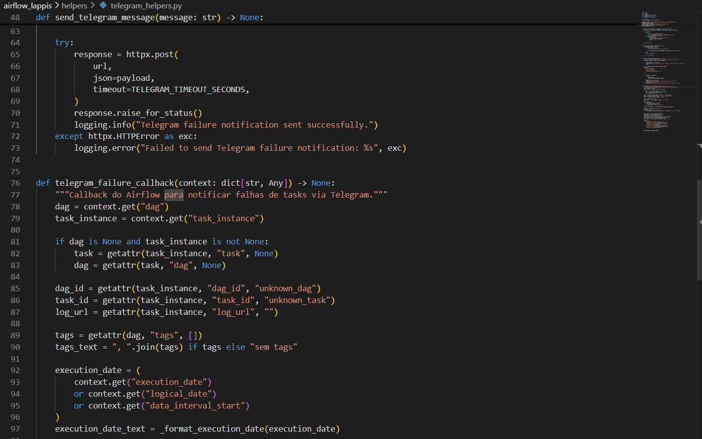

<i><b>Fonte:</b> Lucas Martins</i>

5. Notificação de Falha via Telegram

Screenshot da notificação de falha recebida no Telegram, mostrando detalhes da DAG, task, data de execução, erro e logs

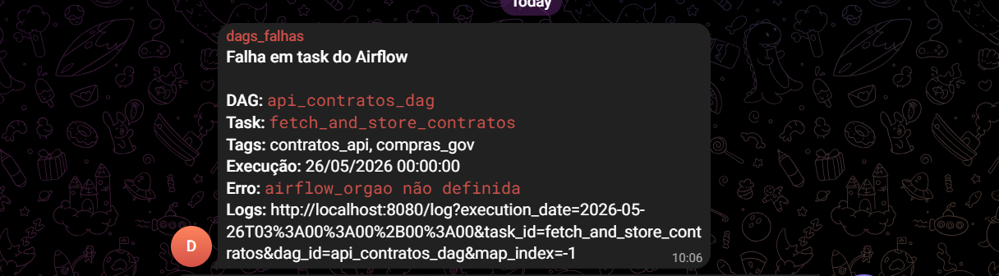

<i><b>Fonte:</b> Lucas Martins</i>

6. Pull Request #321 - Webhook Alerta Telegram

Pull request com a implementação completa da feature de notificações de falhas do Airflow via Telegram

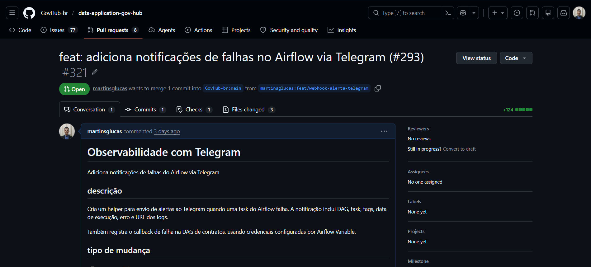

<i><b>Fonte:</b> Lucas Martins</i>

### Maiores Avanços

* Primeiro pull request aberto no projeto Gov Hub BR.
* Implementação bem-sucedida de feature de observabilidade com Telegram para o Airflow.
* Compreensão da arquitetura e fluxo de desenvolvimento do projeto Gov Hub BR.

### Maiores Dificuldades

* Sem maiores dificuldades significativas, mas o processo de configuração do ambiente local e entendimento da estrutura do projeto exigiu um esforço inicial considerável.

### Aprendizados

* Arquitetura do projeto Gov Hub BR e seu pipeline de dados.
* Padrões de desenvolvimento do projeto e boas práticas de contribuição.
* Configuração e uso do Airflow para orquestração de workflows.
* Integração de webhooks do Airflow para observabilidade e notificações.
* Uso de bibliotecas externas (httpx) para fazer requisições HTTP.
* Processo de contribuição em repositórios do GitHub (fork, branches, pull requests).

### Plano Pessoal para a Próxima Sprint

- [ ] Revisar feedback do PR #321 e implementar melhorias sugeridas
- [ ] Trabalhar em novas features ou bug fixes relacionados ao projeto
- [ ] Aprofundar conhecimento em Airflow DAGs e tasks
- [ ] Colaborar com outros membros da equipe em code reviews

---

## Sprint 3 – [27/05/2026 – 08/06/2026]

### Resumo da Sprint

Sprint dedicada à realização do Projeto Individual 4, cujo objetivo foi construir um pipeline de Análise de Dados Não Estruturados (UDA) para o setor habitacional. O projeto processa PDFs de Relações com Investidores de incorporadoras, extrai métricas operacionais com apoio de LLM, persiste os artefatos e dados estruturados com linhagem, e disponibiliza uma API REST para alimentar um boletim de conjuntura.

Durante a sprint, implementei e validei uma arquitetura composta por polling das centrais de resultados, cálculo de hash para idempotência, armazenamento de artefatos no MinIO, parsing com Docling, chunking e filtro semântico, extração com Gemini e contrato Pydantic, persistência em Postgres e endpoints FastAPI documentados via Swagger. A entrega foi validada com dois layouts diferentes de empresas: MRV e Cury.

### Atividades Realizadas

| Data  | Atividade | Tipo (Código/Doc/Discussão/Outro) | Link/Referência | Status |
|-------|-----------|-----------------------------------|-----------------|--------|
| 27/05 | Análise da especificação do Projeto Individual 4 e do boletim de conjuntura de referência | Estudo | - | Concluído |
| 28/05 | Definição da arquitetura do pipeline UDA com polling, MinIO, Postgres, LLM e API REST | Discussão/Arquitetura | - | Concluído |
| 30/05 | Implementação da camada de persistência, catálogo de documentos, linhagem e idempotência por SHA-256 | Código | - | Concluído |
| 01/06 | Implementação do processamento de PDFs com Docling, markdown, chunking e filtro semântico | Código | - | Concluído |
| 03/06 | Implementação da extração com Gemini, contrato Pydantic, fixtures offline e validação de respostas | Código/Teste | - | Concluído |
| 05/06 | Implementação da API FastAPI, endpoint de conjuntura e documentação Swagger/OpenAPI | Código/Doc | - | Concluído |
| 07/06 | Validação com MRV 3T25 e Cury 3T25, persistindo métricas, artefatos e evidências de funcionamento | Teste | - | Concluído |
| 08/06 | Documentação final, README, validação contra boletim real e abertura do PR do projeto | Documentação | - | Concluído |

### Detalhamento das Atividades Realizadas

O projeto foi implementado no repositório de projetos individuais: [lucas-martins-gabriel/projeto-4](https://github.com/martinsglucas/Projetos-Individuais-2026-1/tree/projeto-4/lucas-martins-gabriel/projeto-4). A solução usa fixtures versionadas para garantir reprodutibilidade da avaliação e também registra respostas reais da LLM como evidência de execução com Gemini.

1. Testes automatizados passando

Print do terminal mostrando a suíte de testes do projeto executada com sucesso. A validação final registrou 29 testes passando.

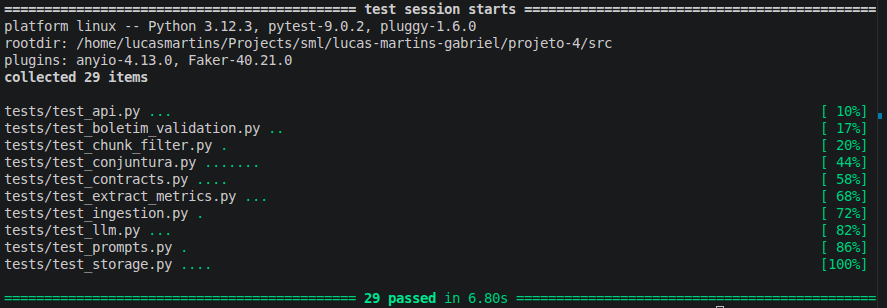

<i><b>Fonte:</b> Lucas Martins</i>

2. Swagger da API

Swagger/OpenAPI da aplicação FastAPI, com os endpoints principais para consulta de empresas, documentos, métricas e conjuntura.

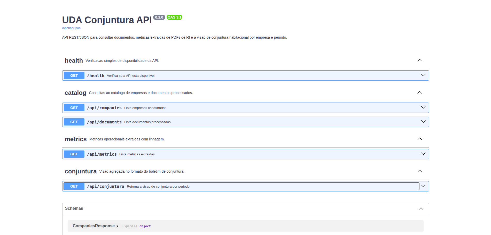

<i><b>Fonte:</b> Lucas Martins</i>

3. Endpoint de conjuntura

Resposta do endpoint `/api/conjuntura?ano=2025&trimestre=3`, usado para consolidar os dados de MRV e Cury no formato esperado pelo boletim.

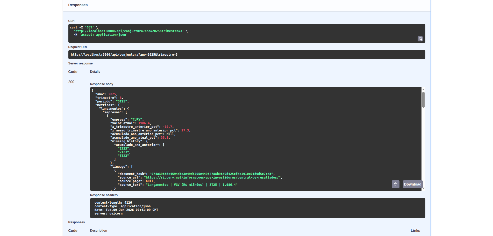

<i><b>Fonte:</b> Lucas Martins</i>

4. Bucket de artefatos no MinIO

Console do MinIO mostrando o bucket `uda-artifacts`, usado para armazenar os PDFs brutos, os markdowns parseados e as respostas validadas da LLM.

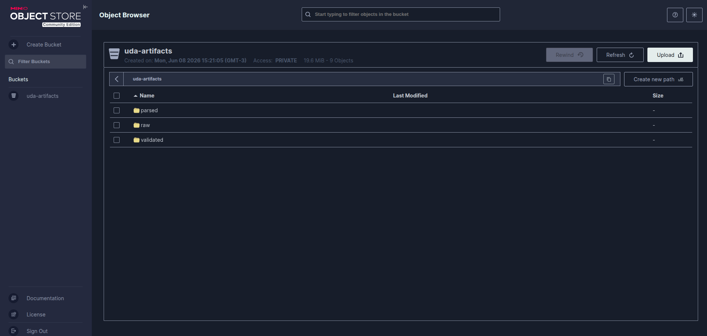

<i><b>Fonte:</b> Lucas Martins</i>

5. Caminho de artefatos no MinIO

Exemplo de caminho persistido no MinIO, evidenciando a organização por tipo de artefato, empresa, ano, período e hash do documento.

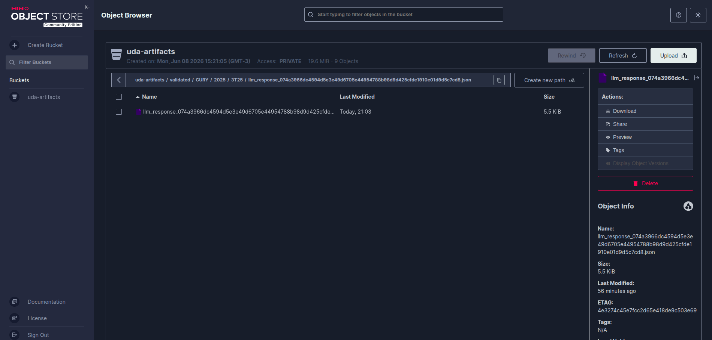

<i><b>Fonte:</b> Lucas Martins</i>

6. Pull Request do Projeto Individual 4

Print do Pull Request de submissão do Projeto Individual 4, com resumo das funcionalidades implementadas e evidências de funcionamento.

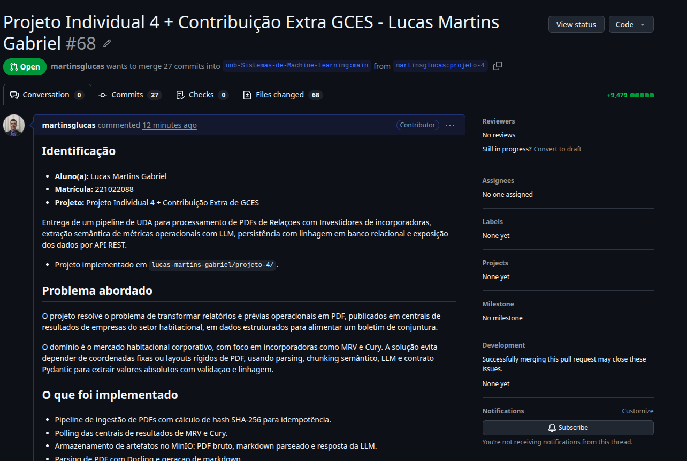

<i><b>Fonte:</b> Lucas Martins</i>

### Maiores Avanços

* Construção de um pipeline completo de UDA, da coleta do PDF até a disponibilização dos dados estruturados por API.
* Integração de MinIO, Postgres, Docling, Gemini, Pydantic e FastAPI em um fluxo único e reprodutível.
* Validação de dois layouts distintos de relatórios, MRV e Cury, atendendo ao requisito de resiliência contra variações de PDF.
* Registro de linhagem dos dados, conectando métricas estruturadas ao PDF original, hash, URL de origem e artefatos persistidos.
* Documentação final com roteiro de reprodução, validação contra boletim real e evidências de funcionamento.

### Maiores Dificuldades

* Lidar com instabilidade temporária do Gemini, que exigiu retry, fallback de modelo e fixtures offline para manter a entrega reprodutível.
* Modelar corretamente as colunas históricas dos relatórios, pois a LLM real nem sempre transforma colunas como `2T25`, `3T24`, `9M25` e `9M24` em métricas temporais separadas.
* Conciliar o formato do boletim oficial com os recortes publicados nos PDFs das empresas, que podem usar segmentações diferentes.
* Ajustar o pipeline para preservar idempotência e linhagem sem depender de regras rígidas de layout do PDF.

### Aprendizados

* Uso de contratos semânticos com Pydantic como camada de qualidade para respostas de LLM.
* Importância de separar extração semântica, validação estrutural e persistência para reduzir risco de alucinação.
* Como MinIO pode ser usado como storage de artefatos para dar rastreabilidade a pipelines de dados não estruturados.
* Estratégias de chunking e filtro semântico para reduzir custo e contexto enviado à LLM.
* Diferença entre validar formato de API e garantir aderência numérica completa a um boletim oficial.

### Plano Pessoal para a Próxima Sprint

- [ ] Revisar eventuais comentários recebidos no PR do Projeto Individual 4
- [ ] Organizar melhor as evidências de execução e documentação técnica
- [ ] Continuar acompanhando oportunidades de contribuição no Gov Hub BR
- [ ] Aprofundar conhecimentos em pipelines de dados, observabilidade e validação automatizada
