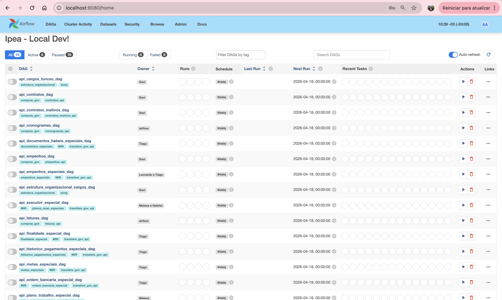
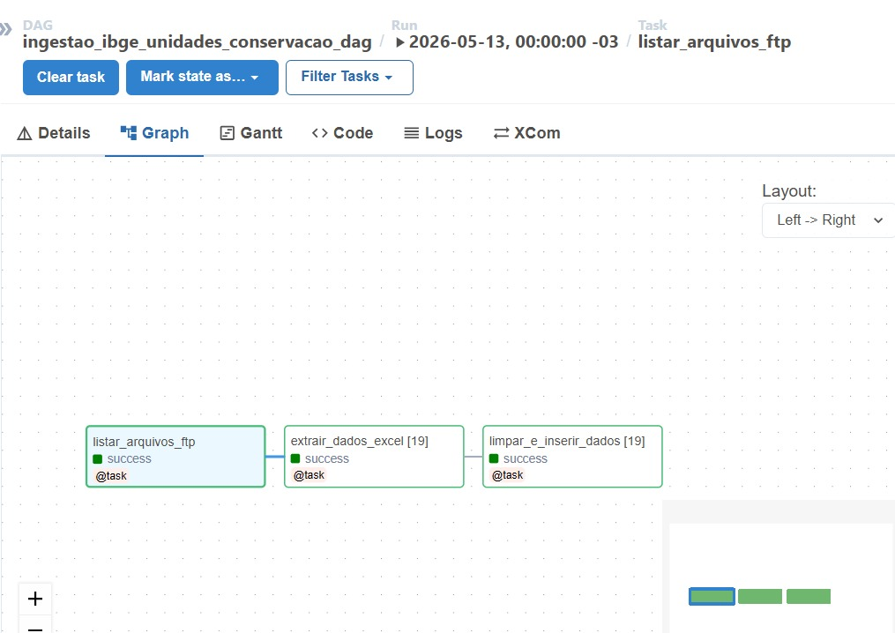
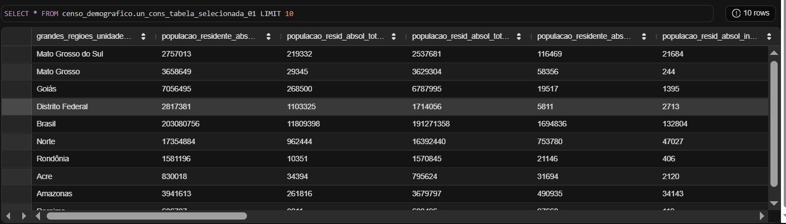
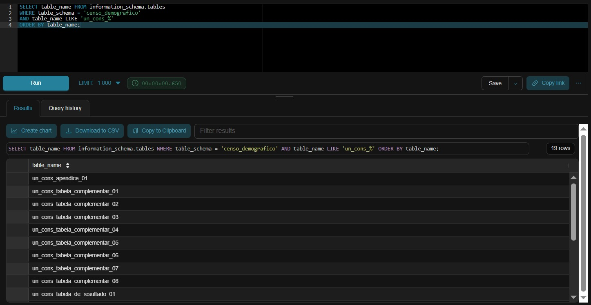
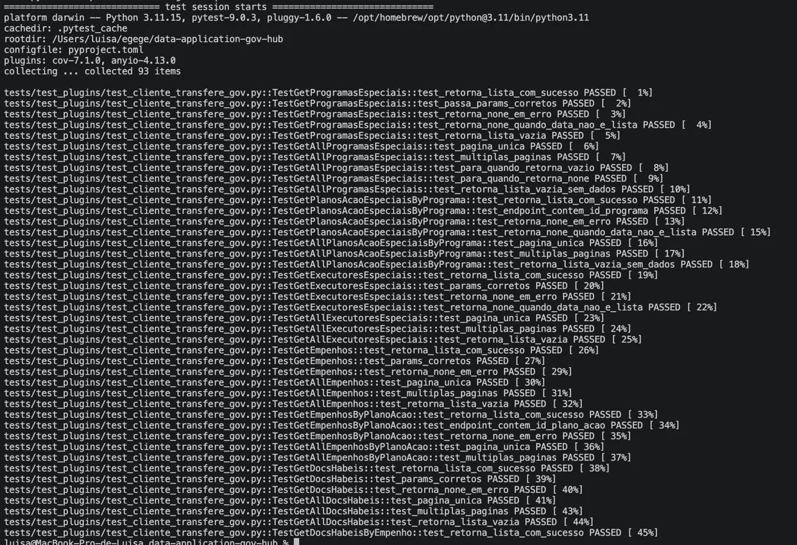
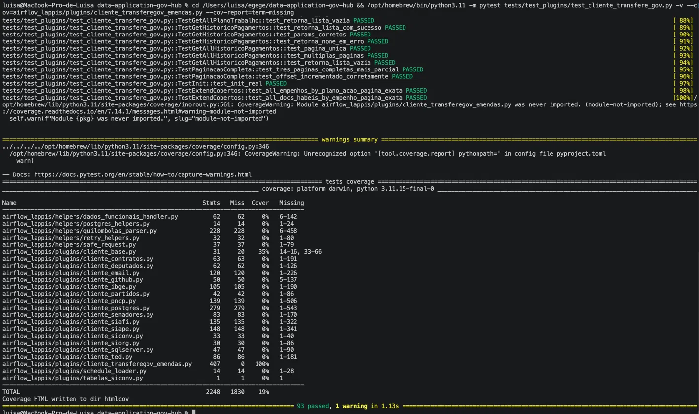
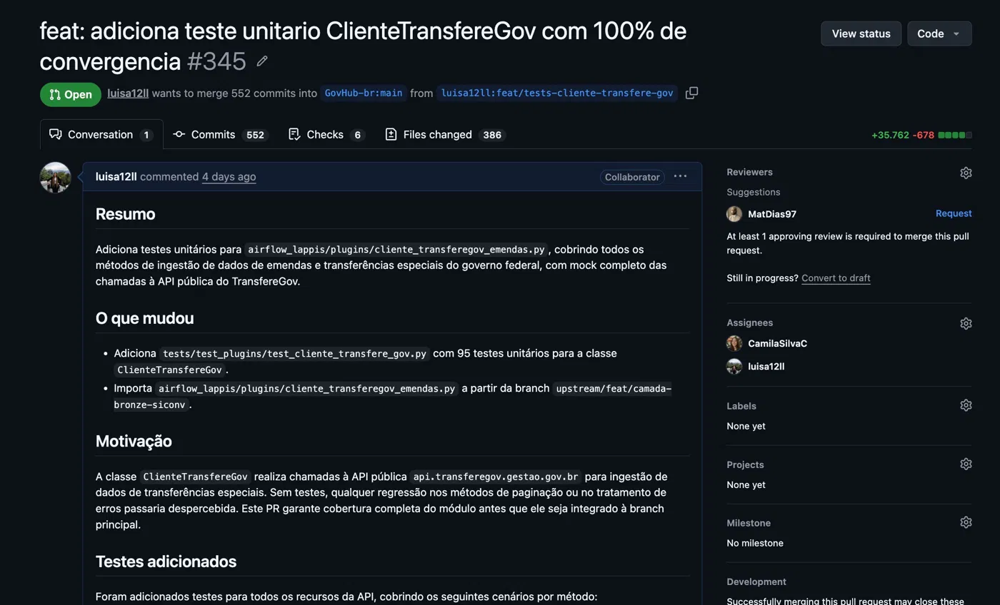

# Diário de Bordo – Luisa de Souza Ferreira

**Disciplina:** Gerência de Configuração e Evolução de Software (GCES)

**Equipe:** Gov Hub BR

**Comunidade/Projeto de Software Livre:** Gov Hub BR

---

## Sprint 0 – [06/04/2026 – 20/04/2026]

### Resumo da Sprint

Essa sprint foi focada na organização da equipe e na estruturação da governança do projeto, incluindo a criação do fork e do repositório de documentação. Realizei o estudo das políticas de contribuição, a leitura integral do e-book e das documentações técnicas. Além disso, configurei o ambiente de desenvolvimento local e, como responsável pela organização, desenvolvi o GitHub Pages utilizando Docsify, garantindo um ambiente padronizado para os relatórios dos membros da equipe.

### Atividades Realizadas

| Data | Atividade | Tipo | Link/Referência | Status |
| :--- | :--- | :--- | :--- | :--- |
| 09/04 | Criação do fork | Código | [Link](https://github.com/luisa12ll/gov-hub.git) | Concluído |
| 11/04 | Estudo das políticas de contribuição e diretrizes do projeto | Estudo | [Guia de Contribuição](https://gov-hub.io/govhub/comunidade/guia-contribuicao/) | Concluído |
| 14/04 | Leitura do E-book e imersão na arquitetura do sistema | Estudo | [E-book GovHub](https://gov-hub.io/govhub/ebook-viewer/) | Concluído |
| 15/04 | Configuração do ambiente local | Código | [Guia de Instalação](https://gov-hub.io/govhub/documentacao/instalacao/) | Concluído |
| 15/04 |Criação do repositório e implementação do Pages dos relatórios| Documentação | [GitHub Pages](https://luisa12ll.github.io/GCES-GovHub-relatorios/#/) | Concluído |
| 18/04 |Atualizando a estrutura do Pages para uma melhor organizacão| Documentação | [GitHub Pages](https://luisa12ll.github.io/GCES-GovHub-relatorios/#/) | Concluído |
| 19/04 |Organizando o meu Diário de Bordo | Documentação | - | Concluído |


### Detalhamento das Atividades Realizadas

Para consolidar a configuração do ambiente e validar as minhas atividades no projeto GovHub, realizei testes e validações locais. Abaixo estão detalhadas as etapas principais, desde a execução da plataforma até a verificação da persistência dos dados:

<details>
<summary><span style="font-size: 1.25em; font-weight: bold; cursor: pointer;">1. Rodando Interface da Plataforma GovHub</span></summary>

Página inicial do Gov Hub BR em execução local (localhost:8000), demonstrando os domínios disponíveis


<p align="center"><i><b>Fonte:</b> Luísa de Souza Ferreira</i></p>
</details>

<details>
<summary><span style="font-size: 1.25em; font-weight: bold; cursor: pointer;">2. Superset - Banco de Dados Conectado</span></summary>

Tela do Apache Superset mostrando a conexão "PostgreSQL Local" configurada com sucesso, habilitando a visualização dos dados processados pelo pipeline. 


<p align="center"><i><b>Fonte:</b> Luísa de Souza Ferreira</i></p>
</details>

<details>
<summary><span style="font-size: 1.25em; font-weight: bold; cursor: pointer;">3. Containers Docker em Execução</span></summary>

Resultado do comando `docker compose ps` mostrando os 4 serviços do pipeline (Airflow, Jupyter, PostgreSQL e Superset) com status **healthy** confirmando que o ambiente está funcionando corretamente.


<p align="center"><i><b>Fonte:</b> Luísa de Souza Ferreira</i></p>
</details>

<details>
<summary><span style="font-size: 1.25em; font-weight: bold; cursor: pointer;">4. Executar Ingestão de Dados - DAG de Contratos Executada</span></summary>

Painel do Apache Airflow mostrando a DAG `api_contratos_dag` ativa e com 2 execuções bem-sucedidas, confirmando que a ingestão dos dados de contratos foi realizada com sucesso.


<p align="center"><i><b>Fonte:</b> Luísa de Souza Ferreira</i></p>
</details>

<details>
<summary><span style="font-size: 1.25em; font-weight: bold; cursor: pointer;">5. Mapear Fontes Disponíveis no Airflow</span></summary>

Painel do Airflow exibindo as 70 DAGs disponíveis no projeto, cada uma responsável por ingerir dados de um sistema governamental diferente (SIAFI, SIAPE, SIORG, Compras.gov, etc).


<p align="center"><i><b>Fonte:</b> Luísa de Souza Ferreira</i></p>
</details>

<details>
<summary><span style="font-size: 1.25em; font-weight: bold; cursor: pointer;">6. DBT - Conexão com o Banco Validada </span></summary>

Resultado do comando `dbt debug` mostrando todas as verficações aprovadas: profiles.yml válido, dbt_project.yml válido e **Connection test: OK**, confirmando que o dbt está conectado ao banco PostgreSQL local.

<p align="center"><i><b>Fonte:</b> Luísa de Souza Ferreira</i></p>
</details>

<details>
<summary><span style="font-size: 1.25em; font-weight: bold; cursor: pointer;"> 7. Conferir Carga de Dados no PostgreSQL</span></summary>

Resultado da query `SELECT COUNT(*) FROM contratos.contratos` mostrando **310 registros** carregados na tabela, comprovando que o pipeline completo funcionou: da ingestão via Airflow até a transformação via dbt.


<p align="center"><i><b>Fonte:</b> Luísa de Souza Ferreira</i></p>
</details>

<details>
<summary><span style="font-size: 1.25em; font-weight: bold; cursor: pointer;">8. Consultar Dados via SQL Lab no Superset</span></summary>

SQL Lab do Superset executando `SELECT * FROM contratos.contratos LIMIT 10`, exibindo os contratos do IPEA/DF com campos como número, contratante, órgão de origem, dados prontos para criação de dashboards.


<p align="center"><i><b>Fonte:</b> Luísa de Souza Ferreira</i></p>

</details>


### Maiores Avanços
* Aprendi a configurar e rodar a aplicação do GovHub localmente no meu sistema;
* Estruturei o repositório de documentação e o deploy via GitHub Pages;
* Implementei regras de governança e proteção de branch para a equipe; e
* Compreendi a arquitetura e os padrões do projeto através do E-book oficial.

### Maiores Dificuldades
* Configuração das dependências do ambiente local apresentou conflitos de versões; 
* O deploy do Docsify teve problemas de roteamento e caminhos relativos no GitHub Pages; e
* Gerenciamento de acessos e organização inicial do fluxo de trabalho para garantir a padronização entre todos os membros.

### Aprendizados
* Uso de Docsify para padronização e automação da documentação técnica da equipe;
* Fluxo de contribuição e governança técnica aplicados ao contexto do GovHub;
* Entendimento da arquitetura e das diretrizes do projeto através da leitura do E-book;
* Compreensão das políticas de qualidade e padrões exigidos pela documentação oficial; e
* Resolução de conflitos de dependências durante a configuração do ambiente local.

### Plano Pessoal para a Próxima Sprint
* [X] Realizar a análise de novas issues no repositório oficial para definir as próximas frentes de contribuição.
* [x] Atuar em conjunto com a **Camila Silva** para o diagnóstico e resolução de problemas técnicos identificados na nossa issue.
* [X] Realizar a análise exploratória de dados governamentais para subsidiar as melhorias no sistema.
* [X] Submeter o primeiro Pull Request focado em melhorias na análise de dados.
* [x] Garantir que o repositório de documentação siga atualizado conforme o avanço das sprints.

---

## Sprint 1 – [21/04/2026 – 11/05/2026]

### Resumo da Sprint

Esta sprint foi dedicada ao desenvolvimento do pipeline de extração automatizada dos dados de Unidades de Conservação do Censo 2022 do IBGE. Realizei juntamente com a **Camila Silva** a implementação da DAG de extração via FTP, transformação dos dados em modelo relacional amplo, armazenamento no schema `censo_demografico` e implementação de metadados. Toda entrega foi concluído com sucesso.

### Atividades Realizadas

| Data | Atividade | Tipo | Link/Referência | Status |
| :--- | :--- | :--- | :--- | :--- |
| 25/04 | Estudo e análise da issue - Extração - Unidades de Conservação #121  | Estudo | [Issue #121](https://github.com/GovHub-br/data-application-gov-hub/issues/121) | Concluído |
| 01/05 | Mapeamento das fontes FTP | Estudo | [FTP IBGE](https://ftp.ibge.gov.br/Censos/Censo_Demografico_2022/Unidades_de_Conservacao/) | Concluído |
| 03/05 | Desenvolvimento da DAG de extração | Código | Airflow | Concluído |
| 06/05 | Extração e transformação dos dados | Código | `extrair_dados_excel` | Concluído |
| 06/05 | Armazenamento no PostgreSQL | Código | Schema `censo_demografico` | Concluído |
| 07/05 | Implementação de metadados | Código | `COMMENT ON TABLE/COLUMN` | Concluído |
| 08/05 | Validação das tabelas criadas | Validação | 19 tabelas `UN_CONS_*` | Concluído |
| 08/05 | Testes no Superset | Teste | SQL Lab | Concluído |
| 10/05 | Organizando o meu Diário de Bordo | Documentação | - | Concluído |


### Detalhamento das Atividades Realizadas

Para validar o pipeline de extração, realizamos testes em cada etapa:

<details>
<summary><span style="font-size: 1.25em; font-weight: bold; cursor: pointer;">1. Execução da DAG de Extração</span></summary>

Print do Airflow mostrando a DAG `ingestao_ibge_unidades_conservacao_dag` em execução com as 3 tasks (listar_arquivos_ftp, extrair_dados_excel, limpar_e_inserir_dados) todas com sucesso.


<p align="center"><i><b>Fonte:</b> Luísa de Souza Ferreira</i></p>
</details>

<details>
<summary><span style="font-size: 1.25em; font-weight: bold; cursor: pointer;">2. Validação das Tabelas Criadas</span></summary>

Query SQL mostrando a listagem das 19 tabelas criadas no schema `censo_demografico` com o padrão de nomenclatura `UN_CONS_*` corretamente aplicado.


<p align="center"><i><b>Fonte:</b> Luísa de Souza Ferreira</i></p>
</details>

<details>
<summary><span style="font-size: 1.25em; font-weight: bold; cursor: pointer;">3. Verificação dos Dados Armazenados</span></summary>

Consulta aos dados da tabela `un_cons_tabela_selecionada_01` no Superset, demonstrando os dados demográficos de Unidades de Conservação com dimensões achatadas corretamente.


<p align="center"><i><b>Fonte:</b> Luísa de Souza Ferreira</i></p>
</details>

### Maiores Avanços

* Implementação bem-sucedida da extração automatizada via FTP;
* Desenvolvimento do pipeline completo (listagem → extração → armazenamento);
* Achatamento correto de dimensões em modelo relacional;
* Implementação de metadados no banco de dados;
* Validação de todos os critérios de aceitação da issue;
* Colaboração efetiva com Camila Silva.

### Maiores Dificuldades

* Tratamento de diferentes formatos de arquivo (Excel e CSV);
* Mapeamento correto das dimensões para achatamento relacional;
* Nomenclatura consistente em todas as 19 tabelas.

### Aprendizados

* Desenvolvimento de DAGs complexas no Airflow com múltiplas etapas;
* Tratamento de dados heterogêneos do IBGE;
* Implementação de metadados estruturados em PostgreSQL;
* Técnicas de achatamento (flattening) para modelagem relacional;
* Importância da validação em cada etapa do pipeline.

### Plano Pessoal para a Próxima Sprint

* [X] Revisar feedback do Pull Request.
* [X] Implementar sugestões de melhoria.
* [X] Documentar o pipeline no repositório.
* [X] Colaborar com Camila na finalização do PR.
* [X] Escolher a próxima issue com Camila.
---

## Sprint 2 – [12/05/2026 – 26/05/2026]

### Resumo da Sprint

Esta sprint foi dedicada à implementação de testes unitários para o módulo `cliente_transferegov_emendas.py`, responsável pela ingestão de dados de emendas e transferências especiais do governo federal. Realizei juntamente com a **Camila Silva** a escrita dos testes, o mock completo das chamadas à API pública do TransfereGov e a resolução dos problemas de ambiente. A entrega atingiu 100% de cobertura de linhas no módulo testado.

### Atividades Realizadas

| Data | Atividade | Tipo | Link/Referência | Status |
| :--- | :--- | :--- | :--- | :--- |
| 12/05 | Estudo e análise da issue #320 | Estudo | [Issue #320](https://github.com/GovHub-br/data-application-gov-hub/issues/320) | Concluído |
| 14/05 | Análise do código de `cliente_transferegov_emendas.py` | Estudo | `airflow_lappis/plugins/cliente_transferegov_emendas.py` | Concluído |
| 18/05 | Configuração do ambiente de testes (Python 3.11, dependências) | Ambiente | `pyproject.toml` | Concluído |
| 18/05 | Implementação dos testes unitários com mock da API | Código | `tests/test_plugins/test_cliente_transfere_gov.py` | Concluído |
| 22/05 | Sincronização do fork com o upstream | Código | Branch `feat/tests-cliente-transfere-gov` | Concluído |
| 25/06 | Atualização do Diário de Bordo | Documentação | - | Concluído |
| 07/06 | Abertura do Pull Request | Código | [PR #345](https://github.com/GovHub-br/data-application-gov-hub/pull/345) | Aguardando revisão |

### Detalhamento das Atividades Realizadas

<details>
<summary><span style="font-size: 1.25em; font-weight: bold; cursor: pointer;">1. Análise da Issue e do Módulo</span></summary>

Estudo da [issue #320](https://github.com/GovHub-br/data-application-gov-hub/issues/320) e leitura completa do módulo `cliente_transferegov_emendas.py`, mapeando todos os métodos da classe `ClienteTransfereGov` e identificando os cenários a serem testados: sucesso, erro HTTP, paginação automática e incremento de offset.

</details>

<details>
<summary><span style="font-size: 1.25em; font-weight: bold; cursor: pointer;">2. Configuração do Ambiente de Testes</span></summary>

O projeto exige Python 3.11 (sintaxe `dict | list` introduzida no 3.10), porém o `pytest` estava sendo executado com Python 3.9 do sistema. A solução foi utilizar o Python 3.11 disponível via Homebrew (`/opt/homebrew/bin/python3.11`) e instalar as dependências necessárias (`pytest`, `pytest-cov`, `httpx`, `pandas`) nesse interpretador.

</details>

<details>
<summary><span style="font-size: 1.25em; font-weight: bold; cursor: pointer;">3. Implementação dos Testes Unitários</span></summary>

Implementados 95 testes unitários organizados em classes por recurso da API. O método `request` herdado de `ClienteBase` foi substituído por `MagicMock` direto na instância, eliminando qualquer chamada real à API do governo federal. Os dados mockados simulam o formato real da API (listas de dicts com os campos esperados por cada endpoint).

Recursos cobertos:

- Programas especiais
- Planos de ação especiais por programa
- Executores especiais
- Empenhos especiais (global e por plano de ação)
- Documentos hábeis especiais (global e por empenho)
- Metas especiais
- Finalidades especiais
- Ordens bancárias especiais
- Relatórios de gestão especial e novo
- Planos de trabalho especiais
- Histórico de pagamentos especiais

Execução dos testes - início da suíte:


<p align="center"><i><b>Fonte:</b> Luísa de Souza Ferreira</i></p>

</details>

<details>
<summary><span style="font-size: 1.25em; font-weight: bold; cursor: pointer;">4. Resultado da Cobertura</span></summary>

Execução do `pytest` com `--cov` confirmando 100% de cobertura no módulo testado:

```
airflow_lappis/plugins/cliente_transferegov_emendas.py    407      0   100%
```

93 testes passando, 0 falhas.


<p align="center"><i><b>Fonte:</b> Luísa de Souza Ferreira</i></p>

</details>

<details>
<summary><span style="font-size: 1.25em; font-weight: bold; cursor: pointer;">5. Pull Request Aberto</span></summary>

Pull Request [#345](https://github.com/GovHub-br/data-application-gov-hub/pull/345) aberto na branch `feat/tests-cliente-transfere-gov`, aguardando revisão.


<p align="center"><i><b>Fonte:</b> Luísa de Souza Ferreira</i></p>

</details>

### Maiores Avanços

- Implementação de 95 testes unitários cobrindo todos os métodos da classe `ClienteTransfereGov`;
- Mock completo das chamadas à API pública do TransfereGov, sem dependência de rede;
- Cobertura de 100% das linhas do módulo `cliente_transferegov_emendas.py`;
- Resolução dos conflitos de versão do Python no ambiente local;
- Colaboração efetiva com Camila Silva.

### Maiores Dificuldades

- Incompatibilidade de versão do Python: o sistema usava Python 3.9, mas o projeto exige 3.11, o que causava `TypeError` na coleta dos testes.

### Aprendizados

- Escrita de testes unitários com `unittest.mock` para clientes HTTP;
- Uso de `MagicMock` e `side_effect` para simular paginação automática;
- Configuração de ambientes Python paralelos via Homebrew no macOS;
- Padrões de cobertura de testes com `pytest-cov`;
- Fluxo de sincronização de fork com upstream no Git.

### Plano Pessoal para a Próxima Sprint

- [ ] Acompanhar a revisão e aprovação do PR #345.
- [ ] Implementar sugestões de melhoria apontadas na revisão.
- [ ] Escolher a próxima issue com a Camila.