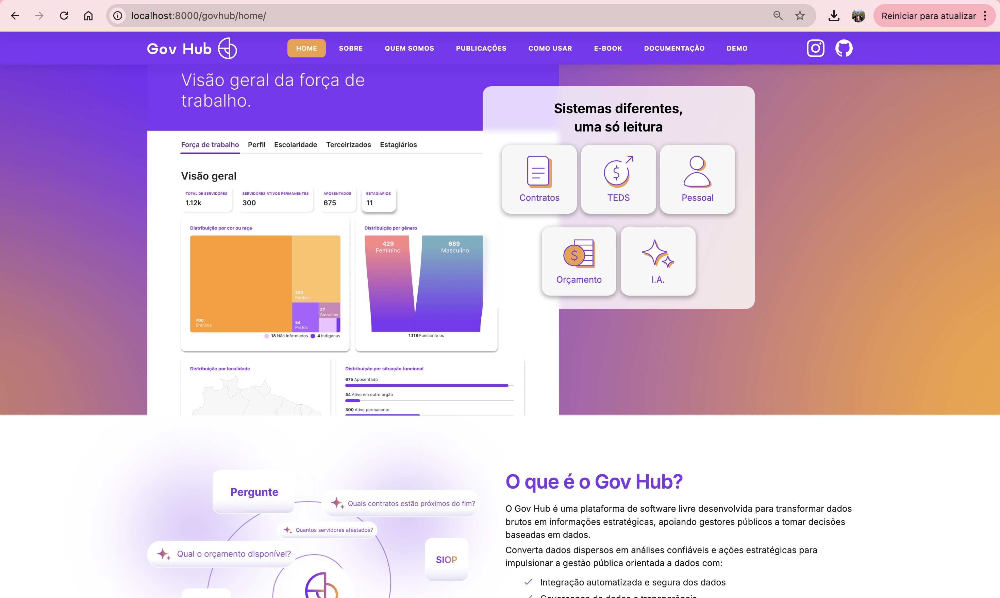
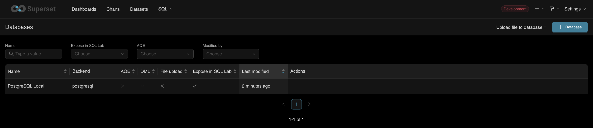
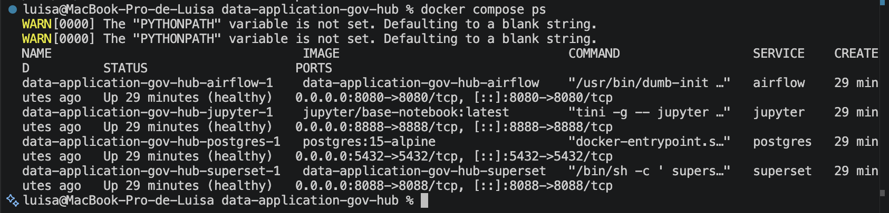
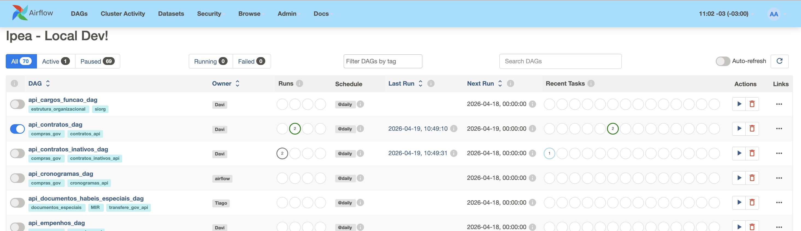
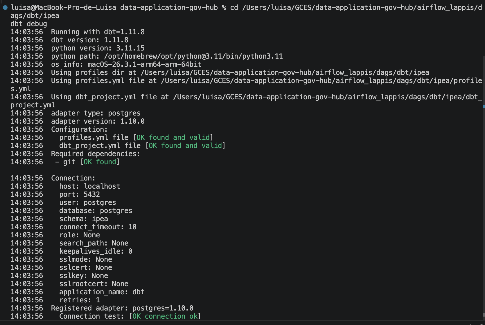
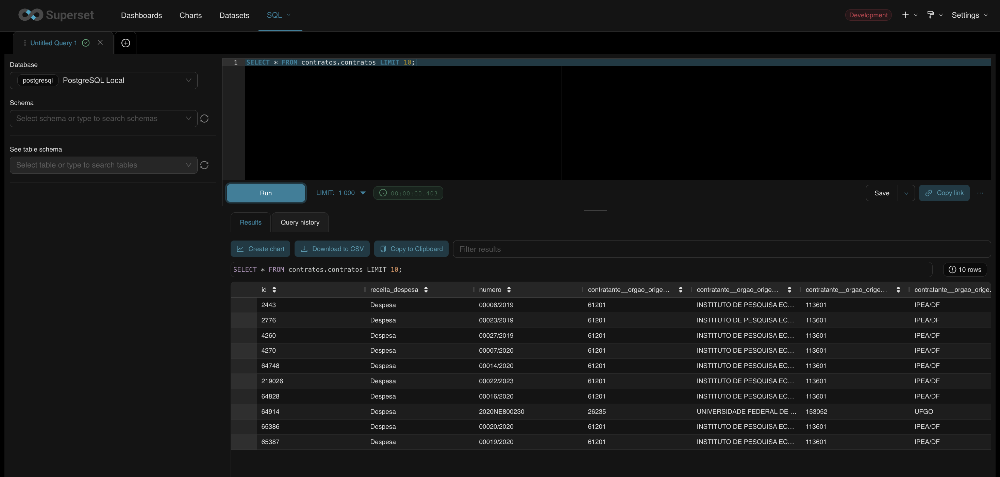
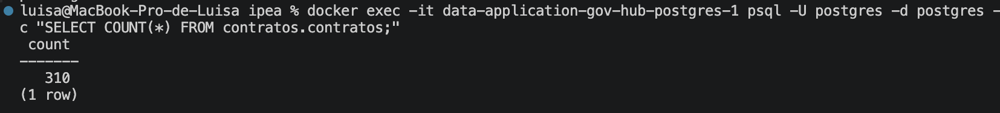

# Diário de Bordo – Luisa de Souza Ferreira

**Disciplina:** Gerência de Configuração e Evolução de Software (GCES)

**Equipe:** Gov Hub BR

**Comunidade/Projeto de Software Livre:** Gov Hub BR

---

## Sprint 0 – [06/04/2026 – 20/04/2026]

### Resumo da Sprint

Essa sprint foi focada na organização da equipe e na estruturação da governança do projeto, incluindo a criação do fork e do repositório de documentação. Realizei o estudo das políticas de contribuição, a leitura integral do e-book e das documentações técnicas. Além disso, configurei o ambiente de desenvolvimento local e, como responsável pela organização, desenvolvi o GitHub Pages utilizando Docsify, garantindo um ambiente padronizado para os relatórios dos membros da equipe.

### Atividades Realizadas

| Data | Atividade | Tipo | Link/Referência | Status |
| :--- | :--- | :--- | :--- | :--- |
| 09/04 | Criação do fork | Código | [Link](https://github.com/luisa12ll/gov-hub.git) | Concluído |
| 11/04 | Estudo das políticas de contribuição e diretrizes do projeto | Estudo | [Guia de Contribuição](https://gov-hub.io/govhub/comunidade/guia-contribuicao/) | Concluído |
| 14/04 | Leitura do E-book e imersão na arquitetura do sistema | Estudo | [E-book GovHub](https://gov-hub.io/govhub/ebook-viewer/) | Concluído |
| 15/04 | Configuração do ambiente local | Código | [Guia de Instalação](https://gov-hub.io/govhub/documentacao/instalacao/) | Concluído |
| 15/04 |Criação do repositório e implementação do Pages dos relatórios| Documentação | [GitHub Pages](https://luisa12ll.github.io/GCES-GovHub-relatorios/#/) | Concluído |
| 18/04 |Atualizando a estrutura do Pages para uma melhor organizacão| Documentação | [GitHub Pages](https://luisa12ll.github.io/GCES-GovHub-relatorios/#/) | Concluído |
| 19/04 |Organizando o meu Diário de Bordo | Documentação | - | Concluído |

### Detalhamento das Atividades Realizadas

Para consolidar a configuração do ambiente e validar as minhas atividades no projeto GovHub, realizei testes e validações locais. Abaixo estão detalhadas as etapas principais, desde a execução da plataforma até a verificação da persistência dos dados:

1. Rodando Interface da Plataforma GovHub

Página inicial do Gov Hub BR em execução local (localhost:8000), demonstrando os domínios disponíveis

<i><b>Fonte:</b> Luísa de Souza Ferreira</i>

2. Superset — Banco de Dados Conectado

Tela do Apache Superset mostrando a conexão "PostgreSQL Local" configurada com sucesso, habilitando a visualização dos dados processados pelo pipeline. 

<i><b>Fonte:</b> Luísa de Souza Ferreira</i>

3. Containers Docker em Execução

Resultado do comando `docker compose ps` mostrando os 4 serviços do pipeline (Airflow, Jupyter, PostgreSQL e Superset) com status **healthy** confirmando que o ambiente está funcionando corretamente.

<i><b>Fonte:</b> Luísa de Souza Ferreira</i>

4. Executar Ingestão de Dados - DAG de Contratos Executada

Painel do Apache Airflow mostrando a DAG `api_contratos_dag` ativa e com 2 execuções bem-sucedidas, confirmando que a ingestão dos dados de contratos foi realizada com sucesso.

<i><b>Fonte:</b> Luísa de Souza Ferreira</i>

5. Mapear Fontes Disponíveis no Airflow

Painel do Airflow exibindo as 70 DAGs disponíveis no projeto, cada uma responsável por ingerir dados de um sistema governamental diferente (SIAFI, SIAPE, SIORG, Compras.gov, etc).

<i><b>Fonte:</b> Luísa de Souza Ferreira</i>

6. DBT — Conexão com o Banco Validada 

Resultado do comando `dbt debug` mostrando todas as verficações aprovadas: profiles.yml válido, dbt_project.yml válido e **Connection test: OK**, confirmando que o dbt está conectado ao banco PostgreSQL local.

<i><b>Fonte:</b> Luísa de Souza Ferreira</i>

 7. Conferir Carga de Dados no PostgreSQL

Resultado da query `SELECT COUNT(*) FROM contratos.contratos` mostrando **310 registros** carregados na tabela, comprovando que o pipeline completo funcionou: da ingestão via Airflow até a transformação via dbt.

<i><b>Fonte:</b> Luísa de Souza Ferreira</i>

8. Consultar Dados via SQL Lab no Superset

SQL Lab do Superset executando `SELECT * FROM contratos.contratos LIMIT 10`, exibindo os contratos do IPEA/DF com campos como número, contratante, órgão de origem, dados prontos para criação de dashboards.

<i><b>Fonte:</b> Luísa de Souza Ferreira</i>

### Maiores Avanços
* Aprendi a configurar e rodar a aplicação do GovHub localmente no meu sistema;
* Estruturei o repositório de documentação e o deploy via GitHub Pages;
* Implementei regras de governança e proteção de branch para a equipe; e
* Compreendi a arquitetura e os padrões do projeto através do E-book oficial.

### Maiores Dificuldades
* Configuração das dependências do ambiente local apresentou conflitos de versões; 
* O deploy do Docsify teve problemas de roteamento e caminhos relativos no GitHub Pages; e
* Gerenciamento de acessos e organização inicial do fluxo de trabalho para garantir a padronização entre todos os membros.

### Aprendizados
* Uso de Docsify para padronização e automação da documentação técnica da equipe;
* Fluxo de contribuição e governança técnica aplicados ao contexto do GovHub;
* Entendimento da arquitetura e das diretrizes do projeto através da leitura do E-book;
* Compreensão das políticas de qualidade e padrões exigidos pela documentação oficial; e
* Resolução de conflitos de dependências durante a configuração do ambiente local.

### Plano Pessoal para a Próxima Sprint
* [ ] Realizar a análise de novas issues no repositório oficial para definir as próximas frentes de contribuição.
* [ ] Atuar em conjunto com a **Camila Silva** para o diagnóstico e resolução de problemas técnicos identificados na nossa issue.
* [ ] Realizar a análise exploratória de dados governamentais para subsidiar as melhorias no sistema.
* [ ] Submeter o primeiro Pull Request focado em melhorias na análise de dados.
* [ ] Garantir que o repositório de documentação siga atualizado conforme o avanço das sprints.
