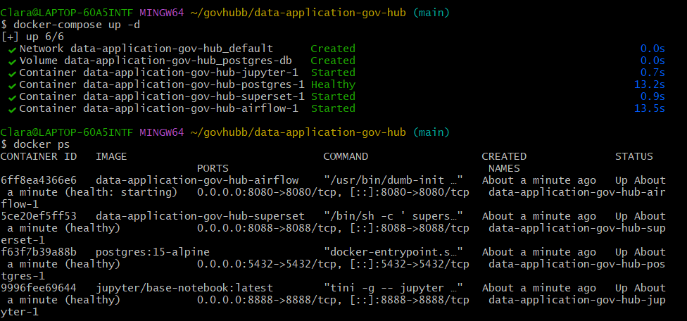
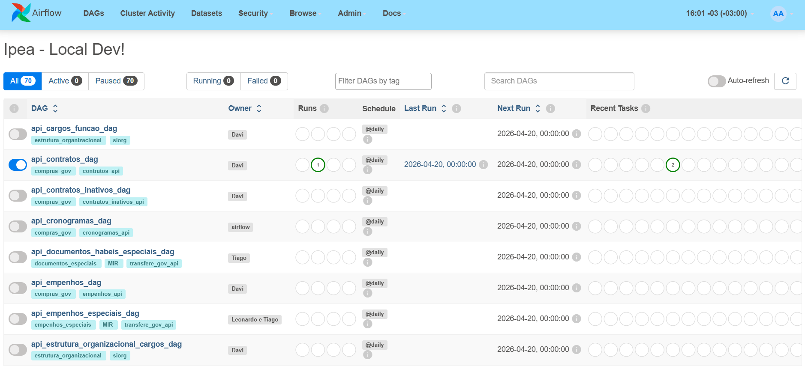
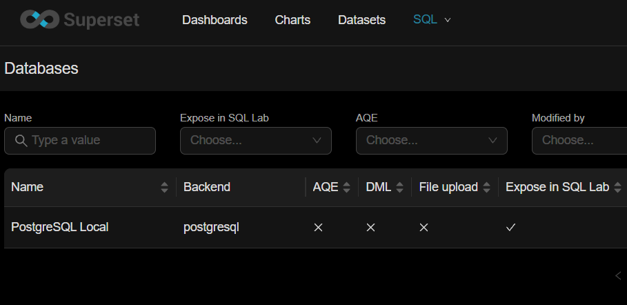

# Diário de Bordo – Maria Clara Alves

**Disciplina:** Gerência de Configuração e Evolução de Software (GCES)

**Equipe:** Gov Hub BR

**Comunidade/Projeto de Software Livre:** Gov Hub BR

---

## Sprint 0 – [06/04/2026 – 20/04/2026]

### Resumo da Sprint

Essa sprint teve como foco principal o aprendizado do fluxo de contribuições e a configuração do ambiente, bem como na familiarização do projeto Gov Hub BR.

### Atividades Realizadas

| Data  | Atividade | Tipo (Código/Doc/Discussão/Outro) | Link/Referência | Status |
| ----- | --------- | --------------------------------- | --------------- | ------ |
| 15/04 | Leitura e estudo da documentação do projeto | Estudo | [link - Documentação](https://gov-hub.io/govhub/sobre-projeto/overview/) | Concluído |
| 19/04 | Configuração inicial do ambiente | Código | [link - Guia de instalação](https://gov-hub.io/govhub/documentacao/instalacao/) | Concluído |
| 20/04 | Rastreamento de good first issues | Estudo | [link - GitHub](https://github.com/GovHub-br/data-application-gov-hub/issues) | Em andamento |

### Atividades realizadas - detalhamento 

1. Configuração da aplicação do GovHub localmente
 

2. Subindo o ambiente com `docker compose`

3. Configuração do Airflow e Superset + conexão do superset com o banco de dados bem sucedida

### Maiores Avanços
* Aprendi a configurar e rodar a aplicação do GovHub localmente no meu sistema;
* Compreendi a arquitetura e os padrões do projeto através do E-book oficial.

### Maiores Dificuldades
* Configuração das dependências do ambiente local apresentou conflitos;
* Entendimento inicial da integração entre as ferramentas do projeto;

### Aprendizados
* Fluxo de contribuição e governança técnica aplicados ao contexto do GovHub;
* Importância de uma documentação clara e bem estruturada em projetos open source;
* Resolução de conflitos de dependências durante a configuração do ambiente local.

### Plano Pessoal para a Próxima Sprint
* [ ] Identificar uma issue para contribuir.
* [ ] Contribuir com pelo menos 1 PR.
* [ ] Participar da revisão de código de um colega.
