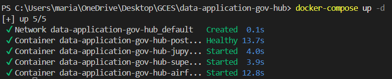
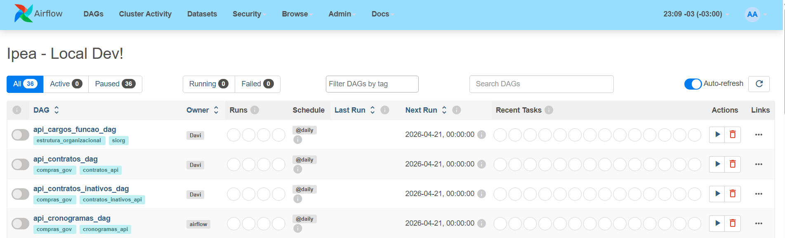
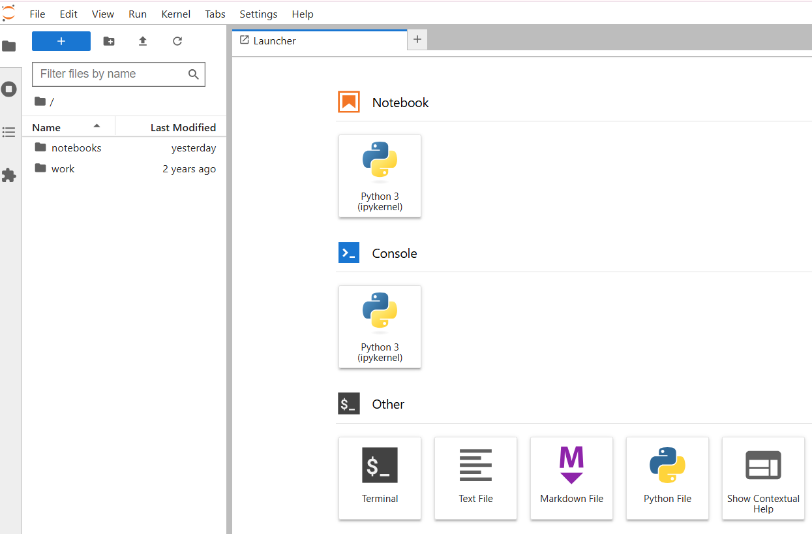
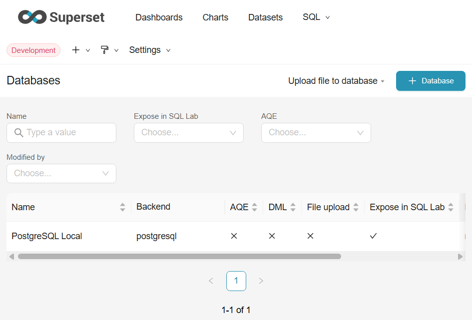

# Diário de Bordo – Maria Eduarda Denis 

*Disciplina:* Gerência de Configuração e Evolução de Software (GCES)  
*Equipa:* Gov Hub BR  
*Comunidade/Projeto de Software Livre:* Gov Hub BR  

---

## Sprint 0 – [06/04/2026 – 23/04/2026]

### Resumo da Sprint
Esta sprint foi dedicada ao reconhecimento da arquitetura do projeto GovHub BR, mapeamento das ferramentas de Gerência de Configuração e superação dos obstáculos técnicos para configurar o ambiente de desenvolvimento em sistema operativo Windows. O foco principal foi garantir a paridade do ambiente local com a stack tecnológica da comunidade através da integração de contentores Docker.

### Atividades Realizadas

| Data  | Atividade | Tipo | Link/Referência | Status |
| ----- | --------- | ---- | --------------- | ------ |
| 16/04 | Estudo da arquitetura Medallion e leitura do E-book | Estudo | [E-book GovHub](https://gov-hub.io/govhub/ebook-viewer/) | Concluído |
| 20/04 | Troubleshooting de instalação do Docker no Windows | Infra | PowerShell Admin | Concluído |
| 22/04 | Setup manual de dependências e variáveis (.env) | Código | Docker Compose | Concluído |
| 23/04 | Integração final Superset e PostgreSQL | Infra | Superset / Postgres | Concluído |
| 23/04 | Mapeamento de Backlog, Issues e Labels | GCES | GitHub Issues | Concluído |

---

### Detalhamento das Atividades Realizadas

#### 1. Orquestração da Stack de Dados
Após a resolução de conflitos de alocação de portas (Port 8088), a stack completa foi instanciada com sucesso. A imagem abaixo comprova o status *healthy* de serviços críticos (Airflow, Jupyter, Postgres e Superset) no ambiente Docker Desktop.

  
Fonte: Maria Eduarda Denis Duarte

#### 2. Validação das Interfaces: Airflow e Jupyter
Acesso garantido às interfaces web do orquestrador *Apache Airflow* (localhost:8080) e do ambiente de desenvolvimento *Jupyter Notebook* (localhost:8888). A estabilização destes serviços ocorreu após a tradução manual dos scripts de inicialização do Makefile para o PowerShell e a configuração correta do ficheiro .env.

  
  
Fonte: Maria Eduarda Denis Duarte

#### 3. Resolução de Conectividade e Drivers (Superset)
Durante a integração da camada de visualização, identifiquei a ausência do driver de conexão no Apache Superset. Realizei uma intervenção direta no contentor via shell interativo (pip install psycopg2-binary) e validei a comunicação bidirecional com o PostgreSQL na rede interna do Docker.

  
Fonte: Maria Eduarda Denis Duarte

#### 4. Mapeamento de Governança e Backlog (Issues)
Realizei uma análise exploratória das issues abertas no repositório para entender a taxonomia de organização da comunidade. O mapeamento revelou uma estrutura de governança baseada em labels que segmentam o trabalho por domínios de dados governamentais e tipos de intervenção técnica.

*Estrutura de Labels Identificada:*
* *Domínios de Dados:* Cidades, IPEA, MIR, Cultura.
* *Taxonomia de Trabalho:* Task (execução técnica), Feature (novas funcionalidades), Bug (correções de erro).
* *Facilitadores de Entrada:* Good First Issue e Help Wanted, essenciais para novos contribuidores.

O backlog atual está fortemente focado na *Ingestão (Extract/Load)* de bases como SIAFI, CAGED e IBGE, além da organização de datasets no Superset.

---

### Maiores Avanços
* *Integração Técnica:* Sucesso na conexão entre a camada de visualização (Superset), orquestração (Airflow), análise (Jupyter) e persistência (PostgreSQL) em ambiente isolado.
* *Orquestração de Ambiente:* Configuração completa da aplicação em Windows/WSL2, superando barreiras de permissões e rede.
* *Mapeamento Estratégico:* Identificação de issues prioritárias (#18 e #19) alinhadas às competências desenvolvidas nesta sprint.
* *Git Workflow:* Realização do fork e configuração de remotes para o fluxo oficial de contribuição.

### Maiores Dificuldades
* *Conflitos de Porta:* Erros de bind na porta 8088 que exigiram a limpeza de contentores órfãos e gestão da rede virtual.
* *Incompatibilidade de Imagem:* Ausência de drivers nativos na imagem oficial do Superset, resolvida via intervenção em runtime.

### Aprendizados
* *Networking em Contentores:* Comunicação via hostnames de serviço internos na infraestrutura Docker.
* *Taxonomia de Backlog:* Como navegar e priorizar tarefas em projetos de software livre de larga escala.
* *Gerência de Configuração:* Importância da persistência de dependências em arquivos de configuração (Dockerfiles).

### Plano Pessoal para a Próxima Sprint
- [ ] Atuar em alguma issue.
- [ ] Propor a persistência do driver psycopg2 via customização do Dockerfile para evitar intervenções manuais.
- [ ] Realizar a primeira ingestão de dados via DAG no Airflow para testar a camada Bronze do projeto.

---

## Sprint 1

### Resumo da Sprint
Durante a Sprint 1, o foco principal migrou para o mapeamento técnico e garantia de qualidade do front-end do projeto, buscando alinhar a minha expertise em Interação Humano-Computador (IHC) com as necessidades da comunidade. Foi realizada uma auditoria na Landing Page do Gov Hub utilizando uma ferramenta especializada em acessibilidade, o que permitiu levantar débitos técnicos significativos na interface, além do mapeamento estratégico de repositórios.

### Atividades Realizadas

| Data  | Atividade | Tipo | Link/Referência | Status |
| ----- | --------- | ---- | --------------- | ------ |
| 24/04 | Mapeamento de issues existentes para contribuição | Discussão/Estudo | [Repositório Gov Hub](https://github.com/GovHub-br/gov-hub) | Concluído |
| 28/04 | Auditoria de Acessibilidade na Landing Page | Outro (Auditoria) | Relatório local do Plugin GG2 | Concluído |

### Maiores avanços
* O uso da Ferramenta de Auditoria IHC v3.1 (Plugin GG2) permitiu identificar sistematicamente gargalos na interface que ferem as diretrizes da WCAG, fornecendo insumos sólidos e métricas (86 erros críticos) para uma proposta formal de refatoração.
* Compreensão inicial da estrutura do projeto em relação à apresentação e necessidades de adequação para navegação via teclado.

### Maiores dificuldades
* **Mapeamento de Arquitetura Multi-repositório:** Encontrar o repositório correto referente ao front-end da aplicação foi um desafio. Inicialmente, a análise esbarrou na arquitetura do repositório `app-lappis-ipea`, que centraliza apenas pipelines (Airflow/dbt) e infraestrutura. Foi necessário realizar comandos de busca via terminal e análises estruturais para localizar o código-fonte da Landing Page no repositório isolado `gov-hub`.

* **Rastreamento de Issues:** No início foi tive dificuldade para contribuir em alguma Issue por falta de Labels OSS. 
### Aprendizados
* Separação de responsabilidades em projetos de grande porte (repositórios distintos para engenharia de dados vs. apresentação/front-end).
* Avaliação prática de acessibilidade em ambientes de produção aplicando métricas de Qualidade de Software.

### Plano Pessoal para a Próxima Sprint
- [x] Consolidar os dados da auditoria em uma Issue detalhada (Governança).
- [x] Configurar o ambiente local do repositório de front-end para iniciar a refatoração.

---

## Sprint 2

### Resumo da Sprint
Nesta sprint, a prioridade foi formalizar o débito técnico encontrado na sprint anterior aplicando estritamente as práticas de **Gerência de Configuração e Rastreabilidade**. A issue detalhando os erros de acessibilidade foi criada, categorizada e assinada, preparando o terreno e as diretrizes de governança para a correção estrutural via código.

### Atividades Realizadas

| Data  | Atividade | Tipo | Link/Referência | Status |
| ----- | --------- | ---- | --------------- | ------ |
| 27/05 | Documentação de Bug (Acessibilidade) | Doc/Discussão | [Issue #106](https://github.com/GovHub-br/gov-hub/issues/106) | Concluído |
| 27/05 | Configuração da Branch de correção | Código | `fix/issue-106-acessibilidade` | Concluído |

### Maiores Avanços
* Abertura estruturada da **Issue #106**, categorizando 86 erros críticos entre Interação/Teclado, Links/Navegação e Semântica/Estrutura. A elaboração incluiu critérios de aceite claros (*Definition of Done*), essenciais para o fluxo ágil.
* Aplicação prática do fluxo de trabalho versionado, vinculando a criação da branch diretamente à issue, garantindo a rastreabilidade da alteração.

### Principais contribuições
* Tradução de uma auditoria acadêmica de IHC em requisitos técnicos acionáveis para o fluxo de desenvolvimento de software livre, garantindo que o problema siga as diretrizes de CI/CD e revisão de código do projeto.

### Maiores dificuldades
* Entender a hierarquia exata dos componentes gerados pelo framework **Tailwind CSS** no repositório `gov-hub` para planejar as intervenções nos estados de foco visível (`:focus`) e semântica HTML (`div` vs `button`) sem quebrar a responsividade da página atual.

### Aprendizados
* Uso pragmático de Metadados no GitHub (Labels como `bug` e configuração de Assignees) para manter a rastreabilidade e o senso de ownership na governança do projeto.
* Leitura e interpretação da estrutura de arquivos do front-end (`index.html` e pipelines de build estáticos).

### Plano Pessoal para a Próxima Sprint (Sprint 3)
- [ ] Aplicar as correções de código (HTML/CSS) na branch `fix/issue-106-acessibilidade` resolvendo os apontamentos do relatório WCAG.
- [ ] Registrar o Commit Semântico utilizando padrões convencionais.
- [ ] Abrir o Pull Request para a Issue #106 e acompanhar o Code Review da comunidade.
- [ ] Iniciar o planejamento e o desenvolvimento do trabalho individual da disciplina.

---
*Assinatura:* Maria Eduarda Denis Duarte Marques