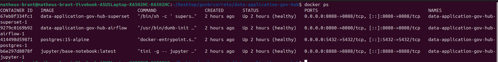
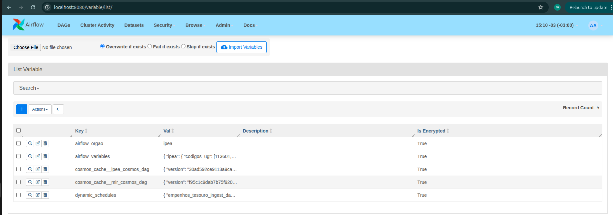
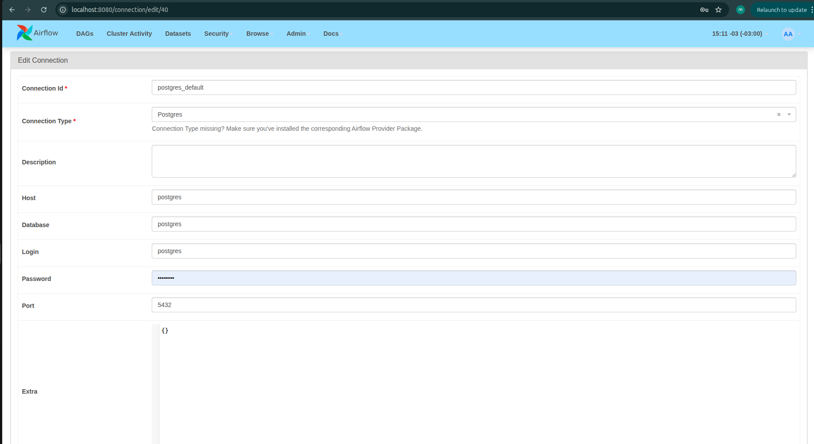
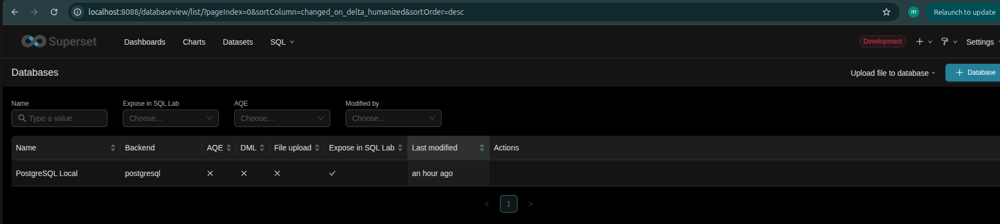
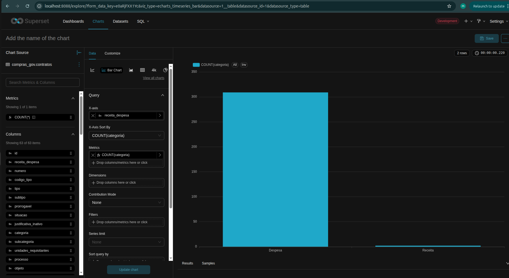
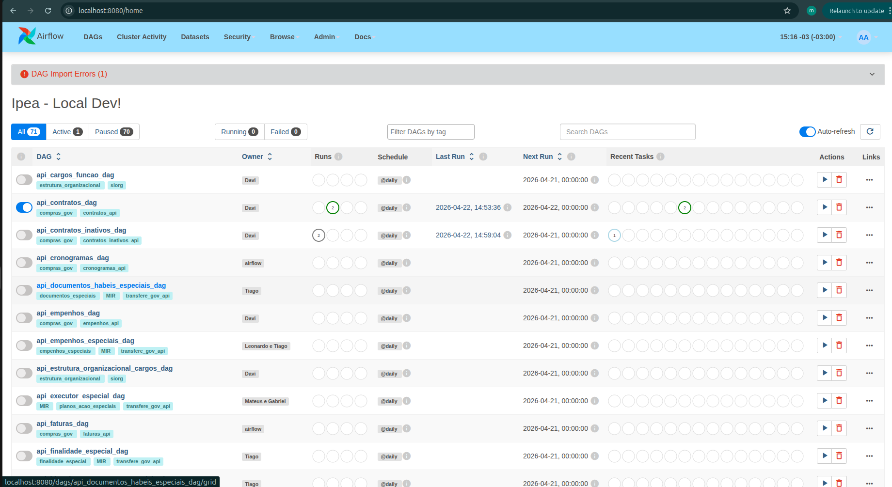
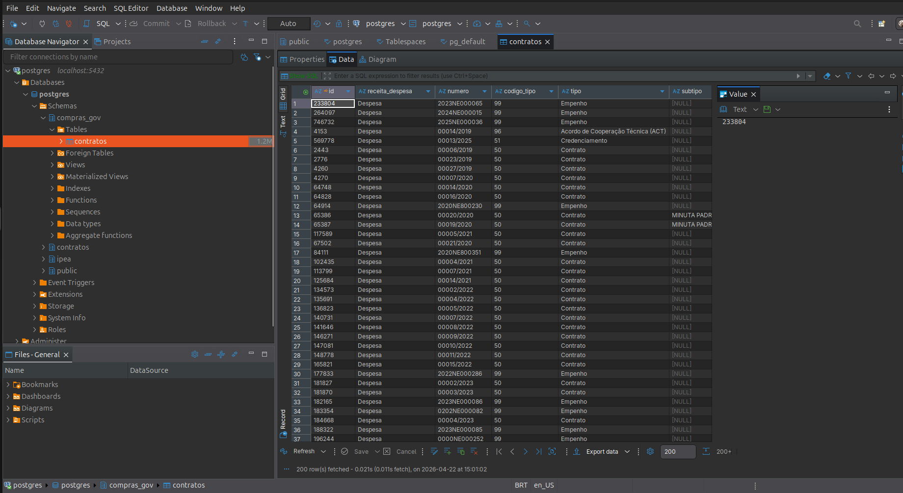

# Diário de Bordo – Matheus de Siqueira Brant

**Disciplina:** Gerência de Configuração e Evolução de Software (GCES)

**Equipe:** Gov Hub BR

**Comunidade/Projeto de Software Livre:** Gov Hub BR

---

## Sprint 0 – [06/04/2026 – 20/04/2026]

### Resumo da Sprint
Nesta sprint, o foco principal foi configurar o ambiente do projeto e entender melhor como funciona o processo de contribuição.

### Atividades Realizadas
| Data  | Atividade | Tipo (Código/Doc/Discussão/Outro) | Link/Referência | Status |
| ----- | --------- | --------------------------------- | --------------- | ------ |
| 17/04 | Leitura e estudo da documentação do projeto | Estudo | [link - Documentação](https://gov-hub.io/govhub/sobre-projeto/overview/) | Concluído |
| 19/04 | Configuração inicial do ambiente | Código | [link - Guia de instalação](https://gov-hub.io/govhub/documentacao/instalacao/) | Concluído |
| 20/04 | Rastreamento de good first issues | Estudo | [link - GitHub](https://github.com/GovHub-br/data-application-gov-hub/issues) | Em andamento |

### Atividades realizadas - detalhamento 

1
. Subindo o ambiente com `docker compose`

2
. Configuração do Airflow e Superset + conexão do superset com o banco de dados bem sucedida

3.Configurando e utilizando o Superset

4. Api contratos dag e dados carregados

5. Configurações dbt

### Maiores Avanços
* Consegui finalizar na configuração do ambiente local.
* Entendi melhor a estrutura do repositório.
* Comecei a explorar as issues do projeto.
* Aprendi melhor como o projeto está organizado.

### Maiores Dificuldades
* A configuração do ambiente levou mais tempo do que eu esperava.
* Tive dificuldade com algumas dependências e comandos.
* Entendimento inicial do projeto.

### Aprendizados
* Fluxo de contribuição do projeto.
* Organização geral do repositório.
* Etapas para rodar o projeto localmente.

### Plano Pessoal para a Próxima Sprint
* [ ] Escolher uma issue para trabalhar.
* [ ] Contribuir com pelo menos 1 PR.
* [ ] Participar da revisão de código de um colega.