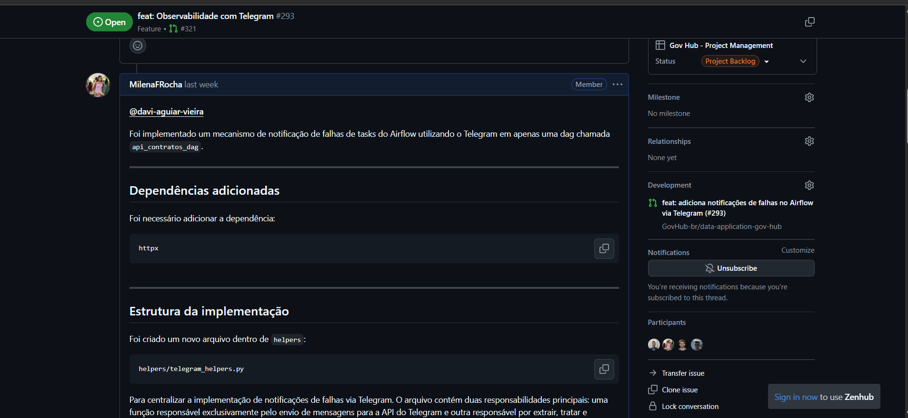

# Diário de Bordo – Milena Fernandes Rocha

**Equipe:** Gov Hub BR
**Comunidade/Projeto de Software Livre:** Gov Hub BR

---

## Sprint 0 – [06/04/2026 – 20/04/2026]

### Resumo da Sprint

Esta sprint teve como foco a ambientação técnica no projeto, abrangendo a configuração do ambiente de desenvolvimento, análise da documentação oficial e compreensão da arquitetura de dados adotada pela plataforma.

Foi realizada a exploração dos pipelines existentes e da organização do repositório, com ênfase na estrutura de DAGs e no fluxo de ingestão de dados. Como resultado prático, foram desenvolvidas as primeiras DAGs, consolidando o entendimento sobre orquestração de workflows e integração entre componentes do sistema.

---

### Atividades Realizadas

| Data  | Atividade                                                            | Tipo   | Link/Referência                                                                                                 | Status    |
| ----- | -------------------------------------------------------------------- | ------ | --------------------------------------------------------------------------------------------------------------- | --------- |
| 06/04 | Configuração do ambiente local (containers, dependências e serviços) | Código | [imagem](assets/dags.png)                                                                                       | Concluído |
| 08/04 | Estudo da documentação oficial e fluxo de contribuição               | Estudo | [Guia](https://gov-hub.io/govhub/comunidade/guia-contribuicao/)                                                 | Concluído |
| 12/04 | Análise da estrutura do repositório e pipelines de dados existentes  | Estudo | [fork de exploração](https://github.com/MilenaFRocha/data-application-cidades)                                  | Concluído |
| 13/04 | Criação de templates padronizados para issues (bug/feature)          | Código | [commit](https://github.com/GovHub-br/data-application-cidades/commit/61a36c70f40d2e3fd211749a9fb6cec04cc0b6cc) | Concluído |
| 15/04 | Desenvolvimento de DAGs para ingestão de dados (ETL inicial)         | Código | [branch](https://github.com/GovHub-br/data-application-cidades/commits/feature/ingestao-dados-habitacao/)       | Concluído |

---

### Maiores Avanços

* Compreensão da arquitetura do projeto, incluindo organização em camadas e separação entre ingestão, processamento e disponibilização de dados.
* Entendimento do funcionamento de pipelines orquestrados por DAGs, incluindo dependências entre tarefas e agendamento.
* Capacidade de configurar e executar o ambiente local com os serviços necessários (ex: banco de dados, orquestrador, containers).
* Implementação das primeiras DAGs de ingestão, aplicando conceitos básicos de ETL (extração, transformação e carga).
* Padronização inicial do processo de contribuição por meio da criação de templates para issues.

---

### Maiores Dificuldades

* Configuração do ambiente local, especialmente em relação a conflitos de portas, variáveis de ambiente e dependências entre serviços.
* Curva de aprendizado inicial na compreensão da estrutura das DAGs e do fluxo completo de execução dos pipelines.
* Entendimento das integrações entre os componentes do sistema (ex: fontes de dados, armazenamento e orquestração).

---

### Aprendizados

* Uso prático de GitHub em fluxo colaborativo: criação de branches, commits, issues e organização de contribuições.
* Estruturação de pipelines de dados utilizando DAGs, incluindo definição de tarefas, dependências e agendamento.
* Conceitos fundamentais de ETL aplicados ao contexto do projeto.
* Boas práticas iniciais de padronização e documentação em projetos de software livre.

---

### Plano Pessoal para a Próxima Sprint

* [ ] Submeter pelo menos 1 Pull Request com código revisado e validado.
* [ ] Participar ativamente de revisões de código (code review).
* [ ] Evoluir as DAGs desenvolvidas, incluindo tratamento de erros e validação de dados.
* [ ] Implementar testes básicos para garantir a confiabilidade dos pipelines.
* [ ] Aprofundar o entendimento sobre a arquitetura de dados do projeto (armazenamento e consumo).

---

## Sprint 1 – [21/04/2026 – 11/05/2026]

### Resumo da Sprint

Sprint dedicada a encontrar a primeira issue para contribuir. Fui designada para a issue [20](https://github.com/GovHub-br/data-application-cidades/issues/20) utilizei uma branch já criada para o desenvolvimento da mesma e consegui meu [PR aprovado](https://github.com/GovHub-br/data-application-cidades/pull/23).

### Atividades Realizadas

| Data  | Atividade                                       | Tipo (Código/Doc/Discussão/Outro) | Link/Referência                                                                                                                     | Status    |
|-------|-------------------------------------------------|-----------------------------------|-------------------------------------------------------------------------------------------------------------------------------------|-----------|
| 14/05 | Designada para issue e estudo da mesma                          | Estudo                            | [Issue 20](https://github.com/GovHub-br/data-application-cidades/issues/20) | Concluído |
| 16/05 | Commit feito              | Desenvolvimento                            | [Commit](https://github.com/GovHub-br/data-application-cidades/commit/a062068db7f8e511c064afbe79e9dc303f887c5f)                                                                       | Concluído |
| 18/05 | PR Aprovado                                    | Configuração                      | [PR](https://github.com/GovHub-br/data-application-cidades/commit/a062068db7f8e511c064afbe79e9dc303f887c5f)                                                     | Concluído |

### Detalhamento das Atividades Realizadas

A issue basicamente era fazer DBTs das camadas bronze, silver e gold para plotagem de gráficos no Superset a partir das golds. Ao analisar os DBTs já desenvolidos percebi que não era necessário bronze e nem silver, apenas a gold pois as ouyras já estavam prontas. Estruturei os sql´s e testei. Populou certo o banco e pude assim fazer o [gráfico de execução financeira x execução física](assets/grafico_superset.png) .

### Maiores Avanços

* Ter contribuido .

### Maiores Dificuldades

* Entender todo o processo e objetivo da issue

### Aprendizados

* Aprendi como funciona DBT

### Plano Pessoal para a Próxima Sprint

* [ ] Procurar outras issue 
* [ ] Poder aprimorar meus conhecimentos técnicos e conhecer novas ferramentas

---

## Sprint 2 – [12/05/2026 – 26/05/2026]

### Resumo da Sprint

Sprint dedicada à contribuição no projeto Gov Hub BR. Implementei minha segunda feature junto com o [Lucas Martins](/contribuicoes_individuais/lucas_martins/lucas_martins.md): um helper para enviar notificações de falhas de tasks do Airflow via Telegram. A feature foi implementada, testada e teve um pull request aberto no repositório principal do projeto.

### Atividades Realizadas

| Data  | Atividade                                      | Tipo (Código/Doc/Discussão/Outro) | Link/Referência                                                                      | Status    |
|-------|------------------------------------------------|-----------------------------------|-------------------------------------------------------------------------------------|-----------|
| 23/05 | Análise da issue #293 de Telegram                | Análise                           | [Issue #293](https://github.com/GovHub-br/data-application-gov-hub/issues/293)       | Concluído |
| 24/05 | Implementação do helper de notificação via Telegram | Código                            | [telegram_helpers.py](https://github.com/martinsglucas/data-application-gov-hub/blob/feat/webhook-alerta-telegram/airflow_lappis/helpers/telegram_helpers.py)         | Concluído |
| 24/05 | Testes da feature e abertura de PR              | Código                            | [PR #321](https://github.com/GovHub-br/data-application-gov-hub/pull/321)            | Concluído |
| 02/0 | Documentação do diário de bordo                 | Documentação                      | -                                                                                    | Concluído |

### Detalhamento das Atividades Realizadas

Os seguintes prints documentam o processo de desenvolvimento da feature de notificações via Telegram:

1. Issue #293 - Observabilidade com Telegram

Issue de feature que propõe a implementação de um webhook do Airflow para notificar falhas de tasks via Telegram

<i><b>Fonte:</b> Lucas Martins</i>

2. Fork do Repositório

Fork do repositório data-application-gov-hub criado para realização das contribuições

<i><b>Fonte:</b> Lucas Martins</i>

3. Dashboard do Airflow

Dashboard do Airflow exibindo os logs de execução da DAG api_contratos_dag com as tasks relacionadas à feature implementada

<i><b>Fonte:</b> Lucas Martins</i>

4. Implementação da Feature - telegram_helpers.py

Código da implementação do helper para envio de mensagens via Telegram, incluindo função de callback para notificar falhas de tasks

<i><b>Fonte:</b> Lucas Martins</i>

5. Notificação de Falha via Telegram

Screenshot da notificação de falha recebida no Telegram, mostrando detalhes da DAG, task, data de execução, erro e logs

<i><b>Fonte:</b> Lucas Martins</i>

6. Pull Request #321 - Webhook Alerta Telegram

Pull request com a implementação completa da feature de notificações de falhas do Airflow via Telegram

<i><b>Fonte:</b> Milena Rocha</i>

### Maiores Avanços

* Segundo pull request aberto no projeto Gov Hub BR.
* Implementação bem-sucedida de feature de observabilidade com Telegram para o Airflow.
* Compreensão da arquitetura e fluxo de desenvolvimento do projeto Gov Hub BR.

### Maiores Dificuldades

* Sem maiores dificuldades significativas, mas o processo de configuração do ambiente local e entendimento da estrutura do projeto exigiu um esforço inicial considerável.

### Aprendizados

* Arquitetura do projeto Gov Hub BR e seu pipeline de dados.
* Integração de webhooks do Airflow para observabilidade e notificações.
* Uso de bibliotecas externas (httpx) para fazer requisições HTTP.
* Uso do bot do Telegram

### Plano Pessoal para a Próxima Sprint

- [ ] Revisar feedback do PR #321 e implementar melhorias sugeridas
- [ ] Trabalhar em novas features ou bug fixes relacionados ao projeto
- [ ] Aprofundar conhecimento em Airflow DAGs e tasks
- [ ] Colaborar com outros membros da equipe em code reviews
 
---

## Sprint 3 – [27/05/2026 – 08/06/2026]

### Resumo da Sprint

Sprint dedicada à realização e entrega da [Issue 32 do GovHub](https://github.com/GovHub-br/data-application-cidades/issues/32).

### Atividades Realizadas

| Data | Atividade | Tipo (Código/Doc/Discussão/Outro) | Link/Referência | Status |
| --- | --- | --- | --- | --- |
| 27/05 | Análise da especificação da issue | Estudo / Doc | [Issue 32](https://github.com/GovHub-br/data-application-cidades/issues/32) | Concluído |
| 28/05 a 05/06 | Construção das camadas bronze, silver e gold | Código | [Commit](https://github.com/GovHub-br/data-application-cidades/commit/b031d5259f3a130fb543d8860fdceaa8cc67c6ae) | Concluído |
| 08/06 | Criação de charts no Superset com as golds | Código / Doc | [Dashboard do Rural](./assets/dahsboard_rural.png) | Concluído |

### Detalhamento das Atividades Realizadas

O projeto foi implementado e consolidado no [PR #88](https://github.com/GovHub-br/data-application-cidades/pull/88). O desenvolvimento incluiu a construção dos modelos no `dbt` (Data Build Tool) necessários para viabilizar as tabelas na camada *gold*, que serviram como fonte de dados para a elaboração dos dashboards finais.

### Maiores Avanços

* **Pipeline End-to-End:** Conclusão bem-sucedida do fluxo completo de dados (ETL/ELT), integrando as camadas Bronze, Silver e Gold.
* **Visualização de Dados:** Entrega funcional das visualizações no Apache Superset (Dashboard do Rural), tornando os dados da camada Gold consumíveis para análise.
* **Consolidação de Código:** Abertura do PR final estruturando todas as etapas desenvolvidas na Issue.

### Maiores Dificuldades

* Lidar com colunas e códigos ausentes de documentação prévia ou dicionário de dados.
* Estruturar e padronizar os dados lidando com diferentes tipos de periodicidade.
* Realizar tratamento e higienização em registros com CNPJs nulos.
* Resolver inconsistências e duplicidades de cadastro (ex: mesmo nome de empreendimento atrelado a diferentes registros de APF).

### Aprendizados

* **Tratamento de Anomalias:** Aprimoramento na criação de regras de negócio no `dbt` para lidar com dados sujos e inconsistentes na origem.
* **Modelagem e Visualização:** Entendimento mais profundo sobre como estruturar a camada *gold* visando a melhor performance e usabilidade dentro do Apache Superset.

### Plano Pessoal para a Próxima Sprint

* Acompanhar a revisão do PR #88, realizar eventuais ajustes ou correções de *code review*.
* Documentar de forma definitiva as regras de negócio utilizadas para o tratamento dos dados, visando facilitar a manutenção futura.
* Iniciar o mapeamento, estudo e desenvolvimento da próxima Issue priorizada para a nova sprint.

---

## Sprint 4 – [09/06/2026 – 22/06/2026]

### Resumo da Sprint

Sprint dedicada à continuidade da contribuição no Gov Hub BR por meio da revisão e manutenção do PR [#321](https://github.com/GovHub-br/data-application-gov-hub/pull/321), referente à feature de alertas de falhas do Airflow via Telegram, desenvolvida em conjunto com o [Lucas Martins](/contribuicoes_individuais/lucas_martins/lucas_martins.md). Durante a sprint, acompanhei os comentários de revisão, corrigi problemas de configuração identificados pelos mantenedores e ajustei a implementação para suportar o envio de notificações para mais de um `chat_id`.

### Atividades Realizadas

| Data  | Atividade | Tipo (Código/Doc/Discussão/Outro) | Link/Referência | Status |
|-------|-----------|-----------------------------------|-----------------|--------|
| 15/06 | Análise dos comentários de revisão do PR #321 | Revisão | [PR #321](https://github.com/GovHub-br/data-application-gov-hub/pull/321#pullrequestreview-4473651469) | Concluído |
| 15/06 | Correção do import do helper de Telegram conforme o `PYTHONPATH` do projeto | Código | [`contratos_ingest_dag.py`](https://github.com/martinsglucas/data-application-gov-hub/blob/feat/webhook-alerta-telegram/airflow_lappis/dags/data_ingest/compras_gov/contratos_ingest_dag.py) | Concluído |
| 15/06 | Inclusão da dependência `httpx` no `requirements.txt` e ajuste da duplicidade no `pyproject.toml` | Configuração | [`requirements.txt`](https://github.com/martinsglucas/data-application-gov-hub/blob/feat/webhook-alerta-telegram/requirements.txt) e [`pyproject.toml`](https://github.com/martinsglucas/data-application-gov-hub/blob/feat/webhook-alerta-telegram/pyproject.toml) | Concluído |
| 15/06 | Ajuste do helper para aceitar um ou múltiplos `chat_id` nas variáveis do Airflow | Código | [`telegram_helpers.py`](https://github.com/martinsglucas/data-application-gov-hub/blob/feat/webhook-alerta-telegram/airflow_lappis/helpers/telegram_helpers.py) | Concluído |
| 15/06 | Correção da quantidade de commits exibida no PR após reescrita da `main` oficial | Manutenção/Git | [PR #321](https://github.com/GovHub-br/data-application-gov-hub/pull/321) | Concluído |
| 16/06 | Documentação das correções realizadas na revisão do PR como contribuição da sprint 4 | Documentação | Este diário de bordo | Concluído |

### Detalhamento das Atividades Realizadas

A continuidade da contribuição foi realizada em conjunto com o Lucas Martins. O foco da sprint foi ajustar a implementação já iniciada na sprint 3, validar a configuração esperada pelo projeto e organizar o histórico da branch para facilitar a revisão pelos mantenedores.

#### Arquivos Alterados na Contribuição

Os últimos commits relacionados ao PR alteraram os seguintes arquivos:

| Arquivo | Descrição da alteração |
|---------|------------------------|
| `airflow_lappis/dags/data_ingest/compras_gov/contratos_ingest_dag.py` | Correção do import para `from telegram_helpers import telegram_failure_callback`, compatível com o `PYTHONPATH` do projeto. |
| `airflow_lappis/helpers/telegram_helpers.py` | Evolução do helper para normalizar a configuração de `chat_id`/`chat_ids` e enviar notificações para múltiplos destinos. |
| `requirements.txt` | Inclusão da dependência `httpx`, necessária para ambientes que instalam dependências por esse arquivo. |
| `pyproject.toml` | Remoção da duplicidade da dependência `httpx` que havia ficado no arquivo. |

#### Commits Relacionados

| Commit | Descrição |
|--------|-----------|
| [`aaf5734`](https://github.com/martinsglucas/data-application-gov-hub/commit/aaf573416fcc39b7c9e6820d37c7dbe4709a9976) | Recriação, após rebase, do patch de implementação inicial das notificações de falhas via Telegram, trabalho já realizado na sprint 3. |
| [`80411b8`](https://github.com/martinsglucas/data-application-gov-hub/commit/80411b8039847dad6c095ac27ba266044616cc82) | Correções solicitadas na revisão durante a sprint 4: import, dependência, múltiplos chats e organização da configuração. |

### Maiores Avanços

* Resposta aos comentários de revisão do PR #321 com ajustes objetivos nos arquivos apontados pelos mantenedores.
* Ampliação da feature para permitir o envio de alertas para mais de um chat do Telegram.
* Correção do histórico da branch do PR após reescrita da `main`, reduzindo o PR para apenas os commits reais da contribuição.
* Validação de que o commit recriado preservou o mesmo patch da implementação original.

### Maiores Dificuldades

* Entender o impacto da reescrita da `main` oficial nos PRs abertos, que passaram a aparecer com centenas de commits indevidos.
* Recriar a branch do PR em cima da nova `main` preservando o conteúdo da contribuição original.
* Ajustar a implementação considerando tanto o ambiente Poetry quanto o uso de `requirements.txt`.

### Aprendizados

* Uso de `git rebase --onto` para reaplicar commits reais de um PR sobre uma nova base.
* Diferença entre preservar o patch de um commit e preservar o hash do commit, que muda quando o commit passa a ter outro pai.
* Importância de alinhar imports com o `PYTHONPATH` configurado no projeto.
* Cuidados ao declarar dependências em projetos que mantêm mais de uma fonte de instalação.
* Como evoluir uma configuração simples (`chat_id`) para suportar múltiplos destinos mantendo compatibilidade com o formato anterior.

### Plano Pessoal para a Próxima Sprint

- [ ] Acompanhar a nova rodada de revisão do PR #321
- [ ] Realizar ajustes adicionais caso os mantenedores solicitem
- [ ] Verificar se a configuração com múltiplos chats atende ao caso de uso esperado pela equipe
- [ ] Continuar contribuindo com melhorias de observabilidade e manutenção no Gov Hub BR
