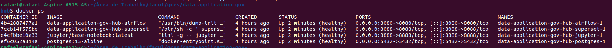
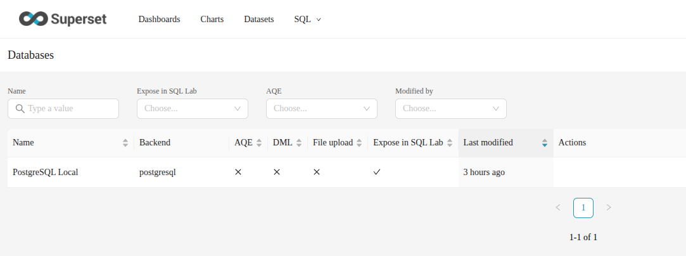
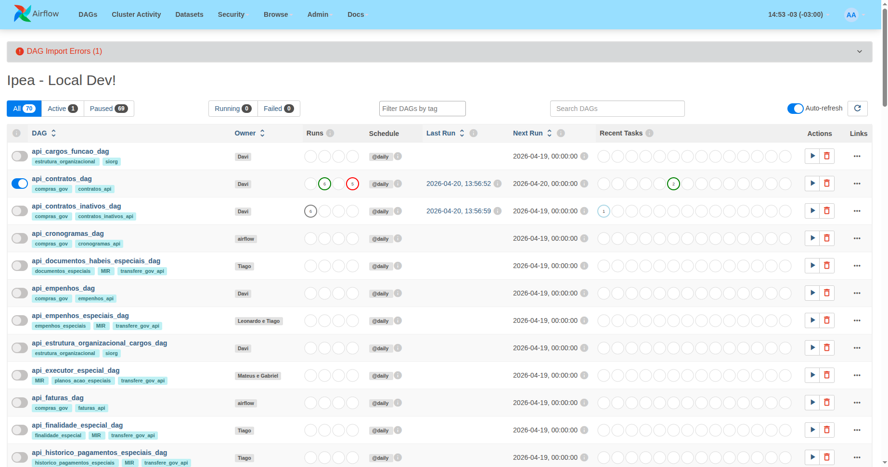
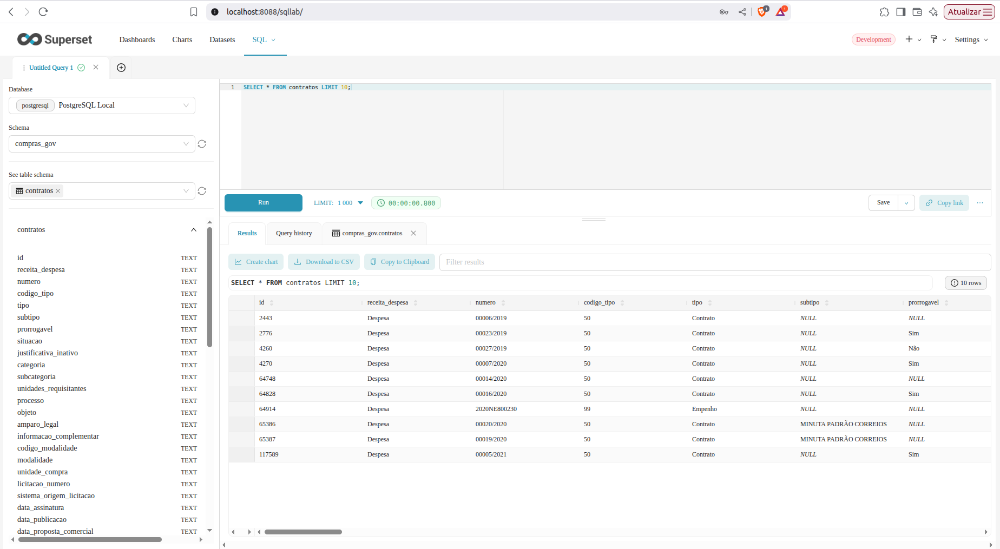
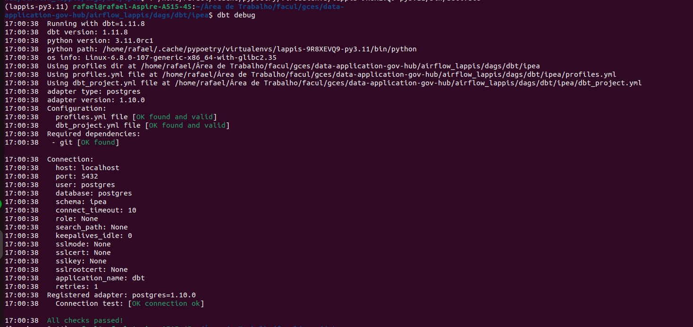
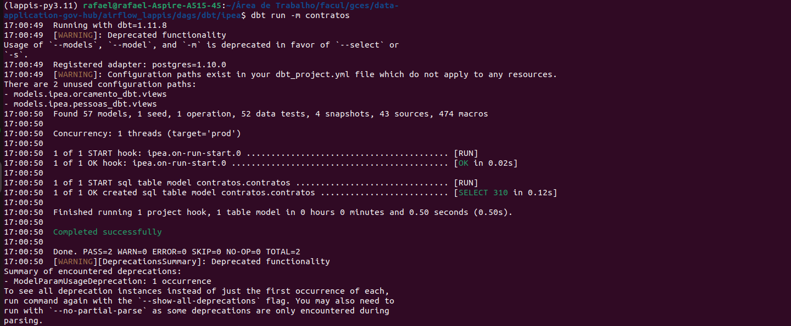

# Diário de Bordo – Rafael Melo Matuda

**Disciplina:** Gerência de Configuração e Evolução de Software (GCES)

**Equipe:** Gov Hub BR

**Comunidade/Projeto de Software Livre:** Gov Hub BR

---

## Sprint 0 – [06/04/2026 – 20/04/2026]

### Resumo da Sprint
Durante a sprint 0, o foco principal foi na familiarização do projeto Gov Hub BR e no aprendizado do fluxo de contribuições e a configuração do ambiente.

| Data  | Atividade | Tipo (Código/Doc/Discussão/Outro) | Link/Referência | Status |
| ----- | --------- | --------------------------------- | --------------- | ------ |
| 15/04 | Leitura e estudo da documentação do projeto | Estudo | [link - Documentação](https://gov-hub.io/govhub/sobre-projeto/overview/) | Concluído |
| 17/04 | Configuração inicial do ambiente | Código | [link - Guia de instalação](https://gov-hub.io/govhub/documentacao/instalacao/) | Concluído |
| 17/04 | Rastreamento de good first issues | Estudo | [link - GitHub](https://github.com/GovHub-br/data-application-gov-hub/issues) | Em andamento |

### Maiores Avanços
* Consegui configurar e rodar a aplicação do GovHub localmente, validando toda a stack (Airflow, Superset e dbt);

* Consegui rodar a aplicação localmente. Containers Dockers rodando:

* Entendi melhor a organização do repositório.
* Configuração do Airflow e Superset.

* Conexão do superset com o banco de dados bem sucedida

* Configuração do dbt

### Maiores Dificuldades
* Variáveis de Ambiente: Erros de sintaxe (espaços em branco) nas chaves das variáveis do Airflow impediram a ingestão inicial.
* Configuração inicial do ambiente local;
* Entendimento inicial da integração entre as ferramentas do projeto (Airflow, Superset e dbt);

### Aprendizados
* Entendimento na prática do fluxo de contribuição e arquitetura do projeto.
* Configuração completa do Airflow, Superset e dbt;
* Importância de uma documentação clara e bem estruturada em projetos open source;

### Plano Pessoal para a Próxima Sprint
* [ ] Identificar uma boa issue para contribuir.
* [ ] Contribuir com pelo menos 1 PR.
* [ ] Participar da revisão de código de um colega.