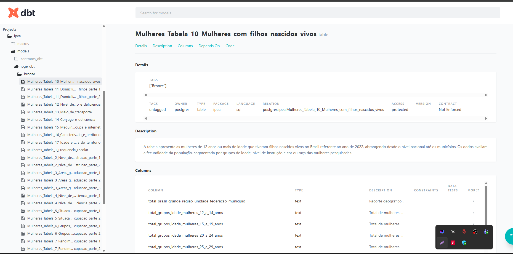
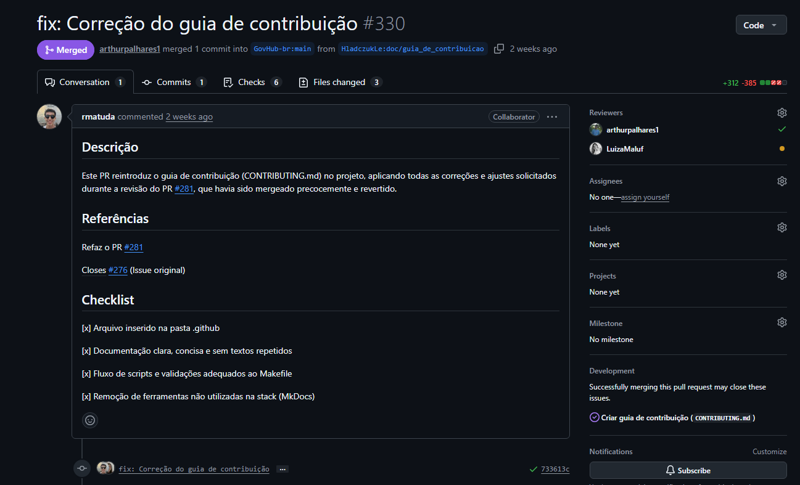

# Diário de Bordo – Rafael Melo Matuda

**Disciplina:** Gerência de Configuração e Evolução de Software (GCES)

**Equipe:** Gov Hub BR

**Comunidade/Projeto de Software Livre:** Gov Hub BR

---

## Sprint 0 – [06/04/2026 – 20/04/2026]

### Resumo da Sprint
Durante a sprint 0, o foco principal foi na familiarização do projeto Gov Hub BR e no aprendizado do fluxo de contribuições e a configuração do ambiente.

| Data  | Atividade | Tipo (Código/Doc/Discussão/Outro) | Link/Referência | Status |
| ----- | --------- | --------------------------------- | --------------- | ------ |
| 15/04 | Leitura e estudo da documentação do projeto | Estudo | [link - Documentação](https://gov-hub.io/govhub/sobre-projeto/overview/) | Concluído |
| 17/04 | Configuração inicial do ambiente | Código | [link - Guia de instalação](https://gov-hub.io/govhub/documentacao/instalacao/) | Concluído |
| 17/04 | Rastreamento de good first issues | Estudo | [link - GitHub](https://github.com/GovHub-br/data-application-gov-hub/issues) | Em andamento |

### Maiores Avanços
* Consegui configurar e rodar a aplicação do GovHub localmente, validando toda a stack (Airflow, Superset e dbt);

* Consegui rodar a aplicação localmente. Containers Dockers rodando:

* Entendi melhor a organização do repositório.
* Configuração do Airflow e Superset.

* Conexão do superset com o banco de dados bem sucedida

* Configuração do dbt

### Maiores Dificuldades
* Variáveis de Ambiente: Erros de sintaxe (espaços em branco) nas chaves das variáveis do Airflow impediram a ingestão inicial.
* Configuração inicial do ambiente local;
* Entendimento inicial da integração entre as ferramentas do projeto (Airflow, Superset e dbt);

### Aprendizados
* Entendimento na prática do fluxo de contribuição e arquitetura do projeto.
* Configuração completa do Airflow, Superset e dbt;
* Importância de uma documentação clara e bem estruturada em projetos open source;

### Plano Pessoal para a Próxima Sprint
* [x] Identificar uma boa issue para contribuir.
* [ ] Contribuir com pelo menos 1 PR.
* [x] Participar da revisão de código de um colega.

## Sprint 1 – [21/04/2026 – 04/05/2026]

### Resumo da Sprint
Trabalhei em parceria com o [Letícia Hladczuk](https://github.com/HladczukLe) para desenvolver o fluxo de dados do IBGE focado no Censo Demográfico das Mulheres. Nosso principal objetivo foi criar uma solução de coleta e organização de dados capaz de lidar com a falta de padrão nas planilhas do governo. Garantimos que o sistema funcione de forma estável, não duplique informações caso precise ser reiniciado e esteja pronto para crescer no futuro. Ao final da sprint, concluímos a implementação e abrimos o Pull Request correspondente para revisão da equipe.

### Atividades Realizadas

| Data  | Atividade | Tipo | Link/Referência | Status |
| ----- | --------- | ---- | --------------- | ------ |
| 21/04 - 23/04 | Mapeamento inicial do projeto e busca por tarefas acessíveis (*good first issues*) | Estudo | [Issues - GovHub](https://github.com/GovHub-br/data-application-gov-hub/issues) | Concluído |
| 24/04 - 27/04 | Desenvolvimento do fluxo de dados do Censo das Mulheres (Issue #122) | Código | [Issue #122](https://github.com/GovHub-br/data-application-gov-hub/issues/122) | Concluído |
| 28/04 | Revisão do código | Estudo/Código | - | Concluído |
| 29/04 | Abertura do Pull Request para a Issue #122 | Código/Doc | [Link - PR](https://github.com/GovHub-br/data-application-gov-hub/pull/241) | Concluído |
| 01/05 | Recebimento da revisão dos mantenedores do projeto | Código | [Link - PR](https://github.com/GovHub-br/data-application-gov-hub/pull/241) | Concluído |
| 01/05 - 04/05 | Desenvolvimento das alterações solicitadas | Código | [Link - PR](https://github.com/GovHub-br/data-application-gov-hub/pull/241) | Concluído |
| 06/05 | Revisão e submissão das alterações | Código | [Link - PR](https://github.com/GovHub-br/data-application-gov-hub/pull/241) | Concluído |

### Implementação da Issue #122

O foco desta entrega foi criar um caminho totalmente automatizado para extrair, limpar e disponibilizar os dados do pacote "Mulheres" do Censo Demográfico 2022. 

As principais atividades foram:

* **Coleta automatizada:** Conectamos nosso sistema diretamente aos servidores do IBGE para ler e baixar os arquivos de forma dinâmica. Optamos por processar esses arquivos na memória, tornando o fluxo mais rápido e evitando sobrecarregar o armazenamento local.
* **Limpeza e organização dos dados:** Desenvolvemos regras inteligentes para ler as planilhas. O sistema agora ignora abas desnecessárias (como gráficos) e identifica automaticamente onde começam os dados reais. Além disso, padronizamos os nomes das colunas.
* **Armazenamento seguro:** Garantimos que os dados fossem salvos no banco de forma segura. Implementamos uma trava de segurança que limpa os registros anteriores antes de uma nova inserção, impedindo a duplicação de dados caso o processo precise rodar mais de uma vez. Também adicionamos colunas para rastrear de onde e quando cada dado veio. Após a revisão do PR, ajustamos a abordagem para utilizar a função `drop_duplicates()` em vez de remover diretamente os registros do banco."
* **Integração e documentação:** Conectamos esse novo fluxo com as ferramentas já utilizadas pelo projeto (dbt) e deixamos as tabelas e colunas devidamente documentadas no banco de dados para facilitar a vida dos próximos desenvolvedores ou analistas que forem utilizar essa base.

### Maiores Avanços
* Criamos uma solução para "fatiar" tabelas do governo que vinham agrupadas horizontalmente, utilizando as colunas em branco das próprias planilhas como guias de corte.
* Garantimos a confiabilidade da ingestão de dados ao criar um mecanismo de prevenção contra dados duplicados.
* Criação e submissão do Pull Request da Issue #122. 
* Conseguimos atender aos pontos levantados na revisão do PR.

### Maiores Dificuldades
* Lidar com os dados abertos do governo. Muitas planilhas utilizam células mescladas e espaços em branco apenas por motivos estéticos, o que dificulta bastante a leitura automatizada.
* As tabelas `.xlsx` possuem várias abas, fazendo necessária uma análise crítica para decidir o que precisaria ser lido para trazer os dados corretos. As abas preferencialmente lidas foram as últimas, onde tinham dados do SIDRA, trazendo de 1 a 3 tabelas por aba. Nesse processo, o complicado foi conseguir lidar com as diferentes estruturas que existiam de uma tabela para outra e/ou de um arquivo para outro.
* Foi necessário criar regras de exceção para algumas tabelas específicas, para que o nome das colunas viesse como solicitado na revisão do PR.
* Conectar no ambiente dbt local.
* Erro ao dar push na branch, sendo necessário fazer um fork do projeto.

### Aprendizados
* Compreensão aprofundada do projeto do GovHub.
* Aprofundei meu conhecimento em limpeza e transformação de dados com pandas, especialmente no tratamento de planilhas com estruturas irregulares.
* Adquiri conhecimento sobre o dbt.
* Adquiri conhecimento sobre ingestão de dados.

Comprobatórios da Issue #122

<h3>Dag para extração das tabelas - <i>mulheres_censo_demografico_dag</i></h3>

<h3>Tabelas extraídas no banco de dados PostgreSQL</h3>

<h3>Tabelas na camada Bronze do DBT</h3>

### Plano Pessoal para a Próxima Sprint
- [x] Ter o PR aprovado
- [x] Encontrar novas issues para contribuir

---

## Sprint 2 – [05/05/2026 – 17/05/2026]
 
### Resumo da Sprint
Nesta sprint, trabalhei em parceria com o [Letícia Hladczuk](https://github.com/HladczukLe) na Issue #276 do GovHub BR. Nosso foco foi estruturar o guia de contribuição (CONTRIBUTING.md).

Nós abrimos o Pull Request (#281) e ele chegou a ser mergeado na branch principal no dia 19/05. No entanto, ainda no mesmo dia, realizaram um revert da nossa entrega por falta de uma revisão mais detalhada. Como as duas ações (o merge e o revert) aconteceram quase simultaneamente, não percebemos de imediato que a nossa contribuição havia sido desfeita e os PRs haviam sido fechados. Identificamos isso alguns dias depois, o que atrasou o início das correções necessárias.

### Atividades Realizadas
 
| Data | Atividade | Tipo | Link/Referência | Status |
| ---- | --------- | ---- | --------------- | ------ |
| 05/05 - 12/05 | Busca de novas issues para contribuir | Estudo | [Issues - GovHub](https://github.com/GovHub-br/data-application-gov-hub/issues) | Concluído |
| 13/05 - 17/05 | Desenvolvimento do `CONTRIBUTING.md` (Issue #276) | Doc | [Issue #276](https://github.com/GovHub-br/data-application-gov-hub/issues/276) | Concluído |

 
### Maiores Avanços
* Criação completa do `CONTRIBUTING.md`, suprindo uma lacuna importante de documentação no projeto.
* Identificação clara dos pontos a melhorar a partir do feedback dos mantenedores.

### Maiores Dificuldades
* Compreender com profundidade todas as ferramentas e convenções reais do projeto para não documentar informações incorretas ou desatualizadas.
* Adequar a documentação à estrutura real do projeto exigiu maior imersão no repositório.

### Aprendizados
* Compreensão da importância de documentação viva e alinhada à realidade do projeto, e não apenas à teoria.
* Experiência prática com o processo de revert e o ciclo de revisão em projetos open source.
* Aprofundamento nas convenções de Conventional Commits e boas práticas de contribuição em projetos colaborativos.

### Plano Pessoal para a Próxima Sprint
- [x] Ter o novo PR aprovado por todos os revisores.
- [x] Buscar novas issues para contribuir.

---

## Sprint 3 – [18/05/2026 – 01/06/2026]

### Resumo da Sprint
Nesta sprint, eu e a [Letícia Hladczuk](https://github.com/HladczukLe) finalizamos o PR da documentação de contribuição e acompanhamos sua evolução até o final do período. Enquanto o PR aguardava aprovação, continuei buscando novas issues do GovHub BR para contribuir com o projeto.

Abrimos 2 PRs, o primeiro foi mergeado por engano sem a revisão correta, tivemos que abrir outro para enviar as correções solicitadas. A aprovação e merge do segundo PR ocorreram posteriormente, no dia 27/06.

### Atividades Realizadas

| Data | Atividade | Tipo | Link/Referência | Status |
| ---- | --------- | ---- | --------------- | ------ |
| 18/05 | Finalização do PR do `CONTRIBUTING.md` | Doc | [Link - PR #281](https://github.com/GovHub-br/data-application-gov-hub/pull/281) | Concluído |
| 19/05 | Acompanhamento do PR e análise de comentários | Doc | [Link - PR #281](https://github.com/GovHub-br/data-application-gov-hub/pull/281) | Concluído |
| 27/05 | Abertura de novo PR corrigindo as alterações solicitadas | Doc | [Link - PR #330](https://github.com/GovHub-br/data-application-gov-hub/pull/330) | Concluída|
| 28/05 - 01/06 | Busca de novas issues para contribuir | Estudo | [Issues - GovHub](https://github.com/GovHub-br/data-application-gov-hub/issues) | Concluído |

### Maiores Avanços
* Enviei o PR de documentação de contribuição do projeto.
* Mantive o acompanhamento do processo de revisão até o fim da sprint.

### Maiores Dificuldades
* Achamos que o arquivo `CONTRIBUTING.md` tinha sido mergeado, pois os PRs tinham sido fechados. Isso atrasou um pouco a correção do arquivo.

### Aprendizados
* Entendi melhor o fluxo de contribuição e como deveria ser feita após a revisão.

### Plano Pessoal para a Próxima Sprint
- [x] Acompanhar o resultado final do PR e validar o merge.
- [x] Avançar para o trabalho individual da disciplina.

Comprobatórios da Sprint

<h3>Pull Request #330</h3>

---

## Sprint 4 – [02/06/2026 – 15/06/2026]

### Resumo da Sprint
Nessa sprint, foquei totalmente na entrega do projeto individual da disciplina (o jogo mk.js). Dediquei meu tempo para atualizar o código antigo para o Node moderno, automatizar testes e segurança diretamente no pipeline do GitLab, e criar toda a infraestrutura rodando no Kubernetes e Terraform.

### Atividades Realizadas

| Data | Atividade | Tipo | Link/Referência | Status |
| ---- | --------- | ---- | --------------- | ------ |
| 02/06 - 04/06 | Atualização de dependências antigas do Node, criação do Dockerfile de desenvolvimento com hot-reload e persistência com Postgres (Fases 1 e 2) | Código / Docker | [Repositório GitLab](https://gitlab.com/unb-esw/gces/gces2026-1/trabalho-final-gces-rafael-matuda) | Concluído |
| 04/06 - 06/06 | Configuração do ESLint global, criação do pipeline de Build & Lint, testes unitários com Jest no ciclo de falha/correção e testes de Fuzzing (Fases 3, 4 e 5) | Código / CI/CD | [Repositório GitLab](https://gitlab.com/unb-esw/gces/gces2026-1/trabalho-final-gces-rafael-matuda) | Concluído |
| 06/06 - 08/06 | Integração de ferramentas de segurança (Semgrep e npm audit) e análise de qualidade usando o SonarCloud no GitLab CI (Fases 6 e 7) | CI/CD / Segurança | [Repositório GitLab](https://gitlab.com/unb-esw/gces/gces2026-1/trabalho-final-gces-rafael-matuda) | Concluído |
| 08/06 - 09/06 | Configuração do Docker de produção usando Nginx para servir o frontend e fazer proxy reverso para o Node.js (Fase 8) | Docker | [Repositório GitLab](https://gitlab.com/unb-esw/gces/gces2026-1/trabalho-final-gces-rafael-matuda) | Concluído |
| 09/06 - 10/06 | Criação dos manifestos do Kubernetes, infraestrutura com Terraform, deploy automático no GitLab Container Registry e segurança de rede com HTTPS e Ingress (Fases 9 e 10) | Infra / IaC / CD | [Repositório GitLab](https://gitlab.com/unb-esw/gces/gces2026-1/trabalho-final-gces-rafael-matuda) | Concluído |

### Maiores Avanços

* A base do projeto individual foi estabelecida, priorizando a criação de containers, pipelines de integração e entrega contínuas (CI/CD) e a garantia da qualidade do software.
* Montei um pipeline de CI/CD bem completo no GitLab, rodando desde linter e testes até análises de segurança e envio automático da imagem de produção para o registry.
* O versionamento e o registro das entregas no repositório do GitLab foram mantidos de forma constante durante a criação e validação da esteira DevOps.
* Houve progresso significativo na implementação das funcionalidades do sistema e na elaboração da documentação técnica.
* Corrigi bugs e lints antigos que estavam quebrando o linter do frontend, além de modernizar o acesso à câmera no código do jogo.

### Maiores Dificuldades
* A transição do projeto para uma arquitetura mais atualizada (separando front-end e backend) demandou refatorações nas configurações e resolução de dependências.
* Resolver problemas de dependências antigas do projeto e erros do ESLint que estavam mascarados no início.
* A homologação do sistema em containers e a correta integração com o GitLab CI geraram alguns obstáculos técnicos relacionados à configuração de ambientes e testes.
* Configurar o proxy do Nginx para aceitar conexões via WebSocket (do socket.io) sem quebrar a comunicação do jogo.
* Configurar o Ingress do Kubernetes com HTTPS (cert-manager com certificado autoassinado) rodando localmente.

### Aprendizados
* Aprendi a estruturar um pipeline completo no GitLab CI com gerenciamento de dependências e artefatos de cobertura de código.
* Compreendi como garantir segurança de ponta a ponta (end-to-end) na infraestrutura usando SAST, SCA, HTTPS e redirecionamentos no Nginx.

### Plano Pessoal para a Próxima Sprint
- [ ] Voltar a contribuir no GovHub
