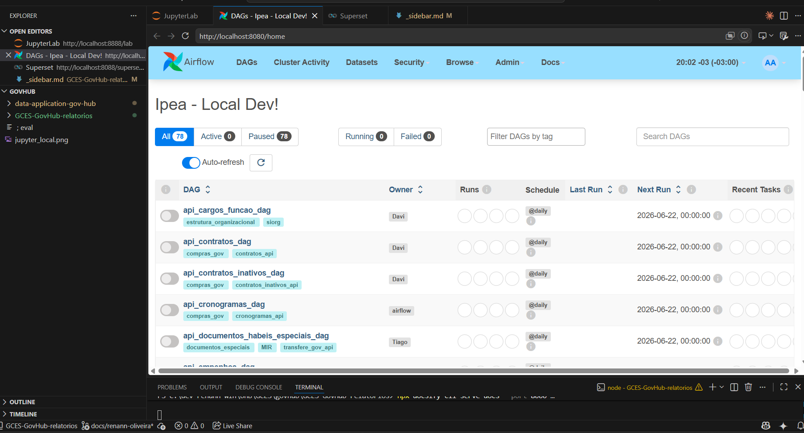
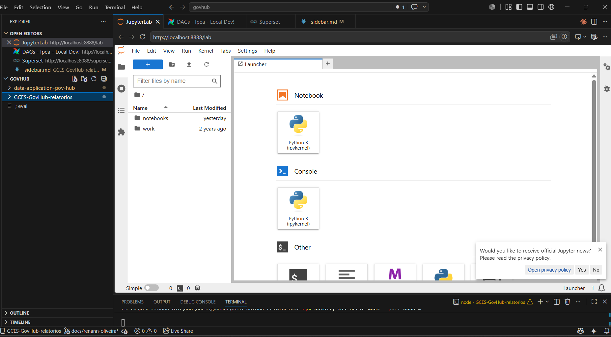
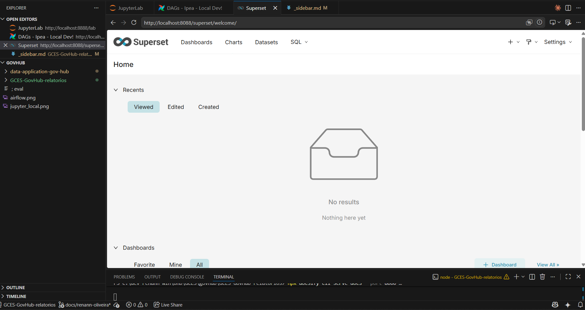

# Diário de Bordo – Luciano de Freitas Melo

**Matrícula:** 200043030  

**Disciplina:** Gerência de Configuração e Evolução de Software (GCES)  

**Equipe:** Gov Hub BR **  

**Projeto:** Gov Hub BR **   

> ** Antes fazia parte do projeto KDE Frameworks e migrei para esse na sprint 3

---

## Sprint 0 – [06/04/2026 – 20/04/2026]

### Resumo da Sprint

Essa Sprint foi focada em entender o ecossistema KDE. Depois segui com a análise do projeto do KDE Frameworks que consistia em conjunto de bibliotecas complementares que facilitam o desenvolvimento de novas aplicação para o ecossistema KDE.   

### Atividades Realizadas

| Data   | Atividade                                            | Tipo (Código/Doc/Discussão/Outro) | Link/Referência         | Status    |
| ------ | ---------------------------------------------------- | --------------------------------- | ----------------------- | --------- |
| 06/04  | Entendendo o que é o KDE Frameworks      | Estudo    | [KDE Frameworks](https://develop.kde.org/products/frameworks/)      | Concluído |
| 08/04  | Leitura do artigo de como contribuir para o ecossistema KDE         | Estudo     | [Get Involved](https://community.kde.org/Get_Involved)     | Concluído |
| 13/04  | Criação de conta no KDE Invent e no Matrix    | Configuração      | [invent.kde.org](https://invent.kde.org) & [matrix.org](https://matrix.org)         | Concluído |
| 15/04  | Explorando possíveis subprojetos para contribuição    | Estudo    | [GitLab - Groups](https://invent.kde.org/explore/groups/active)              | Concluído |
| 19/04  | Estudo do projeto KWidgetsAddons  | Estudo   | [Ship Frameworks via Pip](https://api.kde.org/kwidgetsaddons-index.html) | Concluído |

### Maiores Avanços

* Conta criada na plataforma de contribuição da comunidade Invent e Matrix.
* Visão geral sobre a classificação dos subprojeto em tiers.

### Maiores Dificuldades

* Dificuldade em entender qual issues seriam boas para ínicio e como setar o ambiente de dev para um subprojeto específico.

### Aprendizados

* Entendimento do código de conduta da comunidade.
* Conhecimento da estrutura de repositórios do KDE Frameworks.

### Plano Pessoal para a Próxima Sprint

* [ ] Setar amb. de desenvolvimento para algum subprojeto 
* [ ] Iniciar o desenvolvimento de alguma issue

---

## Sprint 1 – [21/04/2026 – 04/05/2026]

### Resumo da Sprint

> Sem contribuições nessa sprint

### Maiores Avanços

* Sem grandes avanços nessa sprint

### Maiores Dificuldades

* Bastante dificuldade em entrar em contato com o responsável pelos projetos KDE
* Projeto Frameworks é um conjunto de subprojetos, o que dificultou encontrar algum subprojeto que tivesse doc. explicando como setar o amb. de desenvolvimento

### Plano Pessoal para a Próxima Sprint

* [ ] Setar amb. de desenvolvimento para algum subprojeto 
* [ ] Iniciar o desenvolvimento de algum issue

---

## Sprint 2 – [05/05/2026 – 24/05/2026]

### Resumo da Sprint

Durante essa Sprint, busquei outros projeto que pudesse contribuir, usei como critérios os projetos que possuissem mais issues abertas, com isso migrei para o GovHub.
Como a doc. de execução do projeto estava bem estruturada, foi um bom início para executar o projeto, contudo depois tive que migrar para um máquina Windows e na busca por uma alternativa que não fosse dual boot, instalei o WSL e com a ajuda do Claude consegui executar o projeto por meio do WSL.

### Atividades Realizadas

| Data  | Atividade                                   | Tipo (Código/Doc/Discussão/Outro) | Link/Referência | Status    |
| ----- | ------------------------------------------- | --------------------------------- | --------------- | --------- |
| 10/05 | Leitura do código de conduta do projeto      | Doc    | [Guia de Contribuição](https://gov-hub.io/govhub/comunidade/guia-contribuicao/) | Concluído |
| 17/05 | Leitura de como executar o ambiente de desenv. | Doc   | [Getting Started](https://gov-hub.io/govhub/documentacao/instalacao/)    | Concluído |
| 23/05 | Execução local do projeto      | Código   | *Evidências em imagens*  | Concluído |

### Comprovações por Imagem

> Execução Local do Airflow

> Execução Local do Jupyter

> Execução Local do Superset

### Maiores Avanços

* Execução local do projeto;
* WSL instalado na máquina principal;
* Início de uma busca de Issue para contribuir

### Maiores Dificuldades

* Execução do projeto em uma máquina Windows 
* Instalação do WSL 

### Plano Pessoal para a Próxima Sprint

* [ ] Contrubuir em 2 issues 
* [ ] Participar da revisão de código de um colega.

---

## Sprint 3 - [26/05/2026 - 08/06/2026]

### Resumo da Sprint

Nessa Sprint devido a problemas pessoais, foquei em fazer o trabalho individual e o atividade extra, não realizei grandes avanços na contribuição do projeto

### Atividades Realizadas

| Data  | Atividade                                   | Tipo (Código/Doc/Discussão/Outro) | Link/Referência | Status    |
| ----- | ------------------------------------------- | --------------------------------- | --------------- | --------- |
| 06/06 | Leitura do enunciado da atividade extra     | Doc    | [Projeto Individual 4](https://github.com/unb-Sistemas-de-Machine-learning/Projetos-Individuais-2026-1/tree/main/projeto-individual-4) | Concluído |
| 08/06 | Commit da atividade extra | Código   | [Fork com atividade extra](https://github.com/renannOgomes/Projetos-Individuais-2026-1)    | Concluído |

### Maiores Avanços

* Atividade extra concluída
* Inicio da leitura do trabalho indiv.

### Maiores Dificuldades

* Integração com LLMs 

### Plano Pessoal para a Próxima Sprint

* [ ] Contrubuir em 2 issues do projeto GovHub 
* [ ] Participar da revisão de código de um colega.

---

## Sprint 4 - [09/06/2026 - 29/06/2026]

### Resumo da Sprint

Estou contribuindo com 2 Pull Requests que adicionam testes de qualidade de dados via dbt aos modelos do projeto (MIR): testes estruturais de unicidade e não-nulidade nas chaves, validação de integridade referencial entre TEDs e empenhos, e checagem de valores não-negativos nas emendas.

### Atividades Realizadas

| Data  | Atividade                                   | Tipo (Código/Doc/Discussão/Outro) | Link/Referência | Status    |
| ----- | ------------------------------------------- | --------------------------------- | --------------- | --------- |
| 20/06 | Escolha das issues para contribuir      | Doc    | [Testes para mir/empenhos_ted_dbt](https://github.com/GovHub-br/data-application-gov-hub/issues/300) & [Testes para mir/emendas_dbt](https://github.com/GovHub-br/data-application-gov-hub/issues/299) | Concluído |
| 22/06 | Inicio do desenvolvimento da issue "Testes para mir/empenhos_ted_dbt" (300)   | Código    | [Fork para o PR da Issue 300](https://github.com/renannOgomes/data-application-gov-hub/tree/test/empenhos-ted-testes-estruturais) | Concluído |
| 23/06 | Desenvolvimento da issue """Testes para mir/emendas_dbt" (299)| Código   | [Fork para o PR da Issue 299](https://github.com/renannOgomes/data-application-gov-hub/tree/test/emendas-testes-estruturais-valores)    | Concluído |

### Maiores Avanços

* 2 PRs abertos para o projeto GovHub

### Maiores Dificuldades

* Executar os testes já que se trata de um testes que dependem que alguma tabelas já estivessem populadas, tabelas que são criadas apenas quando a DAG era executada de fato.

### Plano Pessoal para a Próxima Sprint

* [ ] Contrubuir em mais 2 issues do projeto GovHub (de preferências issues que não sejam de testes). 
* [ ] Participar da revisão de código de um colega.

    